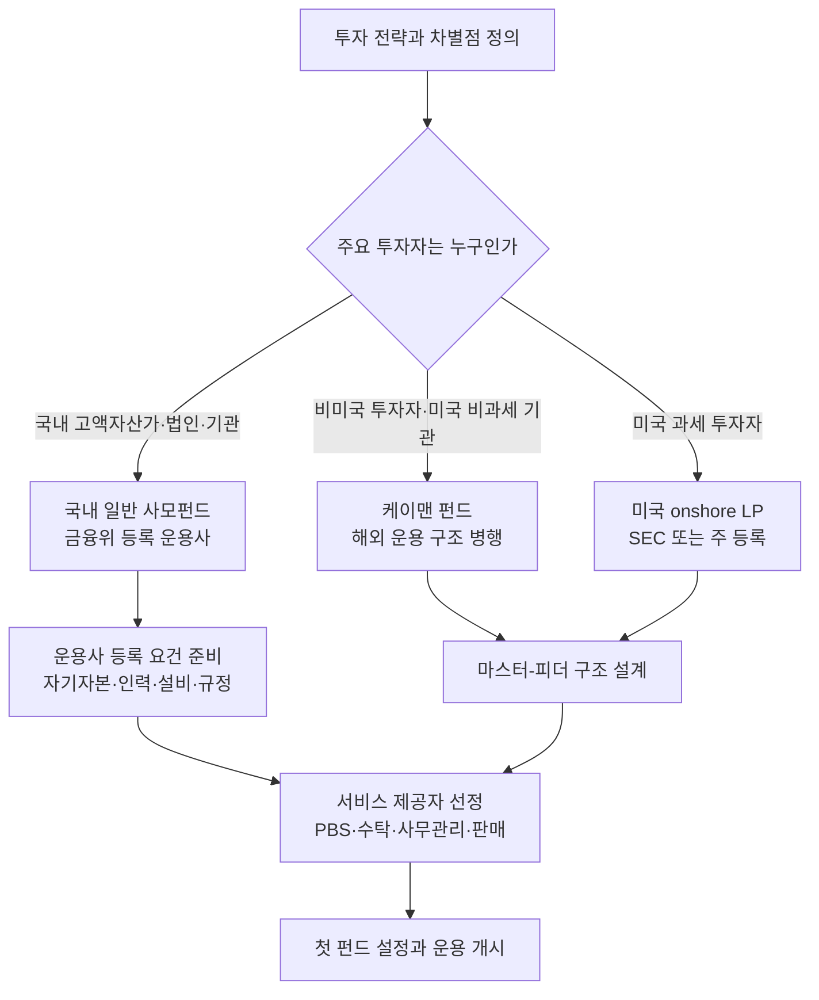
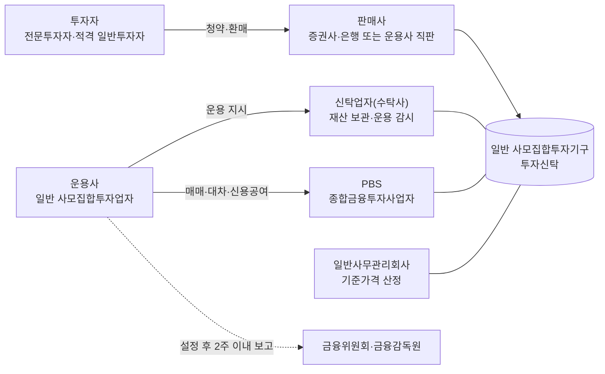
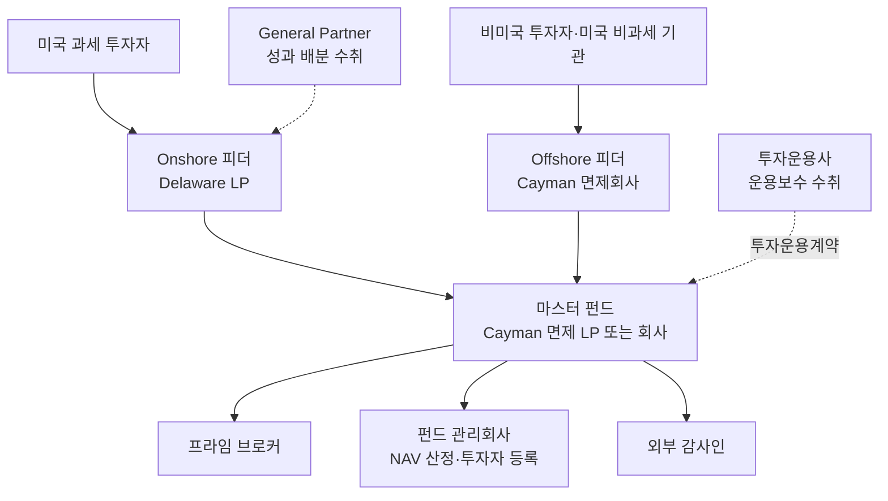
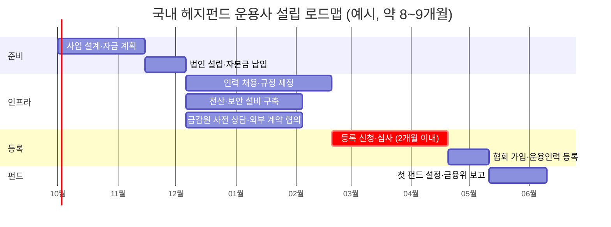
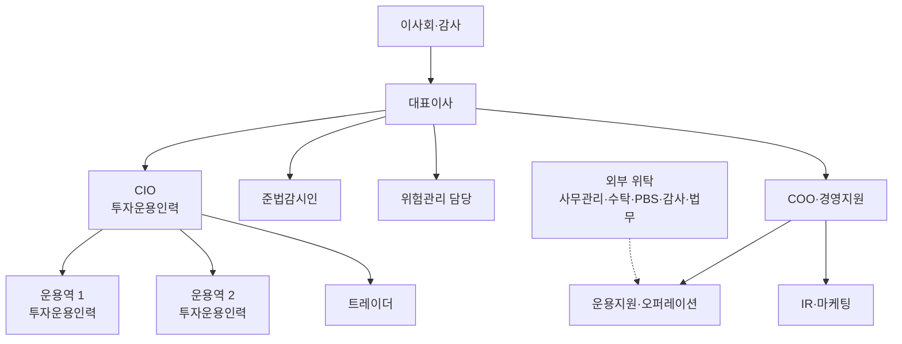
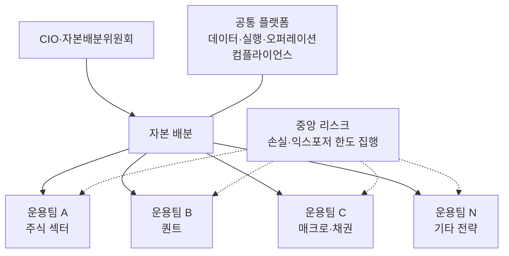
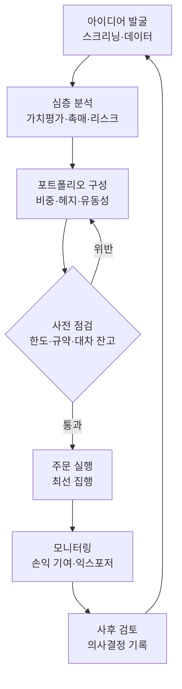

# 헤지펀드 운용사 설립 가이드

**조직·운영·규제 제반 지식과 세계 최고 헤지펀드 벤치마크**

작성 기준일: 2026년 9월 24일
적용 범위: 국내 설립(금융위원회 일반 사모집합투자업 등록)을 중심으로 하고, 글로벌 표준인 미국·케이맨 펀드 구조와 세계 주요 헤지펀드의 운영 모델을 함께 다룹니다.

> **일러두기** 이 리포트는 공개 자료를 바탕으로 정리한 일반 정보이며, 법률·세무·투자 자문이 아닙니다. 수치는 각 출처가 발표한 기준 시점을 따르고, 기준 시점은 표와 본문에 함께 적었습니다. 비용·일정·손익분기처럼 가정에 기반한 수치는 "예시"로 표시했습니다. 실제 설립 과정에서는 금융감독원 사전 상담과 법무법인·회계법인의 검토를 반드시 거쳐야 합니다.

## 목차

| 장 | 제목 | 다루는 내용 |
|---|---|---|
| 요약 | 핵심 요약 | 핵심 수치와 네 가지 결론 |
| 1 | 헤지펀드의 정의와 산업 현황 | 정의, 글로벌·국내 시장 규모와 동향 |
| 2 | 설립 전 핵심 의사결정 | 투자 전략, 관할권, 목표 투자자 |
| 3 | 법적 구조 | 운용사와 펀드의 분리, 국내 투자신탁 구조, 마스터-피더 구조 |
| 4 | 국내 설립 절차 | 등록 요건, 로드맵, 펀드 규제, 공매도, 내부통제, 세제 |
| 5 | 해외 설립 절차 | 미국, 케이맨 제도, EU |
| 6 | 조직도 | 기능 체계, 최소 조직, 성장 단계, 유형별 원형, 보상 |
| 7 | 운영 방식 | 투자 프로세스, 리스크 관리, 실행, 오퍼레이션, 서비스 제공자, 보수, 자금 조달, 기술, 손익 구조 |
| 8 | 제약 조건과 리스크 | 규제·사업·운영·시장 구조 제약, 역사적 실패 사례 |
| 9 | 세계 최고 헤지펀드 벤치마크 | 규모·성과 순위, 운용사별 분석, 국내 사례, 공통 성공 요인 |
| 10 | 실행 체크리스트 | 단계별 점검 항목과 완료 기준 |
| 부록 | 용어집과 참고 자료 | 주요 용어, 인용 출처 |

<!-- body-start -->

## 핵심 요약

헤지펀드를 설립하는 일은 두 층위의 작업으로 나뉩니다. 첫째는 인력을 고용하고 보수를 받는 **운용사(회사)**를 세우는 일이고, 둘째는 투자자의 자금이 실제로 모이는 **펀드(투자기구)**를 설정하는 일입니다. 국내에서는 운용사가 금융위원회에 일반 사모집합투자업 등록을 마친 뒤 일반 사모집합투자기구를 설정하고, 설정일부터 2주일 이내에 금융위원회에 보고하는 순서로 진행됩니다.

**표 0-1** 한눈에 보는 핵심 수치

| 항목 | 내용 | 기준 시점·출처 |
|---|---|---|
| 글로벌 헤지펀드 운용자산 | 5.6조 달러 (사상 최대, 15분기 연속 증가) | 2026년 2분기 말, HFR |
| 2025년 투자자 순이익 | 5,430억 달러 (사상 최대) | 2025년, LCH Investments |
| 상위 20개 운용사 비중 | 운용자산 16.6%, 설립 이후 누적 순이익 41.0% | 2025년 말, LCH Investments |
| 한국형 헤지펀드 설정액 | 40조원 돌파, 운용 펀드 950개 이상 | 2025년 말, 더벨 |
| 국내 사모운용사 수와 적자 비율 | 436개사, 적자 비율 47.9% | 2026년 2분기, 금융감독원 |
| 운용사 최소 자기자본 | 10억원 | 자본시장법 시행령 제271조의2 |
| 상근 투자운용인력 | 3명 이상 | 자본시장법 시행령 제271조의2 |
| 개인 적격투자자 최소 투자금 | 3억원 (레버리지 200% 초과 펀드는 5억원) | 자본시장법 시행령 |
| 펀드 레버리지 한도 | 순자산의 400% 이내 | 자본시장법 제249조의7 |
| 신규 펀드 평균 보수 | 운용보수 1.18%, 성과보수 16.29% | 2025년 3분기 출시 펀드, HFR |
| 신흥 운용사 평균 손익분기 운용자산 | 약 6,400만 달러 | 2022년 조사, AIMA·Cowen |

이 리포트가 도출한 결론은 다음 네 가지입니다.

**첫째, 규제상 진입 장벽은 낮지만 사업상 생존 장벽은 높습니다.** 자기자본 10억원과 상근 운용인력 3명을 갖추면 등록 요건을 충족할 수 있지만, 2026년 2분기 기준 국내 사모운용사 436곳 가운데 47.9%가 적자를 기록했습니다. 같은 해 상반기 자산운용업 전체 순이익이 이미 2025년 연간 순이익을 넘어섰다는 점을 고려하면, 적자의 원인은 시장 환경보다 운용 규모와 비용 구조에 있다고 보아야 합니다.

**둘째, 설립의 성패는 세 가지 조건에 달려 있습니다.** 투자자에게 설명할 수 있는 차별화된 전략, 기관 투자자의 운영 실사(ODD)를 통과할 수 있는 운영 인프라, 그리고 설정 초기의 시드·앵커 자금입니다. 신흥 운용사에 투자하는 기관의 다수가 가장 큰 장애 요인으로 운영 실사 우려를 꼽는다는 조사 결과는 운영 인프라가 투자 성과만큼 중요하다는 사실을 보여 줍니다.

**셋째, 세계 최고 운용사들의 공통점은 수익률 자체보다 운영 원칙에서 나타납니다.** 리스크 규칙의 제도화, 운용 규모(용량)의 의도적 통제, 인재·데이터·기술에 대한 지속적 투자, 그리고 창업자 이후를 대비한 거버넌스 설계가 대표적입니다. 2025년에 상위 20개 운용사 대부분이 자금 유입을 제한하거나 자본을 돌려주었다는 사실은 규모보다 수익률을 우선하는 문화가 장기 성과의 기반이라는 점을 보여 줍니다.

**넷째, 국내 설립 시에는 최근 달라진 제도를 반드시 반영해야 합니다.** 2025년 3월 31일 공매도 전면 재개와 함께 도입된 무차입공매도 방지 전산·내부통제 의무, 2026년 1월부터 0.20%로 오른 증권거래세, 2026년 7월 2일까지 중소형 금융투자업자에게 부과된 책무구조도 제출 의무, 그리고 라임·옵티머스 사태 이후 강화된 판매사·수탁사의 운용 감시 제도가 대표적입니다.

## 1. 헤지펀드의 정의와 산업 현황

### 1.1 헤지펀드란 무엇인가

헤지펀드는 법률에 정의된 용어가 아니라 업계에서 쓰는 명칭입니다. 일반적으로는 소수의 적격 투자자로부터 사모 방식으로 자금을 모으고, 공매도·레버리지·파생상품을 자유롭게 활용하여 시장 방향과 관계없이 절대수익을 추구하는 투자기구를 가리킵니다. 공모펀드는 불특정 다수의 투자자를 보호하기 위해 운용 방법을 엄격하게 제한받는 반면, 헤지펀드는 투자자의 자격과 인원을 제한하는 대가로 운용의 자유를 얻습니다. 이 교환 관계를 이해하면 헤지펀드 규제 전체를 일관된 논리로 읽을 수 있습니다.

국내에서는 2011년 12월 '한국형 헤지펀드'라는 이름으로 도입되었습니다. 이후 2021년 4월 개정되어 같은 해 10월 21일부터 시행된 자본시장법은 사모펀드를 운용 목적(전문투자형·경영참여형)이 아니라 투자자 기준(일반·기관전용)으로 재분류했고, 이에 따라 헤지펀드의 법률상 명칭은 '일반 사모집합투자기구'가 되었습니다. 미국에서는 헤지펀드가 투자회사법상 등록 면제 조항에 의존하는 사모펀드로 운영되며, 운용사는 SEC에 등록한 투자자문업자 또는 면제 보고 자문업자로서 규제를 받습니다. 미국 제도는 5장에서 자세히 다룹니다.

**표 1-1** 국내 펀드 유형별 비교

| 구분 | 공모펀드 | 일반 사모펀드(헤지펀드) | 기관전용 사모펀드(PEF) |
|---|---|---|---|
| 투자자 | 제한 없음 | 전문투자자, 3억원 이상 투자하는 개인·법인 등 적격투자자 | 기관투자자와 이에 준하는 자 |
| 투자자 수 | 제한 없음 | 100인 이하, 일반투자자는 49인 이하 | 사원 총수 100인 이하 |
| 운용사 진입 | 집합투자업 인가 | 일반 사모집합투자업 등록 (자기자본 10억원, 상근 운용인력 3명) | 업무집행사원 등록 (법률상 자기자본 1억원 이상) |
| 레버리지 | 엄격히 제한 | 순자산의 400% 이내 | 일반 사모펀드 규정 준용 |
| 투자 권유·광고 | 투자설명서, 공개 광고 가능 | 핵심상품설명서, 광고 대상 제한 | 사원 대상 |
| 성과보수 | 제한적으로 허용 | 집합투자규약에 따라 설정 | 정관에 따라 설정 |
| 설정 절차 | 사전 등록 | 설정 후 2주일 이내 보고 | 설립등기 후 2주일 이내 보고 |

### 1.2 글로벌 시장 현황

세계 헤지펀드 산업은 2025년과 2026년 상반기에 사상 최대 규모로 성장했습니다. HFR에 따르면 업계 운용자산은 2025년 4분기에 처음으로 5조 달러를 넘어 5.15조 달러로 한 해를 마쳤고, 2025년 한 해 동안의 자산 증가액은 성과 5,270억 달러와 순유입 1,158억 달러를 합한 6,428억 달러로 역대 최대였습니다. 2026년 2분기에는 한 분기에만 4,093억 달러가 늘어 운용자산이 5.6조 달러에 이르렀는데, 이는 HFR이 집계를 시작한 이래 가장 큰 분기 증가액이며 15분기 연속 증가입니다.

**표 1-2** 글로벌 헤지펀드 산업 주요 지표

| 지표 | 수치 | 기준 시점 | 출처 |
|---|---|---|---|
| 업계 운용자산 | 5.6조 달러 | 2026년 2분기 말 | HFR |
| 분기 자산 증가액 | 4,093억 달러 (성과 약 3,640억, 순유입 452억) | 2026년 2분기 | HFR |
| 연간 자산 증가액 | 6,428억 달러 (성과 5,270억, 순유입 1,158억) | 2025년 | HFR |
| 투자자에게 돌려준 순이익 | 5,430억 달러 (사상 최대) | 2025년 | LCH Investments |
| HFRI 종합지수 수익률 | +12.6% | 2025년 | LCH Investments 인용 |
| HFRI 종합지수 수익률 | +7.5% (2021년 이후 최고 상반기) | 2026년 상반기 | HFR |
| 신규 설정 펀드 수 | 561개 (2021년 이후 최다) | 2025년 | HFR |
| 청산 펀드 수 | 287개 (2024년 406개) | 2025년 | HFR |
| 신규 설정 / 청산 | 166개 / 129개 (청산은 2년 만에 최다) | 2026년 1분기 | HFR |
| 업계 평균 운용보수 | 1.32% | 2026년 1분기 | HFR |

전략별로 보면 2026년 1분기 말 기준 주식 헤지(Equity Hedge) 전략의 자산이 1.58조 달러로 가장 크고, 이벤트 드리븐 1.45조 달러, 상대가치 차익거래 1.37조 달러가 뒤를 잇습니다. 특히 상대가치 전략 안의 멀티전략 하위 분류는 8,433억 달러로 업계 두 번째 규모의 하위 전략이 되었습니다. 2026년 상반기 수익률은 주식 헤지 +9.6%(기술 섹터 특화 펀드 +19%), 이벤트 드리븐 +7.4%, 매크로 +6.1%, 상대가치 +3.7%였습니다.

이 성장은 소수의 대형 운용사에 집중되고 있습니다. LCH Investments에 따르면 상위 20개 운용사는 2025년 말 업계 운용자산의 16.6%를 운용하면서 업계 누적 순이익의 41.0%를 만들어 냈고, 2025년 자금 가중 수익률도 15.7%로 HFRI 종합지수(12.6%)를 크게 앞섰습니다. 2026년 9월 블룸버그 보도에 따르면 9대 헤지펀드의 운용자산은 2025년 초 이후 2,240억 달러 늘었고, 밀레니엄은 970억 달러, D.E. Shaw는 900억 달러에 이르렀습니다. 자금 공급원도 달라져 연기금·재단뿐 아니라 고액자산가의 비중이 커지고 있으며, 밀레니엄 운용자산의 30~40%를 고액자산가가 차지하는 것으로 알려졌습니다.

> **핵심** 업계 전체의 성장과 개별 신규 운용사의 성장은 다른 이야기입니다. 신규 설정 펀드 수는 2021년 이후 최다를 기록했지만, 2026년 1분기 청산 펀드 수도 2년 만에 가장 많았습니다. 자금은 검증된 대형 운용사로 먼저 흘러가므로, 신규 운용사는 자금 유입이 늦게 올 것을 전제로 재무 계획을 세워야 합니다.

### 1.3 국내 시장 현황

한국형 헤지펀드는 2011년 12월 약 1,490억원 규모로 출범했습니다. 2015년 10월 운용사 진입 규제가 인가제에서 등록제로 바뀐 뒤 시장이 빠르게 성장하여 2018년 말 순자산이 24조원을 넘었지만, 2019년 10월 당시 업계 1위였던 라임자산운용의 환매 중단 사태로 신뢰 위기를 맞았습니다. 이후 2021년 제도 개편으로 투자자 보호 장치가 강화되었고, 2025년에는 코스피 급등에 힘입어 설정액이 사상 처음으로 40조원을 넘고 운용 펀드 수도 950개를 넘어섰습니다.

**표 1-3** 국내 헤지펀드·자산운용업 주요 지표

| 지표 | 수치 | 기준 시점 | 출처 |
|---|---|---|---|
| 한국형 헤지펀드 설정액 | 40조원 돌파, 운용 펀드 950개 이상 | 2025년 말 | 더벨 |
| 전체 자산운용사 수와 운용자산 | 507개사, 1,937.3조원 | 2025년 말 | 금융감독원 |
| 자산운용사 당기순이익 | 3조 132억원 (전년 대비 +66.5%) | 2025년 | 금융감독원 |
| 자산운용사 흑자·적자 | 흑자 343개사, 적자 164개사 | 2025년 | 금융감독원 |
| 자산운용사 상반기 순이익 | 4조 1,553억원 (2025년 연간 실적 상회) | 2026년 상반기 | 금융감독원 |
| 사모운용사 수와 적자 비율 | 436개사, 47.9% (전 분기 대비 +6.4%p) | 2026년 2분기 | 금융감독원 |
| 공모운용사 수와 적자 비율 | 77개사, 14.3% | 2026년 2분기 | 금융감독원 |
| 코스피 상승률 | +75.6% | 2025년 | 더벨 |

**표 1-4** 2025년 한국형 헤지펀드 전략별 평균 수익률 (더벨 헤지펀드 리그테이블)

| 전략 | 평균 수익률 | 해석 |
|---|---|---|
| 롱바이어스드 | 62.61% | 순매수 노출이 큰 전략으로 코스피 급등의 수혜가 가장 컸습니다 |
| 에쿼티헤지 | 35.46% | 롱숏 전략도 시장 상승분 일부를 흡수했습니다 |
| 멀티 | 25.30% | 전략 분산형 펀드의 설정 규모가 크게 늘었습니다 |
| 이벤트드리븐 | 14.24% | 282개 펀드, 합산 설정액 5조 4,322억원 (2024년 수익률 2.44%) |
| 픽스드인컴 | 5.25% | 채권·레포 중심 전략입니다 |
| 기타 | 5.04% | |

2025년 수익률은 운용 역량(알파)보다 시장 상승(베타)의 영향을 크게 받았습니다. 더벨은 이벤트드리븐 전략의 수익률 상승도 이벤트 투자 자체보다 국내 주식 편입 비중이 높은 펀드들이 시장 상승을 누린 결과라고 분석했습니다. 따라서 2025년 트랙레코드를 앞세워 자금을 모으려는 운용사는 하락장에서의 방어력을 별도로 입증해야 하며, 투자자 역시 그 점을 가장 먼저 질문할 것입니다.

> **핵심** 국내 시장은 외형이 빠르게 커지고 있지만 수익은 상위 운용사에 집중되고 있습니다. 2026년 상반기 자산운용업 순이익이 이미 2025년 연간 실적을 넘어섰는데도 사모운용사의 적자 비율은 오히려 높아졌습니다. 신설 운용사는 규모의 경제를 확보하기 전까지 적자를 견딜 자본을 미리 준비해야 합니다.

## 2. 설립 전 핵심 의사결정

설립 절차에 들어가기 전에 세 가지 질문에 먼저 답해야 합니다. 어떤 전략으로 수익을 낼 것인지, 누구의 자금을 받을 것인지, 어느 관할권의 법률 아래에서 펀드를 만들 것인지입니다. 이 세 가지가 정해져야 조직 규모, 필요한 인프라, 규제 부담, 초기 자본의 크기가 결정됩니다.

### 2.1 투자 전략 선택

**표 2-1** 주요 헤지펀드 전략별 설립 요건 비교

| 전략 | 수익 원천 | 핵심 인력 | 인프라 요구 | 운용 용량 | 국내 적용 시 유의점 |
|---|---|---|---|---|---|
| 주식 롱숏 | 종목 선별 알파, 숏 포지션으로 시장 위험 축소 | 섹터 애널리스트, PM | PBS 대차, 잔고관리 전산, 리스크 시스템 | 중간 | 2025년 3월 공매도 재개 이후 대차 상환기간 제한과 잔고관리 전산 의무 |
| 롱바이어스드 | 순매수 노출과 종목 선별 | PM, 애널리스트 | 기본 수준 | 중간 이상 | 상승장 성과는 크지만 하락장 방어력을 따로 입증해야 함 |
| 이벤트 드리븐·메자닌·공모주 | 인수합병, 구조조정, 공모주 배정, CB·BW·EB | 딜 소싱, 법률·신용 분석 인력 | 딜 네트워크, 비상장 자산 평가 체계 | 작음~중간 | 비시장성 자산이 50%를 넘으면 개방형 펀드 불가, 공매도 거래자의 CB·BW 취득 제한 |
| 상대가치·차익거래 | 가격 괴리의 수렴 | 퀀트, 트레이더 | 저지연 실행, 레버리지 | 중간 | 레버리지 400% 한도, 증권거래세 0.20% |
| 매크로 | 금리·환율·원자재의 방향성 | 이코노미스트, 트레이더 | 선물·외환 거래 인프라 | 큼 | 해외 파생상품 접근성, 외환 규제 |
| 퀀트·시스템 | 통계적 신호, 팩터 | 퀀트 리서처, 엔지니어 | 데이터·백테스트·실행 시스템 | 전략별 상이 | 회전율이 높으면 거래세 부담이 크고 모델 거버넌스가 필요 |
| 멀티전략·멀티매니저 | 다수 독립 팀의 비상관 수익 합산 | 다수 PM 팀, 중앙 리스크 조직 | 대규모 공통 플랫폼 | 매우 큼 | 규모의 경제가 전제되어 설립 단계 모델로 부적합 |
| 픽스드인컴 | 캐리, 신용 스프레드 | 채권 운용역 | 레포·신용 인프라 | 큼 | 국내에서는 증권사 레포펀드 비중이 컸으나 최근 비중이 줄어듦 |

신설 운용사에게 권할 만한 원칙은 **검증 가능한 단일 핵심 전략으로 시작하는 것**입니다. 멀티매니저 플랫폼은 최근 업계에서 가장 빠르게 성장한 모델이지만, 중앙 리스크·데이터·실행 인프라와 수백 명 규모의 인력이 있어야 작동하므로 설립 단계의 모델로는 적합하지 않습니다. 전략 하나에 집중하면 인력과 시스템을 최소화할 수 있고, 투자자에게 수익 원천을 명확하게 설명할 수 있습니다. 트랙레코드가 쌓인 뒤에 인접 전략을 추가하는 방식이 성장 경로로서 가장 안전합니다.

국내 시장에서 전략을 고를 때에는 제도 변화를 함께 고려해야 합니다. 2025년 공매도 전면 재개로 롱숏 전략의 운용 여건은 정상화되었지만, 대차 상환기간 제한과 잔고관리 전산 의무가 새로 생겼습니다. 2025년 상법 개정으로 이사의 충실의무 대상이 주주까지 확대되는 등 지배구조 환경이 바뀌고 있어 이벤트 드리븐·행동주의 전략의 기회도 넓어지고 있습니다. 반면 회전율이 높은 퀀트 전략은 2026년부터 0.20%로 오른 증권거래세를 비용 모델에 반드시 반영해야 합니다.

### 2.2 관할권 선택

**표 2-2** 펀드 설립 관할권 비교

| 구분 | 국내 일반 사모펀드 | 미국 onshore 펀드 | 케이맨 offshore 펀드 |
|---|---|---|---|
| 주요 투자자 | 국내 고액자산가, 법인, 기관 | 미국 과세 투자자 | 비미국 투자자, 미국 비과세 기관 |
| 대표 법적 형태 | 투자신탁 | Delaware 유한파트너십(LP) | 면제회사(Exempted Company) 또는 면제 유한파트너십 |
| 운용사 규제 | 금융위원회 등록 | SEC 등록 투자자문업자 또는 면제 보고 자문업자, 경우에 따라 주(state) 등록 | 운용사 소재지 규제를 따름 |
| 펀드 규제 | 설정 후 2주일 이내 보고 | 투자회사법 3(c)(1)·3(c)(7) 면제, Regulation D 사모 발행 | CIMA 등록 (투자자별 최소 청약 10만 달러 등) |
| 장점 | 국내 판매망, 원화 자금, 국내 시장 접근성 | 세계 최대 자금 시장 접근 | 세제 중립성, 글로벌 기관 투자자에게 익숙한 표준 |
| 부담 요인 | 투자자 수·레버리지 한도, 판매사 의존 | 규제 준수 비용, 투자자 적격성 요건 | 이사회, 자금세탁방지 담당자, 현지 감사 등 운영 비용 |

국내 투자자 중심으로 시작한다면 국내 일반 사모펀드가 가장 현실적인 선택입니다. 해외 투자자 유치가 필요한 단계에 이르면 케이맨 마스터-피더 구조를 추가하는 방식이 일반적입니다. 다만 국내 운용사가 해외 펀드를 운용하려면 국내 금융투자업 규제, 외국환 거래 규정, 해외 현지 규제를 동시에 검토해야 하므로, 해외 구조는 운용 규모와 투자자 수요가 확인된 뒤에 도입하는 편이 비용 면에서 합리적입니다. 싱가포르나 홍콩에 운용 거점을 두는 방안도 있으며, 이 경우 현지 금융당국(싱가포르 MAS, 홍콩 SFC)의 인가가 별도로 필요합니다.

### 2.3 목표 투자자와 자금 조달 경로

**표 2-3** 투자자 유형별 특징과 접근 경로

| 투자자 유형 | 특징 | 요구 사항 | 접근 경로 |
|---|---|---|---|
| 국내 고액자산가 | 3억원 이상 투자하는 적격 일반투자자, 펀드당 49인 한도 | 판매사 상품 승인, 핵심상품설명서 | 증권사 PB·WM 채널, 운용사 직접 판매 |
| 국내 법인·전문투자자 | 투자자 수 한도의 부담이 상대적으로 작음 | 운용 보고, 전략 설명 | 직접 영업 |
| 국내 기관(연기금·공제회·보험사) | 대규모 자금, 긴 의사결정 기간 | 다년간의 트랙레코드, 운영 실사 | 위탁운용사 선정 공모, 제안 영업 |
| 시드·앵커 투자자 | 설정 초기의 대규모 자금 | 운용사 수익 공유 또는 지분 | 시딩 전문사, 계열 금융사, 대주주 |
| 해외 기관·패밀리오피스 | 달러 자금, 엄격한 운영 실사 | 독립 사무관리, 외부 감사, 표준 실사 질의서(DDQ) 응답 | 케이맨 펀드, 프라임 브로커의 투자자 소개(cap intro) |

설정 초기에는 투자자 수와 금액이 모두 작기 때문에 운용사 대주주의 자기자금 투자와 계열 금융사·지인 네트워크의 자금이 첫 자금이 되는 경우가 많습니다. 초기 투자자에게 보수를 할인해 주는 설립자 클래스(founder share class)는 해외에서 널리 쓰이는 유치 수단이며, 국내에서도 집합투자규약으로 투자자별 보수 조건을 달리 설계할 수 있는지 법률 검토를 거쳐 활용할 수 있습니다.

### 2.4 의사결정 흐름

아래 흐름도는 전략 정의에서 첫 펀드 설정까지 의사결정이 이어지는 순서를 정리한 것입니다.

## 3. 법적 구조

### 3.1 운용사와 펀드의 분리

헤지펀드 사업은 운용사(회사)와 펀드(투자기구)를 분리하는 구조를 기본으로 합니다. 운용사는 인력을 고용하고, 투자 의사결정을 내리고, 보수를 받는 영리 법인입니다. 펀드는 투자자의 자금이 모이는 별도의 법적 실체이며, 펀드 재산은 운용사의 고유재산과 분리되어 제3자인 수탁사나 커스터디언이 보관합니다. 이 분리 원칙은 운용사가 파산하거나 부정행위를 저지르더라도 투자자 재산을 보호하기 위한 장치이며, 기관 투자자가 운영 실사에서 가장 먼저 확인하는 항목이기도 합니다.

미국식 구조에서는 여기에 무한책임사원(General Partner, GP) 법인이 추가됩니다. 투자운용사(Investment Manager)는 운용보수를 받고, 펀드의 무한책임사원은 성과보수를 보수가 아닌 이익 배분(performance allocation) 형태로 받습니다. 성과보수를 이익 배분으로 받으면 세무상 성격이 달라질 수 있기 때문에 두 법인을 나누어 두는 것이 일반적입니다.

### 3.2 국내 구조: 투자신탁형 일반 사모펀드

국내 헤지펀드는 대부분 투자신탁 형태로 설정됩니다. 운용사는 위탁자로서 신탁업자(수탁사)에게 운용을 지시하고, 수탁사는 펀드 재산을 보관하면서 운용 지시가 법령과 집합투자규약에 맞는지 감시합니다. 증권 대차와 신용공여가 필요한 전략은 종합금융투자사업자가 제공하는 전담중개업무(PBS)를 이용하며, 기준가격 산정은 일반사무관리회사에 맡기는 경우가 많습니다.

**표 3-1** 국내 헤지펀드 참여 기관과 역할

| 기관 | 역할 | 비고 |
|---|---|---|
| 운용사(일반 사모집합투자업자) | 전략 수립, 운용 지시, 핵심상품설명서 작성, 규제 보고 | 금융위원회 등록 |
| 신탁업자(수탁사) | 재산 보관·관리, 운용 지시 감시, 분기별 자산 대사 | 일반투자자 대상 펀드는 감시 의무가 강화됨 |
| 판매사 | 적격투자자 확인, 핵심상품설명서 검증·교부, 운용이 설명서에 부합하는지 확인 | 운용사가 직접 판매하는 것도 가능 |
| PBS(종합금융투자사업자) | 증권 대차, 신용공여, 담보 관리, 재산 보관 연계 | 자기자본 3조원 이상 증권사만 영위 가능 |
| 일반사무관리회사 | 기준가격 산정, 펀드 회계 | 운용사가 산정 결과를 별도로 검증하는 것이 바람직함 |
| 외부감사인 | 펀드 재무제표 감사 | 원칙적으로 의무, 투자자 전원 동의 등 예외 인정 |
| 금융위원회·금융감독원 | 등록, 보고 접수, 검사와 제재 | |

### 3.3 글로벌 표준: 마스터-피더 구조

해외 기관 자금을 받는 헤지펀드는 대부분 마스터-피더 구조를 사용합니다. 미국 과세 투자자는 미국 델라웨어 유한파트너십(onshore 피더)에, 비미국 투자자와 미국 비과세 기관(연기금·재단 등)은 케이맨 면제회사(offshore 피더)에 투자하고, 두 피더가 하나의 마스터 펀드에 자금을 모아 단일 포트폴리오로 운용합니다. 미국 비과세 기관이 법인형 offshore 피더를 거치는 이유는 레버리지를 사용하는 펀드에서 발생할 수 있는 비관련 사업 과세소득(UBTI)을 차단하기 위해서입니다. 이 구조를 쓰면 투자자별 세무 요구를 충족하면서도 포트폴리오를 하나로 관리할 수 있어 매매 배분과 운영이 단순해집니다.

### 3.4 기타 구조

**표 3-2** 대안적 펀드·계좌 구조

| 구조 | 설명 | 활용 상황 |
|---|---|---|
| 별도 운용 계좌(SMA)·단독 펀드 | 대형 투자자 한 명을 위해 별도 계좌나 펀드를 운용 | 대형 기관이 맞춤 조건과 투명성을 요구할 때. 국내에서 계좌 형태로 운용하려면 투자일임업 등록이 필요 |
| 분리형 포트폴리오 회사(SPC) | 한 법인 안에 자산·부채가 분리된 여러 포트폴리오를 둠 | 여러 전략이나 클래스를 비용 효율적으로 운영할 때 |
| 운용 계좌 플랫폼 | 제3자 플랫폼이 계좌를 소유하고 운용사는 운용만 담당 | 신규 운용사가 기관 수준의 트랙레코드를 쌓을 때 |
| UCITS 등 공모형 대체투자 펀드 | 유동성·레버리지 제한을 받는 공모형 헤지 전략 | 유럽 개인 투자자 채널로 확장할 때 |
| 공모 액티브 ETF | 사모 전략의 운용 방식을 상장 ETF로 제공 | 사모 규제의 투자자 수 한도를 넘어 확장할 때 (국내 타임폴리오, 해외 Man Group 사례) |

## 4. 국내 설립 절차

### 4.1 일반 사모집합투자업 등록 요건

일반 사모집합투자업을 영위하려면 금융위원회에 등록해야 하며, 등록하지 않고 영업하는 것은 금지됩니다(자본시장법 제249조). 등록 요건은 법률(제249조의3)과 시행령(제271조의2)에 나뉘어 규정되어 있으며, 핵심은 다음 표와 같습니다.

**표 4-1** 일반 사모집합투자업 등록 요건

| 요건 | 내용 | 근거 |
|---|---|---|
| 법적 형태 | 상법상 주식회사 또는 대통령령으로 정하는 금융회사, 또는 국내에 영업소를 둔 외국 집합투자업자 | 법 제249조의3 제2항 제1호 |
| 자기자본 | 10억원 이상 (법률은 5억원 이상으로 정하고, 시행령이 10억원으로 규정) | 법 같은 항 제2호, 시행령 제271조의2 제3항 |
| 인력 | 상근 임직원인 투자운용인력 3명 이상 | 시행령 제271조의2 제4항 제1호 |
| 물적 설비 | 업무 수행에 필요한 전산설비와 통신수단, 사무실 등 업무 공간과 사무장비, 전산설비를 보호할 보안설비 | 시행령 제271조의2 제4항 제2호 |
| 임원 | 금융회사의 지배구조에 관한 법률 제5조의 임원 자격 요건 충족 | 법 같은 항 제4호 |
| 대주주 | 충분한 출자능력, 건전한 재무상태, 사회적 신용 | 법 같은 항 제5호 |
| 재무·사회적 신용 | 경영건전성 기준 충족, 법령 위반 사실이 없을 것, 최근 5년간 등록 직권말소 이력이 없을 것 등 | 법 같은 항 제6호, 시행령 |
| 이해상충 방지 | 운용사와 투자자 사이, 특정 투자자와 다른 투자자 사이의 이해상충을 방지하는 체계 | 법 같은 항 제7호 |
| 심사 기간 | 신청서 접수 후 2개월 이내 결정 (보완 기간 등은 산입하지 않음) | 법 제249조의3 제4항·제5항 |
| 등록 후 의무 | 등록 요건 유지 (자기자본·대주주 요건은 완화된 기준 적용) | 법 제249조의3 제8항 |

금융위원회는 요건을 갖추지 못했거나, 신청서를 거짓으로 작성했거나, 보완 요구를 이행하지 않은 경우가 아니면 등록을 거부할 수 없습니다. 등록이 결정되면 등록부에 기재되고 관보와 홈페이지에 공고됩니다. 등록 이후에도 방심해서는 안 됩니다. 2021년 개정법은 자기자본 유지 요건 미준수, 일정 기간의 미영업, 투자운용인력 요건 미준수, 월별 업무보고서 미제출 등을 등록 직권말소 사유로 정했습니다. 운용인력이 퇴사하여 3명 아래로 줄어드는 상황은 신설 운용사에서 흔히 일어나므로 인력 계획에 여유를 두어야 합니다.

투자운용인력은 금융투자협회에 등록된 금융투자전문인력이어야 하며, 자격과 경력 요건은 협회 규정을 따릅니다. 등록 신청 전에 채용 예정자의 등록 가능 여부를 확인해 두는 것이 좋습니다.

### 4.2 단계별 로드맵

아래 로드맵은 일반적인 소요 기간을 바탕으로 작성한 예시입니다. 실제 기간은 준비 수준, 보완 요구 횟수, 외부 계약 협의 속도에 따라 크게 달라집니다.

**표 4-2** 국내 운용사 설립 로드맵 (예시)

| 단계 | 예상 기간 | 주요 작업 | 산출물 |
|---|---|---|---|
| 1. 사업 설계 | 1~2개월 | 전략·목표 투자자·수익 모델 확정, 창업 멤버와 대주주 구성, 자금 계획 수립 | 사업계획서, 3개년 재무 모델, 주주간 계약 |
| 2. 법인 설립 | 2~4주 | 주식회사 설립, 자본금 10억원 이상 납입, 사무실 임차 | 법인 등기, 사업자 등록 |
| 3. 인력·규정 | 2~3개월 | 상근 투자운용인력 3명 이상 채용, 준법감시인 선임, 내부통제기준·이해상충방지·위험관리 규정 제정, 책무구조도 작성 | 규정집, 인력 현황 |
| 4. 전산·설비 | 2개월 (3단계와 병행) | 주문관리·리스크·잔고관리 시스템, 보안설비, 업무 연속성 계획 | 시스템 구축·테스트 기록 |
| 5. 사전 협의 | 2개월 (3단계와 병행) | 금융감독원 사전 상담, PBS·수탁사·사무관리사·판매사와 협의 | 협의 결과, 거래 의향서 |
| 6. 등록 신청·심사 | 2개월 이내 (보완 기간 별도) | 등록신청서 제출, 보완 요구 대응, 현장 확인 | 등록 결정, 관보·홈페이지 공고 |
| 7. 협회 가입·인력 등록 | 2~4주 | 금융투자협회 회원 가입, 투자운용인력 등록 | 등록 확인 |
| 8. 첫 펀드 설정 | 1개월 내외 | 집합투자규약·핵심상품설명서 작성, 수탁·PBS·판매 계약, 설정 | 설정 후 2주일 이내 금융위원회 보고 |

<!-- roadmap -->

### 4.3 펀드 설정과 운용 규제

운용사 등록을 마친 뒤 설정하는 일반 사모펀드에는 다음과 같은 규제가 적용됩니다. 2021년 제도 개편 이후 일반투자자가 참여하는 펀드에는 투자자 보호 장치가 추가로 적용된다는 점을 기억해야 합니다.

**표 4-3** 일반 사모펀드 주요 규제

| 항목 | 규제 내용 | 근거 |
|---|---|---|
| 적격투자자 | 대통령령으로 정하는 전문투자자, 또는 3억원 이상 투자하는 개인·법인 등 (레버리지 200% 초과 펀드는 5억원 이상) | 법 제249조의2, 시행령 제271조 |
| 투자자 수 | 100인 이하, 일반투자자는 49인 이하 | 2021년 개정 |
| 양도 제한 | 적격투자자가 아닌 자에게 집합투자증권 양도 금지 | 법 제249조의8 제3항 |
| 설정 보고 | 설정일부터 2주일 이내 금융위원회 보고, 변경 시에도 2주일 이내 변경 보고 | 법 제249조의6 |
| 레버리지 | 파생상품 위험평가액, 채무보증, 차입금, 실질적 차입의 합계가 순자산의 400% 이내 | 법 제249조의7 제1항 |
| 금지 행위 | 개인에게 직접 대여하거나 대부업자 연계로 이를 회피하는 행위, 대출형 펀드를 일정 전문투자자 외에 발행하는 행위 등 | 법 제249조의7 제2항 |
| 정기 보고 | 매 분기 말 기준 파생상품 매매, 채무보증·담보 제공, 금전 차입 현황 보고 | 법 제249조의7 제3항 |
| 수시 보고 | 환매 연기 등 투자자 보호 관련 사유 발생 시 3영업일 이내 보고 | 법 제249조의7 제4항 |
| 경영참여 투자 | 의결권 있는 주식 10% 이상 보유 등 경영참여 목적 투자는 15년 이내 처분 | 법 제249조의7 제5항 |
| 개방형 설정 제한 | 시가를 산출할 수 없는 비시장성 자산 비중이 50%를 넘으면 개방형(수시 환매형) 설정 불가 | 2021년 개정 하위 규정 |
| 핵심상품설명서 | 운용사가 작성하여 판매사에 제공하고, 판매사는 규약과의 부합 여부를 검증한 뒤 일반투자자에게 교부 | 법 제249조의4 |
| 판매사 운용 감시 | 일반투자자 대상 펀드는 판매사가 운용이 설명서에 부합하는지 확인하고, 부합하지 않으면 시정 요구 | 법 제249조의4 제5항·제6항 |
| 수탁사 운용 감시 | 일반투자자 대상 펀드는 수탁사가 운용 지시를 감시하고 매 분기 자산 대사 수행 | 법 제249조의8 제2항 |
| 외부 감사·보고서 | 외부 감사 원칙적 의무 (투자자 전원 동의 등 예외), 일반투자자에게 자산운용보고서 교부 | 법 제249조의8 제2항 |
| 환매 연기 | 일반투자자 대상 펀드는 환매 연기일부터 3개월 이내 집합투자자총회 개최 | 법 제249조의8 제5항 |
| 투자 광고 | 전문투자자 또는 금융투자상품 잔고가 일정 금액 이상인 일반투자자만을 대상으로, 서면·전화·전자우편 등으로 개별 통지 | 법 제249조의5 |
| 직접 판매 | 운용사는 자신이 운용하는 펀드를 직접 판매할 수 있으며, 이 경우 판매 관련 행위 규제를 준용 | 법 제249조의8 제9항 |

### 4.4 공매도·대차 규제

국내 공매도는 2023년 11월 전면 금지되었다가 2025년 3월 31일 전 종목을 대상으로 재개되었습니다. 재개와 함께 무차입공매도를 막기 위한 제도가 대폭 강화되었고, 이 제도는 롱숏 전략을 쓰는 신설 운용사의 설립 준비 항목을 직접 바꾸었습니다.

**표 4-4** 2025년 3월 31일 이후 공매도 관련 주요 의무

| 구분 | 내용 |
|---|---|
| 대차 상환기간 | 공매도 목적 대차는 90일 이내에서 정하고, 연장을 포함해도 총 12개월을 넘을 수 없음 (거래정지 등 예외 인정) |
| 계좌별 잔고 관리 | 법인·기관투자자는 내부통제기준에 따라 독립거래단위, 펀드·일임·신탁 계좌별로 잔고 범위 안에서만 매도 주문이 나가도록 관리 |
| 주문 기록 보관 | 공매도 주문별 일시, 종목, 수량, 담당 임직원 정보를 5년간 보관 |
| 공매도 전산시스템 | 종목별 순보유잔고가 발행주식의 0.01% 이상(1억원 미만 제외)이거나 10억원 이상이어서 보고 대상이 되는 법인 등은 잔고를 관리하는 전산시스템을 구축·이용 |
| 잔고 정보 제출 | 매 영업일의 종목별 잔고 정보를 2영업일 이내 한국거래소에 제출하고, 거래소 중앙점검시스템(NSDS)이 무차입공매도 여부를 전수 점검 |
| 자금 조달 참여 제한 | 공매도 거래자의 전환사채·신주인수권부사채 취득 제한 |
| 과열 종목 제도 | 공매도가 급증한 종목은 다음 날 공매도를 제한하는 과열종목 지정 제도 운영 |

> **주의** 롱숏 전략을 쓸 계획이라면 잔고관리 시스템을 자체 구축할지, PBS가 제공하는 시스템과 연계할지를 등록 신청 전에 결정해야 합니다. 공매도 내부통제기준은 등록 심사에서 제출하는 내부통제 체계의 일부로 함께 준비하는 것이 효율적입니다.

### 4.5 내부통제·책무구조도·준법감시

금융회사의 지배구조에 관한 법률에 따라 운용사는 준법감시인을 두어야 하며, 준법감시인은 자산 운용 업무를 겸직할 수 없습니다. 회사 규모에 따라 준법감시인이 위험관리책임자를 겸직할 수 있는 경우도 있으므로, 최소 인원으로 출발하는 신설 운용사는 겸직 가능 범위를 법률 검토로 확인해야 합니다. 금융감독원은 2025년 9월 신설 사모운용사 대표이사 설명회에서 소규모 신설 운용사의 대표이사가 직접 내부통제 체계를 점검하고 이를 책무구조도에 반영하라고 요청했으며, 준법감시인 겸직 금지 위반을 주요 위반 사례로 소개했습니다.

책무구조도는 임원별로 내부통제 책무를 배분한 문서입니다. 자산총액 5조원 미만이면서 운용재산 20조원 미만인 중소형 금융투자업자 1,007개사는 2026년 7월 2일까지 책무구조도를 금융감독원에 제출해야 했습니다. 따라서 지금 설립하는 운용사는 설립 초기부터 책무구조도 기반의 내부통제 체계를 갖추어야 합니다.

금융감독원이 공개한 사모운용사의 흔한 위반 유형은 설립 준비 과정에서 미리 막을 수 있는 것들입니다. 집합투자규약에 투자 대상 취득 한도를 잘못 적은 경우, 편입 비율 위반을 인지하지 못한 채 운용을 계속한 경우, 부실화된 채권을 근거 없이 과대평가한 경우, 의결권 행사 내용과 사유를 공시하지 않은 경우가 대표적입니다. 규약 한도를 주문 단계에서 자동으로 점검하는 사전 컴플라이언스 기능과 자산 평가 위원회 운영 규정은 등록 전에 준비해야 할 기본 장치입니다.

### 4.6 세제

**표 4-5** 헤지펀드 운용과 관련된 주요 세제

| 구분 | 내용 | 설립 시 시사점 |
|---|---|---|
| 증권거래세 | 2026년 1월 1일 양도분부터 코스피 0.20%(거래세 0.05%와 농어촌특별세 0.15%), 코스닥 0.20%, 코넥스 0.10% (2025년 코스피·코스닥 각 0.15%) | 매도 금액 기준으로 부과되므로 회전율이 높을수록 부담이 커짐 |
| 금융투자소득세 | 2024년 12월 폐지가 확정되어 시행되지 않음 | 기존 과세 체계가 유지됨 |
| 투자자 과세 | 펀드에서 분배받는 이익은 원칙적으로 배당소득으로 과세되고, 금융소득 합계가 연 2,000만원을 넘으면 종합과세 대상. 국내 상장주식 매매·평가 손익은 과세 대상 이익에서 제외 | 전략별 세후 수익률을 투자자에게 설명할 수 있어야 함 |
| 운용사 과세 | 운용보수와 성과보수는 운용사의 법인 수익으로 법인세 과세 | 성과보수 변동성을 반영한 세후 현금흐름 계획 필요 |

증권거래세 부담은 간단한 계산으로 가늠할 수 있습니다. 연간 매도 금액이 순자산의 10배인 전략(편도 회전율 1,000%)이라면 거래세만으로 순자산의 약 2.0%가 비용으로 나가며, 이는 업계 평균 운용보수보다 큰 금액입니다. 고회전 전략을 계획한다면 백테스트 단계부터 거래세와 매매 수수료를 비용에 넣어 검증해야 합니다.

## 5. 해외 설립 절차

해외 구조는 국내 설립보다 참여자가 많고 규제 층위가 복잡합니다. 여기서는 설립자가 의사결정에 필요한 수준으로 핵심 요건을 정리하며, 실제 설립은 현지 법무법인의 자문을 전제로 합니다.

### 5.1 미국

미국에서는 운용사 규제(투자자문업법), 펀드 규제(투자회사법), 발행 규제(증권법)가 각각 따로 적용됩니다. 운용사는 규제 자산(RAUM)이 1억 달러 이상이면 일반적으로 SEC에 투자자문업자(RIA)로 등록해야 합니다. 사모펀드만 자문하고 미국 내 운용자산이 1억 5,000만 달러 미만이면 사모펀드 자문업자 면제를 받아 면제 보고 자문업자(ERA)로서 Form ADV의 일부만 제출할 수 있으며, 이 경우에도 주(state) 차원의 등록 의무를 별도로 확인해야 합니다.

**표 5-1** 미국 헤지펀드 설립 시 주요 규제 요건

| 구분 | 요건 | 비고 |
|---|---|---|
| 펀드 등록 면제 | 투자회사법 3(c)(1): 수익적 소유자 100인 이하, 또는 3(c)(7): 적격매수자(qualified purchaser)만 투자 | 적격매수자는 개인 기준 투자자산 500만 달러 이상 |
| 사모 발행 | Regulation D Rule 506(b)는 일반 권유 금지, Rule 506(c)는 일반 권유를 허용하되 적격투자자 여부를 검증 | 최초 판매 후 15일 이내 Form D 제출 |
| 적격투자자(accredited investor) | 개인 순자산 100만 달러 초과(주거주지 제외) 또는 최근 2년 소득 20만 달러(부부 합산 30만 달러) 초과 등 | 일부 전문 자격증 보유자도 인정 |
| 성과보수 부과 요건(qualified client) | 2026년 6월 29일부터 운용사에 맡긴 자산 140만 달러 이상 또는 순자산 270만 달러 이상 (종전 110만·220만 달러) | 3(c)(1) 펀드는 모든 투자자가 이 요건을 충족해야 성과보수 부과 가능 |
| Form PF | SEC 등록 사모펀드 자문업자의 비공개 보고서 | 2024년 개정안의 준수 기한이 여러 차례 연기되어 2027년 7월 1일로 변경, 2026년 4월 추가 개정안 제안 |
| 선물 거래 | 상품선물 거래 시 CFTC 상품풀 운영자(CPO) 등록 또는 면제(예: Rule 4.13(a)(3)) | |
| 컴플라이언스 | 최고준법책임자(CCO) 지정과 컴플라이언스 규정(Rule 206(4)-7), 마케팅 규칙, 커스터디 규칙, 윤리 강령 | 2023년 제정된 사모펀드 자문업자 규칙은 2024년 6월 연방 제5순회항소법원에서 무효화됨 |

> **주의** 미국 규제는 기준 금액이 주기적으로 조정됩니다. 성과보수 부과 요건(qualified client)은 5년마다 인플레이션을 반영하여 조정되며, 가장 최근 조정은 2026년 6월 29일부터 적용되었습니다. 청약 서류와 투자자 적격성 확인서에 최신 기준을 반영했는지 반드시 확인해야 합니다.

### 5.2 케이맨 제도

케이맨 제도는 해외 헤지펀드가 가장 많이 사용하는 역외 관할권입니다. 개방형 펀드는 케이맨 통화청(CIMA)에 뮤추얼펀드법상 펀드로 등록해야 하며, 가장 흔한 형태는 제4조 제3항에 따른 등록 펀드입니다. 이 형태는 투자자별 최소 청약 금액이 10만 달러 이상이거나 CIMA가 인정한 거래소에 상장된 경우에 인가·관리 요건을 면제받습니다.

**표 5-2** 케이맨 등록 펀드의 주요 의무

| 구분 | 내용 |
|---|---|
| 등록 수수료 | 최초 신청 수수료 약 366달러, 연간 수수료 약 4,482달러 (마스터 펀드는 약 3,201달러), 매년 1월 15일까지 납부 |
| 감사 | 케이맨 소재 감사인의 감사를 받은 재무제표를 회계연도 종료 후 6개월 이내 CIMA에 제출 |
| 이사 | 펀드 이사는 이사 등록·인가법에 따라 등록 |
| 자금세탁방지 | 자금세탁방지 준법책임자(AMLCO), 자금세탁보고책임자(MLRO)와 부책임자(DMLRO) 지정 |
| 조세 정보 교환 | FATCA와 CRS 보고 |
| 규제 기준 | 지배구조, 내부통제, 순자산가치 산정, 자산 분리, 아웃소싱, 사이버보안, 기록 보관에 관한 CIMA 규제 기준 준수 |
| 제재 | 위반 건별로 최대 100만 케이맨 달러(약 120만 미국 달러)의 행정 과태료 부과 가능 |

케이맨 펀드는 등록 자체보다 운영 비용이 더 큰 부담입니다. 독립 이사 보수, 자금세탁방지 담당자 위탁 비용, 현지 감사 비용, 펀드 관리회사 보수가 매년 발생하므로, 해외 투자자 자금이 어느 정도 확보된 뒤에 설립하는 것이 합리적입니다.

### 5.3 EU와 영국

EU에서 대체투자펀드를 운용하거나 판매하려면 대체투자펀드운용사 지침(AIFMD)을 따라야 합니다. 개정 지침(AIFMD II)의 국내법 전환 기한은 2026년 4월 16일이었으며, 핵심 변경 사항은 다음과 같습니다. 개방형 대체투자펀드는 환매 제한(gate), 환매 통지 기간 연장, 환매 수수료, 스윙 프라이싱, 희석 방지 부과금 등 조화된 목록에서 유동성 관리 수단을 두 가지 이상 선택하여 펀드 문서에 반영해야 합니다. 업무 위탁 규제가 확대되어 운용사는 위탁 현황을 기록해야 하고, EU에 거주하는 상근 인력 2명 이상이 일상 경영을 책임져야 합니다. 대출을 직접 실행하는 펀드에 대한 규율도 새로 도입되었으며, 강화된 감독 보고 의무는 2027년 4월부터 적용됩니다.

비EU 운용사가 EU 투자자에게 펀드를 판매하려면 대체로 국가별 사모 판매 제도를 이용해야 하므로, 판매 대상 국가마다 요건을 따로 확인해야 합니다. 영국은 EU 탈퇴 이후 독자적인 규제 체계를 운영하므로 별도 검토가 필요합니다.

### 5.4 국내 운용사의 해외 확장 시 유의점

국내 운용사가 해외 펀드를 운용하거나 해외 투자자를 유치하려면 세 가지를 함께 검토해야 합니다. 첫째, 국내 금융투자업 규제에서 해외 펀드 운용과 해외 투자자 대상 업무가 어떻게 취급되는지 확인해야 합니다. 둘째, 해외 법인 설립과 자금 이동에 따른 외국환 거래 신고 의무를 확인해야 합니다. 셋째, 투자자 소재국의 판매 규제(미국의 Regulation D, EU의 국가별 사모 판매 제도 등)를 준수해야 합니다. 이 세 층위가 모두 얽히므로 국내 법무법인과 현지 법무법인이 함께 참여하는 자문 구조를 권합니다.

## 6. 조직도

### 6.1 기능 체계

헤지펀드 운용사의 기능은 투자를 직접 수행하는 프런트 오피스, 투자를 통제하고 검증하는 미들 오피스, 거래와 회계를 처리하는 백 오피스, 그리고 회사를 운영하고 자금을 모으는 경영·영업 부문으로 나뉩니다. 소규모 운용사는 한 사람이 여러 기능을 맡지만, 운용과 통제(리스크·준법)의 보고 라인만큼은 처음부터 분리해야 합니다.

**표 6-1** 헤지펀드 운용사의 기능별 직무

| 부문 | 직무 | 주요 책임 | 설립 초기 운영 방식 |
|---|---|---|---|
| 경영 | 대표이사(CEO) | 경영 총괄, 대외 관계, 자금 조달 | 창업자가 맡는 경우가 많음 |
| 프런트 | 최고투자책임자(CIO) | 투자 철학, 최종 포트폴리오 결정, 위험 예산 배분 | 대표이사 겸직이 흔함 |
| 프런트 | 포트폴리오 매니저(PM)·운용역 | 전략 또는 북(book) 운용, 성과 책임 | 투자운용인력 3명 요건의 핵심 |
| 프런트 | 애널리스트·퀀트 리서처 | 기업·산업 분석, 모델 연구 | 운용역과 겸직하거나 소수 채용 |
| 프런트 | 트레이더 | 주문 집행, 최선 집행, 대차와 유동성 관리 | 운용역 겸직 또는 1명 |
| 미들 | 위험관리 담당(CRO) | 한도 설정·점검, 스트레스 테스트, 유동성 관리, 독립 보고 | CIO와 분리된 보고 라인 필수 |
| 미들 | 준법감시인(CCO) | 내부통제기준, 이해상충 관리, 임직원 개인 매매, 판매 자료 심사, 규제 보고 | 법정 선임, 운용 업무 겸직 금지 |
| 미들 | 오퍼레이션 | 매매 확인, 결제, 운용사·PB·수탁사 간 잔고 대사, 기업 행위 처리 | 1명과 외부 위탁 병행 |
| 백 | 펀드 회계·기준가 | 기준가격 산정 결과 검증 | 사무관리회사 위탁과 내부 검증 병행 |
| 백 | 재무·경영지원(CFO·COO) | 운용사 회계, 예산, 인사, 계약 관리 | 1명이 겸직 |
| 백 | IT·데이터·보안 | 시스템 운영, 데이터 관리, 사이버보안, 업무 연속성 | 외부 위탁 중심 |
| 영업 | IR·마케팅 | 투자자 관계, 판매사 협업, 실사 질의서 대응, 보고서 작성 | 대표이사와 1명 |
| 영업 | 법무 | 규약·계약 검토 | 외부 법무법인 활용 |

### 6.2 국내 신설 운용사의 최소 조직

등록 요건과 실무 운영을 함께 고려하면 국내 신설 운용사의 현실적인 최소 조직은 7~9명입니다. 투자운용인력 3명(CIO 포함 가능), 준법감시인 1명, 위험관리 담당 1명(규모에 따라 겸직 가능 여부 확인), 운용지원·오퍼레이션 1명, 경영지원·IR 1~2명으로 구성하고, 기준가 산정·수탁·대차·감사·법무는 외부에 맡기는 형태입니다.

> **핵심** 위험관리 담당이 CIO에게 보고하는 구조는 피해야 합니다. 위 조직도처럼 리스크와 준법 기능이 대표이사(또는 이사회)에게 직접 보고하도록 설계해야 운용 부문이 한도를 넘었을 때 통제 기능이 실제로 작동합니다. 기관 투자자는 운영 실사에서 이 보고 라인을 반드시 확인합니다.

### 6.3 성장 단계별 조직

**표 6-2** 성장 단계별 조직 설계 (예시)

| 단계 | 운용자산 규모 (예시) | 인원 | 조직 특징 | 우선 투자 영역 |
|---|---|---|---|---|
| 1단계 설립기 | 1,000억원 미만 | 7~10명 | CIO 중심의 단일 전략, 백 오피스 외부 위탁 최대화, 통제 기능의 최소 독립성 확보 | 트랙레코드, 규정과 시스템의 완성도 |
| 2단계 성장기 | 1,000억~5,000억원 | 10~25명 | 전략 2~3개로 확장, 전담 리스크팀, IR 전담 인력, 기준가 내부 검증(shadow NAV) | 판매 채널 다변화, 기관 운영 실사 대응 |
| 3단계 기관화 | 5,000억원 이상 | 25명 이상 | 복수 PM 체제, 중앙 리스크·데이터 플랫폼, 해외 펀드 구조 검토 | 인재 육성 체계, 거버넌스와 승계 계획 |

### 6.4 유형별 조직 원형

운용 전략에 따라 조직이 작동하는 원리가 다릅니다. 설립자는 자신의 전략에 맞는 원형을 선택하고, 그 원형이 요구하는 핵심 기능에 먼저 투자해야 합니다.

**표 6-3** 헤지펀드 조직의 네 가지 원형

| 원형 | 조직 원리 | 핵심 기능 | 대표 사례 |
|---|---|---|---|
| 단일 매니저 펀더멘털 | CIO가 소수의 애널리스트와 함께 집중 포트폴리오를 운용 | 리서치 깊이, 의사결정 규율 | TCI, 엘리엇 |
| 시스템·퀀트 | 연구, 엔지니어링, 실행이 하나의 파이프라인으로 연결되고 모델을 중앙에서 관리 | 데이터 인프라, 연구 플랫폼, 모델 거버넌스 | 르네상스, 투시그마, AQR, Man AHL |
| 멀티매니저 플랫폼 | 다수의 독립 운용팀(pod)에 자본을 배분하고 중앙 리스크가 손실 규칙을 집행 | 자본 배분, 중앙 리스크, 인재 확보, 공통 플랫폼 | 밀레니엄, 시타델, Point72, Balyasny |
| 매크로 | 소수의 핵심 의사결정자와 리서치 조직, 또는 체계적 매크로 연구 조직 | 거시 리서치, 파생상품 실행 | 브리지워터 |

멀티매니저 플랫폼의 구조는 다음과 같습니다. 각 운용팀은 배분받은 자본 안에서 독립적으로 운용하고, 중앙 리스크 조직은 팀별 손실과 익스포저 한도를 실시간으로 점검합니다. 밀레니엄의 경우 운용팀이 배분 자본 대비 5% 손실을 내면 자본이 줄어들고 7.5% 손실을 내면 퇴출된다는 규칙이 업계에 널리 알려져 있습니다.

### 6.5 보상 구조

운용사의 수익은 운용보수와 성과보수로 구성되고, 임직원 보상은 기본급과 성과급으로 구성됩니다. 멀티매니저 플랫폼에서는 운용팀이 자신이 만든 손익(팀 비용 차감 후)의 일정 비율을 성과급으로 받는 공식형 보상이 표준이며, 이 보상은 펀드 비용으로 투자자에게 전가되는 경우가 많습니다. 단일 전략 운용사는 회사 전체 성과보수를 재원으로 성과급 풀을 만들고 기여도에 따라 배분하는 방식이 일반적입니다.

신설 운용사가 보상 체계를 설계할 때 고려할 원칙은 세 가지입니다. 첫째, 핵심 인력의 이탈이 곧 등록 요건 위반(투자운용인력 3명 미만)으로 이어질 수 있으므로 지분 참여나 이연 보상으로 장기 근속 동기를 만들어야 합니다. 둘째, 성과급은 단기 수익이 아니라 위험 조정 성과와 한도 준수 여부를 반영해야 합니다. 셋째, 운용 인력이 자신이 운용하는 펀드에 직접 투자하도록 하여 투자자와 이해관계를 일치시키는 것이 좋습니다. 지배구조 법령은 일정 규모 이상 금융회사의 성과보수 이연 지급을 규정하고 있으므로, 적용 대상 여부를 설립 단계에서 확인해야 합니다.

## 7. 운영 방식

### 7.1 투자 프로세스

헤지펀드의 투자 프로세스는 아이디어 발굴에서 사후 검토까지 이어지는 순환 구조입니다. 모든 주문은 실행 전에 한도·규약·대차 잔고를 자동으로 점검하는 단계를 통과해야 하며, 이 단계가 있어야 운용 재량과 통제가 함께 작동합니다.

각 단계에서 운용사가 갖추어야 할 장치는 다음과 같습니다. 아이디어 발굴 단계에서는 투자 대상의 범위와 스크리닝 기준을 문서로 정해 두어야 운용이 전략에서 벗어나는 것(스타일 드리프트)을 막을 수 있습니다. 심층 분석 단계에서는 투자 논리, 기대 수익의 원천, 손절 또는 재검토 조건을 기록합니다. 포트폴리오 구성 단계에서는 종목·섹터·요인별 노출과 유동성을 함께 고려하여 비중을 정합니다. 사후 검토 단계에서는 수익과 손실을 의사결정 기록과 대조하여 운이 아닌 과정의 품질을 평가합니다. 투자위원회를 운영한다면 회의록과 의사결정 근거를 남겨야 하며, 이 기록은 기관 투자자의 운영 실사에서 투자 규율을 입증하는 자료가 됩니다.

### 7.2 리스크 관리 체계

리스크 관리는 헤지펀드의 생존을 결정하는 기능입니다. 수익은 운용역의 역량에서 나오지만, 치명적인 손실은 대부분 한도 체계의 부재나 한도 미준수에서 나옵니다.

**표 7-1** 위험 유형별 측정 지표와 통제 수단

| 위험 | 측정 지표 | 통제 수단 (예시) |
|---|---|---|
| 시장 위험 | 총·순 익스포저, 베타, VaR, 스트레스 손실 | 총·순 익스포저 한도, 섹터·단일 종목 한도, 시나리오별 손실 한도 |
| 손실 관리 | 고점 대비 손실(drawdown) | 단계별 규칙 (예: 일정 손실 도달 시 위험 축소, 추가 손실 시 운용 중단 검토) |
| 유동성 위험 | 일평균 거래량 대비 청산 소요 일수, 환매 조건과의 정합성 | 환매 주기·통지 기간 설정, 환매 제한 조항, 비시장성 자산 비중 관리 |
| 레버리지 | 법정 레버리지 비율(순자산의 400%), 총 레버리지 | 법정 한도보다 낮은 내부 한도 설정 |
| 쏠림(크라우딩) | 헤지펀드 보유 집중도, 공매도 잔고 비율, 대차 수수료 | 쏠림 지표 모니터링, 숏 스퀴즈 대비 한도 |
| 거래상대방 위험 | PB·장외파생 상대방별 노출 | 복수 PB 활용, 담보 관리 |
| 운영 위험 | 오류·사고 건수, 대사 불일치 건수 | 이중 확인(4-eyes) 원칙, 3자 대사, 권한 분리 |
| 모델 위험 | 모델 변경 이력, 실제 성과와 모델 예측의 괴리 | 모델 변경 승인·검증 절차, 코드 접근 통제 |
| 규제 위험 | 한도 위반, 보고 누락 | 주문 전 컴플라이언스 점검, 규제 보고 일정표 |

손실 규칙은 사전에 수치로 정하고 예외 없이 집행할 때 의미가 있습니다. 멀티매니저 운용사들이 운용팀별 손실 한도를 기계적으로 집행하는 이유는 손실을 본 운용역이 스스로 위험을 줄이기 어렵다는 행동 편향 때문입니다. 단일 전략 운용사도 같은 원리를 펀드 단위와 종목 단위에 적용할 수 있습니다.

### 7.3 트레이딩과 실행

실행 체계는 주문관리시스템(OMS)과 체결관리시스템(EMS)을 중심으로 구성됩니다. 주문은 OMS에서 사전 컴플라이언스 점검(규약 한도, 법정 한도, 공매도 가능 잔고)을 거친 뒤 EMS나 증권사 주문 채널로 전달되고, 체결 결과는 다시 OMS와 포트폴리오 관리 시스템에 반영됩니다. 운용사는 최선 집행 정책을 문서화하고, 거래 비용 분석(TCA)으로 브로커와 주문 방식의 성과를 정기적으로 점검해야 합니다.

국내 시장에서는 두 가지를 추가로 고려해야 합니다. 첫째, 공매도 주문은 펀드 계좌별 잔고 범위 안에서만 나가도록 시스템으로 통제하고, 주문 기록을 5년간 보관해야 합니다. 둘째, 증권거래세 0.20%와 매매 수수료를 포함한 총 거래 비용을 전략의 기대 수익과 비교하여 적정 회전율을 관리해야 합니다.

### 7.4 오퍼레이션과 기준가 산정

**표 7-2** 거래 한 건의 처리 과정

| 단계 | 내용 | 담당 |
|---|---|---|
| 체결 | 주문 체결과 체결 내역 확인 | 트레이더, 브로커 |
| 확인·배분 | 펀드별 체결 수량 배분, 매매 확인 | 오퍼레이션 |
| 결제 | 국내 주식 기준 체결일로부터 2영업일 후 결제 | PB, 수탁사 |
| 대사 | 운용사·PB·수탁사(또는 사무관리사)의 잔고와 현금을 매일 대조 | 오퍼레이션 |
| 기준가 산정 | 사무관리회사가 산정하고 운용사가 독립적으로 검증 | 사무관리회사, 운용사 |
| 보고 | 투자자 보고서, 규제 보고 | IR, 준법감시인 |

오퍼레이션의 핵심 원칙은 **운용사가 스스로 펀드의 가치를 확정하지 않는 것**입니다. 펀드 재산은 독립된 수탁사가 보관하고, 기준가는 독립된 사무관리회사가 산정하며, 운용사는 그 결과를 내부 기록과 대조하여 검증합니다. 역사상 최대 규모의 금융 사기로 꼽히는 매도프 사건은 자산 보관과 가치 산정을 운용 주체가 사실상 통제했기 때문에 오랫동안 드러나지 않았습니다. 기관 투자자가 독립 사무관리와 독립 보관을 투자의 전제 조건으로 요구하는 이유가 여기에 있습니다.

### 7.5 서비스 제공자

**표 7-3** 서비스 제공자 선정 기준

| 서비스 | 국내 | 해외 | 선정 기준 |
|---|---|---|---|
| 프라임 브로커(PBS) | 자기자본 3조원 이상 종합금융투자사업자 | HFR 집계 상위: 골드만삭스, UBS, JP모건, 모건스탠리 | 대차 가능 물량, 대차 수수료와 신용공여 금리, 시스템 연계, 신규 운용사 지원 수준 |
| 수탁·보관 | 신탁업자(주로 은행), 일부 증권사 | 커스터디언 (PB가 겸영하는 경우가 많음) | 소규모·비시장성 자산 펀드 수탁 가능 여부, 감시 역량 |
| 사무관리·펀드 관리 | 일반사무관리회사 | HFR 집계 상위: Citco, SS&C | 기준가 정확성, 보고 품질, 독립성 |
| 회계 감사 | 회계법인 | 대형 회계법인 등 | 헤지펀드 감사 경험 |
| 법무 | 법무법인 | 역외 법무법인, 미국 법무법인 | 펀드 설립과 규제 대응 경험 |
| 판매 | 증권사·은행 PB·WM 채널, 운용사 직판 | 판매 대행사(placement agent), PB의 투자자 소개 | 고객 기반, 상품 승인 절차, 판매 보수 |
| 기술 | 주문·리스크·데이터 시스템 공급사 | 주문·리스크·데이터 시스템 공급사 | 비용, 확장성, 보안 |

국내에서는 라임·옵티머스 사태 이후 수탁 기관이 소규모 사모펀드나 비상장 자산이 포함된 펀드의 수탁을 꺼리는 경향이 나타났습니다. 수탁사를 구하기 어려운 운용사가 PBS를 통해 수탁을 연계하는 사례도 있으므로, 수탁사 확보는 등록 신청 전에 협의를 시작해야 하는 항목입니다.

### 7.6 보수 구조

**표 7-4** 헤지펀드 보수 조건과 시장 동향

| 조건 | 의미 | 시장 동향 |
|---|---|---|
| 운용보수 | 순자산 대비 연율로 받는 고정 보수 | 업계 평균 1.32% (2026년 1분기), 2025년 3분기 신규 펀드 평균 1.18% |
| 성과보수 | 이익 중 일정 비율 | 2025년 3분기 신규 펀드 평균 16.29% |
| 하이워터마크 | 직전 최고 기준가를 넘는 이익에만 성과보수 부과 | 사실상 표준 조건 |
| 허들(기준수익률) | 기준수익률을 넘는 이익에만 성과보수 부과 | 미국 텍사스 교원연금이 주도하는 60여 개 자산 소유자 연합이 현금 수익률 허들을 요구 |
| 성과보수 확정 주기 | 성과보수를 확정하는 주기 (예: 연 1회) | 주기가 짧을수록 투자자에게 불리 |
| 비용 전가(pass-through) | 인건비 등 운영비를 펀드에 직접 부과 | 멀티매니저에서 확산되었고, BNP파리바 집계로 멀티전략 투자자 몫은 2021년 이익 1달러당 54센트에서 2023년 41센트로 감소 |
| 설립자 클래스 | 초기 투자자에게 보수 할인 | 신규 운용사의 대표적인 자금 유치 수단 |
| 대형 약정 할인 | 약정 규모에 따라 보수 차등 | 2024년 Jain Global은 2.5억 달러 이상 약정 투자자에게 성과보수 10%를 제시 |
| 국내 초기 관행 | 2011년 한국형 헤지펀드 출범 당시 운용보수 0.3~1%, 성과보수는 기준수익률(5~7%) 초과분의 10~20% | 현재 조건은 펀드별로 다양하므로 판매사와 동종 펀드를 조사하여 결정 |

보수 조건은 두 방향의 압력을 받고 있습니다. 한편으로는 운용보수 평균이 꾸준히 낮아지고 허들 요구가 늘고 있으며, 다른 한편으로는 성과가 검증된 대형 운용사가 비용 전가로 총비용을 높이고 있습니다. 신설 운용사는 대형사의 조건을 따라가기보다 운용보수를 낮추고 성과보수에 하이워터마크와 합리적인 허들을 붙여, 투자자가 이해하기 쉬운 구조로 설계하는 편이 자금 유치에 유리합니다.

### 7.7 자금 조달과 투자자 관계

AIMA와 Cowen이 2022년에 발표한 조사에서 기관 투자자의 80.8%는 신흥 운용사에 투자할 때 가장 큰 장애 요인으로 운영 실사 우려, 낮은 사무관리 기준, 투명성 부족을 꼽았습니다. 같은 조사에서 신흥 운용사의 평균 손익분기 운용자산은 2017년 8,600만 달러에서 2022년 6,400만 달러로 낮아졌습니다. AIMA는 2026년 글에서 해외 기준 최소 출범 예산이 과거 25만 달러에서 서비스 제공자의 신규 운용사 지원 프로그램 덕분에 약 10만 달러 수준으로 낮아졌지만, 이 정도 예산은 매우 빠듯하여 나중에 위험을 키울 수 있다고 경고했습니다.

운영 실사에 대비하려면 표준 실사 질의서(DDQ)에 대한 답변을 미리 준비해야 합니다. 주요 항목은 조직과 핵심 인력, 투자 프로세스, 리스크 관리, 자산 평가 정책, 독립 사무관리와 보관, 컴플라이언스 규정, 사이버보안, 업무 연속성 계획, 이해상충 관리입니다. 월간 성과 보고서와 분기 또는 연간 투자자 서신도 설정 첫 달부터 일정한 형식으로 발행하는 것이 신뢰를 쌓는 데 도움이 됩니다.

시드 투자자는 설정 초기의 대규모 자금을 제공하는 대가로 운용사 수익의 일부나 운용사 지분을 받습니다. 해외 업계 자료에 따르면 시드 투자자는 통상 2,500만~1억 달러를 투자하고 운용사 수익의 15~30% 또는 운용사 지분 10~25%를 요구합니다. 시드 자금은 즉시 규모를 만들어 주지만 운용사의 경제성을 장기간 희석하므로, 수익 공유 기간과 상한, 되사기(buy-back) 조건을 협상하는 것이 중요합니다.

국내에서는 판매사의 상품 승인이 사실상 자금 조달의 관문입니다. 판매사는 핵심상품설명서를 검증하고 운용이 설명서에 부합하는지 확인할 의무를 지므로, 운용 전략과 위험 요인을 명확하게 문서화한 운용사일수록 승인 절차를 빠르게 통과합니다. 운용사 직판은 판매 보수를 줄일 수 있지만 투자자 확인과 설명 의무를 직접 수행할 인력과 체계가 필요합니다.

### 7.8 기술 인프라

**표 7-5** 헤지펀드 기술 스택의 구성 요소

| 구성 요소 | 기능 | 설립 초기 권장 방식 |
|---|---|---|
| 주문관리·체결관리(OMS·EMS) | 주문 생성, 사전 컴플라이언스 점검, 체결 관리 | 구매 또는 PB 제공 시스템 활용 |
| 포트폴리오 관리(PMS) | 포지션, 손익, 성과 기여 분석 | 구매 |
| 리스크 엔진 | 익스포저, VaR, 스트레스 테스트 | 구매 후 내부 지표 추가 |
| 공매도 잔고관리 | 계좌별 매도 가능 잔고 통제, 거래소 보고 | PB 연계 또는 구매 |
| 데이터 | 시장·재무·대체 데이터, 데이터 품질 관리 | 필요한 데이터부터 단계적으로 구매 |
| 리서치 환경 | 분석·백테스트 코드, 모델 저장소 | 퀀트 전략은 자체 구축, 버전 관리 필수 |
| 투자자 보고·CRM | 보고서 생성, 투자자 관리 | 구매 |
| 보안·업무 연속성 | 접근 통제, 로그, 백업, 재해 복구 | 외부 전문 업체와 계약 |

원칙은 **차별화의 원천만 직접 만들고 나머지는 구매하는 것**입니다. 퀀트 운용사라면 리서치와 신호 생성은 자체 역량이어야 하지만, 주문 시스템이나 투자자 보고 시스템까지 직접 만들 이유는 없습니다. 모델을 운용에 쓰는 운용사라면 모델 변경 승인, 코드 접근 권한, 변경 이력 관리를 컴플라이언스 규정에 포함해야 합니다. 2025년 1월 SEC가 투시그마에 9,000만 달러의 과징금을 부과한 사건은 모델 취약점을 알고도 수년간 방치하고 한 직원의 무단 모델 변경을 감독하지 못한 결과였습니다.

### 7.9 운용사 손익 구조와 손익분기 (예시)

운용사의 수입은 운용보수와 성과보수이고, 비용의 대부분은 인건비와 시스템·임차 비용 같은 고정비입니다. 운용보수는 운용자산에 비례하고 성과보수는 성과에 따라 크게 변하므로, 보수적인 사업 계획은 운용보수만으로 고정비를 감당할 수 있는 시점을 기준으로 세워야 합니다.

> **예시** 아래 수치는 서울 소재 신설 운용사를 가정한 계산 예시이며 실제 비용은 인력 구성과 전략에 따라 크게 달라집니다. 판매·수탁·사무관리 보수는 펀드가 별도로 부담한다고 가정했습니다.

**표 7-6** 연간 고정비 가정 (예시, 단위: 억원)

| 항목 | 가정 | 금액 |
|---|---|---|
| 인건비 | 7명, 1인당 평균 총 인건비 1.3억원 (사회보험·퇴직급여 포함) | 9.1 |
| 사무실 | 임차료와 관리비 | 1.0 |
| IT·데이터 | 시장 데이터 단말기, 주문·리스크 시스템, 보안 | 1.5 |
| 외부 전문가 | 법무, 회계 감사, 자문 | 0.8 |
| 기타 | 협회비, 보험, 일반 운영비 | 0.6 |
| 합계 | | 13.0 |

운용보수율을 1.0%, 성과보수율을 20%(하이워터마크 충족 가정)로 두면, 손익분기 운용자산은 성과보수 차감 전 수익률(r)에 따라 다음과 같이 달라집니다. 계산식은 고정비 ÷ (운용보수율 + 성과보수율 × r)입니다.

**표 7-7** 수익률별 손익분기 운용자산 (예시)

| 성과보수 차감 전 수익률 | 0% | 5% | 10% | 15% |
|---|---|---|---|---|
| 손익분기 운용자산 | 1,300억원 | 650억원 | 433억원 | 325억원 |

**표 7-8** 운용자산과 수익률에 따른 운용사 수입과 영업손익 (예시, 단위: 억원, 수입 / 영업손익)

| 운용자산 | 수익률 0% | 수익률 5% | 수익률 10% |
|---|---|---|---|
| 300억원 | 3.0 / -10.0 | 6.0 / -7.0 | 9.0 / -4.0 |
| 500억원 | 5.0 / -8.0 | 10.0 / -3.0 | 15.0 / +2.0 |
| 1,000억원 | 10.0 / -3.0 | 20.0 / +7.0 | 30.0 / +17.0 |
| 2,000억원 | 20.0 / +7.0 | 40.0 / +27.0 | 60.0 / +47.0 |

이 계산이 보여 주는 결론은 분명합니다. 운용보수만으로 흑자를 내려면 이 예시에서 1,300억원의 운용자산이 필요하고, 그보다 작은 운용사는 성과보수에 의존할 수밖에 없습니다. 성과보수는 하이워터마크 때문에 손실이 난 다음 해에 거의 발생하지 않으므로, 한 번의 부진이 2~3년의 적자로 이어질 수 있습니다. 국내 사모운용사의 절반 가까이가 적자를 내는 구조적 이유가 여기에 있습니다.

초기 자본은 등록 요건인 자기자본 10억원에 설치 비용(인테리어, 시스템 구축, 법무·컨설팅 등)과 18~24개월의 운영 적자를 견딜 여유 자금을 더해 계획해야 합니다. 등록 후에도 자기자본 유지 요건(완화된 기준)을 지켜야 하므로, 적자로 자기자본이 줄어드는 속도까지 고려하면 위 예시 기준으로 최소 25억~30억원 수준을 준비하는 것이 안전합니다.

## 8. 제약 조건과 리스크

헤지펀드 운용사가 마주하는 제약은 규제, 사업, 운영, 시장 구조의 네 층위로 나눌 수 있습니다. 규제 제약은 명문화되어 있어 준비하기 쉬운 반면, 사업 제약과 시장 구조 제약은 눈에 잘 띄지 않아 신설 운용사의 실패 원인이 되는 경우가 많습니다.

### 8.1 규제 제약

**표 8-1** 관할권별 주요 규제 제약

| 관할권 | 제약 | 운영상 영향 |
|---|---|---|
| 국내 | 펀드당 투자자 100인 이하 (일반투자자 49인 이하) | 개인 자금만으로는 펀드 규모 확대에 한계가 있어 법인·기관 자금이 필요 |
| 국내 | 개인 최소 투자금 3억원 (레버리지 200% 초과 펀드 5억원) | 잠재 투자자 풀이 고액자산가로 한정 |
| 국내 | 레버리지 순자산의 400% 이내 | 고레버리지 상대가치 전략의 설계 제약 |
| 국내 | 투자 광고 대상과 방법 제한 | 마케팅은 판매사 채널과 개별 통지 중심 |
| 국내 | 공매도 대차 상환기간 90일, 최장 12개월과 잔고관리 전산 의무 | 장기 숏 포지션의 차환 관리, 시스템 비용 발생 |
| 국내 | 비시장성 자산 50% 초과 시 개방형 설정 불가 | 메자닌·비상장 투자 전략은 폐쇄형 구조 필요 |
| 국내 | 판매사·수탁사의 운용 감시 의무 | 운용 재량이 핵심상품설명서 범위로 제한 |
| 미국 | 3(c)(1) 투자자 100인 한도, 적격투자자·성과보수 부과 요건 | 투자자 적격성 확인 절차 필요 |
| 미국 | 일반 권유 제한 (506(b)), 적격성 검증 의무 (506(c)) | 마케팅 방식 선택에 따라 절차가 달라짐 |
| 미국 | Form PF 등 보고 의무 (개정안 준수 기한 2027년 7월 1일) | 규모가 커질수록 보고 부담 증가 |
| EU | AIFMD II 유동성 관리 수단, 위탁·실체 요건 | EU 판매 시 펀드 문서와 조직 요건 보완 |

### 8.2 사업 제약

**표 8-2** 신설 운용사의 주요 사업 제약과 대응

| 제약 | 내용 | 대응 방향 |
|---|---|---|
| 손익분기 운용자산 | 고정비에 비해 운용보수 수입이 작음 (국내 사모운용사 적자 비율 47.9%) | 고정비 최소화, 외부 위탁 활용, 시드 자금 확보, 운영 적자 버퍼 확보 |
| 판매 채널 의존 | 판매사의 상품 승인과 감시 의무, 판매 보수 부담 | 판매사 복수화, 직판과 기관 영업 병행 |
| 수탁사 확보 | 소규모·비상장 자산 펀드의 수탁 기피 | 등록 전 사전 협의, PBS 연계 |
| 인재 확보 | 대형 운용사와 멀티매니저 플랫폼과의 인재 경쟁 | 지분 참여, 성과 연동 보상, 명확한 투자 철학 |
| 운용 용량 | 전략별로 수용 가능한 자금 규모에 한계 | 용량 추정과 신규 자금 제한 기준 사전 공지 |
| 거래 비용 | 증권거래세 0.20%와 매매 수수료 | 회전율 관리, 비용 반영 백테스트 |
| 대차 제약 | 대차 가능 종목과 물량의 한계, 상환기간 제한 | PBS 대차 풀 확인, 대체 헤지 수단 확보 |
| 트랙레코드 | 기관 자금은 다년간의 검증된 성과를 요구 | 감사받은 성과 기록, 일관된 보고 체계 |

### 8.3 운영 리스크

운영 리스크는 투자 판단과 무관하게 운용사를 무너뜨릴 수 있습니다. 첫째는 핵심 인력 리스크입니다. 소규모 운용사는 CIO 한 사람에게 성과가 집중되므로, 핵심 인력이 이탈하거나 활동하지 못하게 되면 투자자가 환매할 수 있는 조항(key person clause)을 요구받는 경우가 많습니다. 둘째는 평가 리스크입니다. 시가가 없는 자산을 운용사가 스스로 높게 평가하면 기준가가 부풀려지고, 환매가 몰리는 순간 손실이 한꺼번에 드러납니다. 셋째는 부정행위 리스크로, 독립된 보관·사무관리·감사 체계가 가장 효과적인 방어 수단입니다. 넷째는 모델 리스크와 사이버 리스크입니다. 모델 변경 통제와 시스템 접근 통제는 이제 컴플라이언스의 핵심 영역이 되었습니다.

### 8.4 시장 구조 리스크

헤지펀드 자산이 소수의 대형 운용사에 집중되면서 쏠림 위험이 커지고 있습니다. 2026년 9월 블룸버그 보도에서 한 투자 전문가는 멀티전략 펀드들이 비슷한 포지션을 보유하고 있어 동시에 청산을 강요받을 수 있으며, 이 위험은 단순한 주식 펀드보다 분산된 멀티전략 펀드에서 더 알아차리기 어렵다고 지적했습니다. 실제로 2026년 상반기 AI·기술주 중심의 강세 이후 HFR의 기술 섹터 헤지펀드 지수는 2026년 7월 한 달 동안 7.0% 하락했습니다. 신설 운용사가 대형 운용사와 같은 종목에 집중하면, 자신의 판단과 관계없이 대형 운용사의 청산 흐름에 휩쓸릴 수 있습니다.

> **주의** 쏠림은 수익률 표에 나타나지 않습니다. 상위 헤지펀드의 공개 보유 종목(미국 13F 공시 등), 공매도 잔고 비율, 대차 수수료 변화를 정기적으로 점검하고, 쏠림이 심한 종목에는 별도 한도를 두는 것이 좋습니다.

### 8.5 역사적 실패 사례와 교훈

**표 8-3** 주요 헤지펀드 실패 사례

| 사례 | 연도 | 무슨 일이 있었나 | 설립자가 얻을 교훈 |
|---|---|---|---|
| LTCM | 1998 | 노벨 경제학상 수상자들이 참여한 상대가치 펀드가 대차대조표 기준 약 25배의 레버리지로 운용하다 러시아 채무불이행 이후 급격한 손실을 입었고, 14개 금융기관이 36억 달러를 투입해 구제 | 정상 상황의 통계를 과신하지 말고, 레버리지와 유동성 위기를 함께 가정한 스트레스 테스트를 해야 함 |
| 아마란스 | 2006 | 한 트레이더에게 집중된 천연가스 선물 포지션에서 60억 달러가 넘는 손실이 발생하여 청산 | 단일 운용역·단일 자산 집중 한도와 독립 리스크 감독이 필요함 |
| 매도프 | 2008 | 수십 년간 이어진 폰지 사기로 서류상 약 650억 달러의 손실이 드러남 | 독립 보관, 독립 사무관리, 신뢰할 수 있는 외부 감사가 투자자 보호의 기본임 |
| 아케고스 | 2021 | 패밀리오피스가 여러 PB와의 총수익스와프로 레버리지를 숨긴 채 집중 투자하다 마진콜로 붕괴했고, 거래 은행들이 합계 100억 달러 이상 손실 | 거래상대방도 위험을 떠안으며, PB별로 분산된 레버리지는 합산해서 관리해야 함 |
| 멜빈 캐피털 | 2021~2022 | 게임스톱 공매도 포지션이 개인 투자자의 대규모 매수(숏 스퀴즈)로 큰 손실을 입은 뒤 2022년 5월 청산 | 공매도 쏠림과 소셜미디어 기반 수급 위험을 한도로 관리해야 함 |
| 라임·옵티머스 | 2019~2020 | 라임은 유동성이 낮은 자산을 개방형 펀드에 담았다가 환매를 중단했고, 옵티머스는 공공기관 매출채권에 투자한다고 알리고 약 5,000억원을 모아 다른 곳에 투자. 두 사건 합산 2조원 이상의 피해 | 유동성 불일치 금지, 수탁·판매 단계의 독립 감시, 정확한 자산 평가. 2021년 제도 개편의 직접적 계기 |
| 투시그마 모델 사건 | 2025 | 2019년 3월 파악된 모델 취약점을 2023년 말까지 제대로 고치지 않았고, 한 직원의 무단 모델 변경을 감독하지 못해 SEC 과징금 9,000만 달러와 1억 6,500만 달러 자발적 상환 | 모델 변경 통제와 취약점 즉시 수정은 수탁자 의무의 일부임 |

실패 사례들의 공통점은 투자 아이디어가 틀렸다는 점보다 통제 장치가 없었거나 작동하지 않았다는 점에 있습니다. 과도한 레버리지, 한 사람 또는 한 자산에 대한 집중, 유동성 불일치, 독립적 검증의 부재가 반복해서 등장합니다. 신설 운용사가 설립 단계에서 이 네 가지를 막는 장치를 갖추면, 대부분의 치명적 실패 경로를 미리 차단할 수 있습니다.

## 9. 세계 최고 헤지펀드 벤치마크

"최고"의 기준은 여러 가지입니다. 이 장에서는 운용 규모, 투자자에게 안겨 준 누적 순이익, 최근 성과라는 세 가지 기준으로 세계 최고 헤지펀드를 정리하고, 운용사별 운영 모델에서 신설 운용사가 가져올 수 있는 교훈을 도출합니다.

### 9.1 운용 규모 순위

헤지펀드 운용 규모는 집계 기준에 따라 크게 달라집니다. 순수 헤지펀드 자산(레버리지 제외)을 기준으로 하면 상위권 운용사들의 규모가 비슷하지만, 미국 Form ADV에 신고하는 규제 자산(RAUM)은 레버리지를 포함하므로 멀티매니저 운용사의 경우 순자산의 몇 배로 커집니다. 예를 들어 밀레니엄과 시타델은 규제 자산 기준으로 각각 3,000억 달러를 크게 넘습니다. 아래 표는 With Intelligence가 2025년 6월 말 기준으로 집계한 헤지펀드 자산 순위입니다.

**표 9-1** 헤지펀드 자산 기준 상위 운용사 (2025년 6월 말, With Intelligence)

| 순위 | 운용사 | 본사 | 주력 전략 | 헤지펀드 자산 (억 달러) |
|---|---|---|---|---|
| 1 | Bridgewater Associates | 미국 코네티컷 | 매크로 | 780 |
| 2 | AQR Capital Management | 미국 코네티컷 | 퀀트 | 776 |
| 3 | Millennium Management | 미국 뉴욕 | 멀티전략 | 775 |
| 4 | Elliott Management | 미국 플로리다 | 이벤트 드리븐 | 761 |
| 5 | TCI Fund Management | 영국 런던 | 이벤트 드리븐·집중 투자 | 700 |
| 6 | Man Group | 영국 런던 | 퀀트 | 665 |
| 7 | Citadel | 미국 플로리다 | 멀티전략 | 660 |
| 8 | D.E. Shaw Group | 미국 뉴욕 | 멀티전략 | 658 |
| 9 | Two Sigma | 미국 뉴욕 | 퀀트 | 648 |
| 10 | BlackRock | 미국 뉴욕 | 복합 | 558 |
| 11 | Adage Capital Management | 미국 매사추세츠 | 주식 | 490 |
| 12 | Goldman Sachs Asset Management | 미국 뉴욕 | 복합 | 480 |
| 13 | Renaissance Technologies | 미국 뉴욕 | 퀀트 | 460 |
| 14 | Marshall Wace | 영국 런던 | 주식 | 430 |
| 15 | Point72 Asset Management | 미국 코네티컷 | 멀티전략 | 377 |

With Intelligence에 따르면 헤지펀드 자산이 10억 달러를 넘는 551개 운용사가 2025년 상반기 말 3.6조 달러를 운용했으며, 이는 업계 전체의 약 86%에 해당합니다. 이후 대형 운용사의 규모는 더 커졌습니다. 2026년 9월 블룸버그 보도에 따르면 밀레니엄은 970억 달러를 운용하며 10월 1일에 220억 달러의 신규 약정을 받을 예정이고, D.E. Shaw는 19개월 동안 400억 달러가 늘어 900억 달러, AQR은 회사 전체 기준 1,400억 달러를 넘었으며, 브리지워터의 회사 전체 운용자산은 약 1,020억 달러로 회복되었습니다. 시타델의 헤지펀드 운용자산은 2025년 말 659억 달러였고, 롱온리 자산을 포함한 맨그룹의 전체 운용자산은 2026년 6월 말 2,536억 달러로 사상 최대를 기록했습니다.

### 9.2 성과 순위

LCH Investments는 매년 설립 이후 투자자에게 안겨 준 누적 순이익(보수 차감 후)을 기준으로 상위 20개 운용사를 발표합니다. 이 기준은 오래되고 규모가 큰 운용사에 유리하지만, 투자자 관점에서 가장 직접적인 성과 척도입니다.

**표 9-2** 누적 순이익 기준 상위 운용사 (2025년 말, LCH Investments)

| 순위 | 운용사 | 설립 연도 | 설립 이후 누적 순이익 | 2025년 순이익 |
|---|---|---|---|---|
| 1 | Citadel | 1990 | 904억 달러 | 74억 달러 (연간 5위) |
| 2 | D.E. Shaw | 1988 | 799억 달러 | 127억 달러 (연간 3위) |
| 3 | Bridgewater | 1975 | 791억 달러 | 156억 달러 (연간 2위) |
| 10 | Soros Fund Management | 1973 | 439억 달러 | 외부 자금 운용 종료로 집계 고정 |

2025년 한 해 동안 가장 많은 순이익을 낸 운용사는 TCI였습니다. TCI는 189억 달러를 벌어 단일 운용사 기준 사상 최대 연간 순이익을 기록했고, 최근 3년 동안의 순이익은 400억 달러에 이르러 누적 순위도 14위에서 5위로 올라섰습니다. 엘리엇은 57억 달러로 연간 6위였습니다. 상위 20개 운용사 전체로는 2025년에 1,158억 달러, 설립 이후 누적 9,698억 달러를 투자자에게 안겼습니다. LCH는 2025년에 상위 20개 운용사 대부분이 자금 유입을 제한하거나 자본을 돌려주어 운용 규모를 억제했으며, 이러한 용량 통제가 성과를 유지하는 비결의 일부라고 평가했습니다.

**표 9-3** 주요 헤지펀드의 2025년 수익률

| 운용사 | 펀드 | 2025년 수익률 | 비고 |
|---|---|---|---|
| Bridgewater | Pure Alpha II | +34% | 펀드 역사상 최고 수익률 |
| Bridgewater | All Weather | +20% | 리스크 패리티 전략 |
| D.E. Shaw | Oculus | +28.2% | |
| D.E. Shaw | Composite | +18.5% | 주력 멀티전략 펀드 |
| ExodusPoint | 주력 펀드 | +18% | 2017년 설립 이후 최고, 운용자산 약 120억 달러 |
| Balyasny | 주력 펀드 | +16.7% | |
| Millennium | 주력 펀드 | +10.5% | 2020년 이후 처음으로 시타델을 앞섬 |
| Citadel | Wellington | +10.2% | |
| (비교) HFRI 종합지수 | | +12.6% | 업계 평균 |

### 9.3 운용사별 운영 모델 분석

**Citadel (시타델)** 1990년 켄 그리핀이 설립했고 본사는 마이애미입니다. 주식, 원자재, 채권·매크로, 크레딧, 퀀트 전략을 하나의 플랫폼에서 운용하는 멀티전략 운용사이며, 시장조성 회사인 시타델 증권과는 별개 회사입니다. 누적 순이익 904억 달러로 업계 1위를 지키고 있고, 2017년 이후 투자자에게 돌려준 자본이 320억 달러를 넘습니다. 채권 발행 설명서에서 공개된 자료를 분석한 보도에 따르면, 3개 주요 펀드는 2021년 초부터 2024년 9월까지 568억 달러의 이익을 냈고, 이 가운데 투자자 몫이 300억 달러, 운용사 보수가 75억 달러, 인건비 중심의 비용 전가 금액이 170억 달러였습니다. 신설 운용사가 참고할 점은 성과가 좋은 해에도 자본을 반환하여 규모를 억제하는 원칙, 그리고 비용 구조를 투자자에게 구체적으로 공개해야 한다는 점입니다.

**Millennium Management (밀레니엄)** 1989년 이스라엘 잉글랜더가 3,500만 달러로 설립했고 본사는 뉴욕입니다. 330개가 넘는 독립 운용팀에 자본을 배분하고 중앙 리스크 조직이 손실 규칙을 기계적으로 집행하는 멀티매니저 모델을 산업화했습니다. 운용팀이 5% 손실을 내면 자본이 줄고 7.5% 손실을 내면 퇴출된다는 규칙이 널리 알려져 있습니다. 2025년에는 운용사 지분 10~15%를 외부에 매각하는 방안을 검토한다는 보도가 나왔는데, 이는 창업자 이후의 승계와 임직원 보상 설계를 위한 조치로 해석되었습니다. 참고할 점은 운용역에게 넓은 재량을 주되 손실 한도를 사전에 수치화하고 예외 없이 집행하는 규율입니다. 한편 비용 전가 구조에 대한 투자자 반발은 이 모델의 약점으로 지적됩니다.

**D.E. Shaw** 1988년 컴퓨터 과학자 데이비드 쇼가 설립했고 본사는 뉴욕입니다. 계산과학 기반의 시스템 운용과 재량적 운용을 결합한 하이브리드 운용사이며, 현재는 7인 집행위원회가 회사를 이끌고 있습니다. 2025년 Oculus가 28.2%, Composite가 18.5%를 기록했고 누적 순이익은 799억 달러로 업계 2위입니다. 참고할 점은 창업자 한 사람에게 의존하지 않는 집단 경영 체제와 연구 중심 문화이며, 이는 핵심 인력 리스크를 줄이는 거버넌스 설계의 모범 사례입니다.

**Bridgewater Associates (브리지워터)** 1975년 레이 달리오가 설립했고 본사는 코네티컷 웨스트포트입니다. 체계적 글로벌 매크로(Pure Alpha)와 리스크 패리티(All Weather)를 대표하는 운용사이며, '원칙(Principles)'과 극단적 투명성으로 알려진 조직 문화를 갖고 있습니다. 2022~2023년 부진 이후 닐 바 데아 CEO는 Pure Alpha의 규모를 내부 목표치인 500억~600억 달러 수준으로 줄였고, 2025년 Pure Alpha II는 34%로 펀드 역사상 최고 수익률을 기록했습니다. 달리오는 2025년에 남은 지분을 모두 매각하고 이사회에서 물러났습니다. 창업자 퇴진 이후에도 성과를 회복한 승계 사례이자, 규모를 줄여 수익률을 회복한 용량 관리 사례입니다.

**Renaissance Technologies (르네상스 테크놀로지)** 수학자 짐 사이먼스가 1978년 설립한 전신 회사에서 출발했으며, 사이먼스는 2024년 5월 별세했습니다. 완전 시스템 운용의 상징이며, 대표 펀드 Medallion은 임직원 자금만 운용합니다. 외부 투자자용 펀드인 RIEF는 2024년에 22.7%로 2011년 이후 최고 수익률을 기록했습니다. 참고할 점은 금융 경력보다 수학·과학 역량을 기준으로 인재를 뽑고 연구 인프라를 공유하는 협업형 연구 조직, 그리고 가장 뛰어난 전략의 용량을 엄격히 제한하는 원칙입니다.

**Two Sigma (투시그마)** 2001년 존 오버덱과 데이비드 시겔 등이 설립했고 본사는 뉴욕입니다. 데이터 과학과 기술을 전면에 내세운 퀀트 운용사로 2025년 6월 말 헤지펀드 자산은 648억 달러입니다. 2025년 1월 SEC는 모델 취약점 방치와 감독 실패를 이유로 9,000만 달러의 과징금을 부과했고, 회사는 피해 펀드에 1억 6,500만 달러를 자발적으로 상환했습니다. 공동 창업자 사이의 경영권·승계 갈등도 공개적으로 드러났습니다. 참고할 점은 모델 기반 운용사에게 모델 변경 통제가 컴플라이언스의 핵심이라는 점, 그리고 창업자 간 지배구조 합의를 설립 단계에서 문서화해야 한다는 점입니다.

**Elliott Management (엘리엇)** 1977년 폴 싱어가 설립했고 본사는 플로리다입니다. 행동주의 투자와 부실채권 투자를 결합한 이벤트 드리븐 운용사로, 2025년 말 운용자산 800억 달러는 LCH 상위 20개 운용사 가운데 가장 큽니다. 한국에서도 삼성물산 합병(2015년)과 현대차그룹 지배구조 개편(2018년) 사안에서 행동주의 투자자로 활동했습니다. 참고할 점은 법률·재무 구조조정 전문성을 운용 역량으로 내재화한 조직 구성입니다.

**TCI Fund Management** 2003년 크리스 혼이 설립했고 본사는 런던입니다. 소수 우량 기업에 장기 집중 투자하고 필요하면 경영 개선을 요구하는 운용사입니다. 2025년 189억 달러의 순이익으로 단일 운용사 기준 사상 최대 연간 기록을 세웠지만, 2022년에는 81억 달러의 손실을 기록한 적도 있습니다. 참고할 점은 소수 인력으로도 초대형 성과가 가능하다는 사실과, 집중 투자 전략에는 변동성을 견딜 수 있는 장기 투자자 기반이 반드시 필요하다는 사실입니다.

**Man Group (맨그룹)** 1783년 설립된 영국 운용사로 런던증권거래소에 상장되어 있습니다. 시스템 운용(Man AHL 등), 재량 운용, 크레딧, 롱온리를 아우르는 멀티 부티크 구조이며, 운용자산은 2025년 말 2,276억 달러에서 2026년 6월 말 2,536억 달러로 늘었습니다. 2025년에 287억 달러의 순유입을 기록했고 액티브 ETF 플랫폼을 출범하여 자산관리 채널로 확장했습니다. 참고할 점은 상장사 수준의 투명성을 유지하면서 헤지펀드 역량을 다양한 상품 형태로 확장한 전략입니다.

**AQR Capital Management** 1998년 클리프 애스니스 등이 설립했고 본사는 코네티컷 그리니치입니다. 가치·모멘텀 등 팩터 기반 퀀트 운용사로, 2025년 상반기에만 헤지펀드 자산이 199억 달러 늘었고 2026년 9월에는 회사 전체 운용자산이 1,400억 달러를 넘었습니다. 참고할 점은 학술 연구를 공개하고 전략 논리를 투명하게 설명하여 기관 투자자의 신뢰를 얻는 방식입니다.

이 밖에 Point72(스티브 코언), Balyasny, ExodusPoint 등 멀티매니저 운용사들이 빠르게 성장했습니다. With Intelligence는 2025년 상반기에 멀티전략 펀드가 가장 빠르게 성장했고, 처음으로 주식 전략보다 많은 자산을 늘렸다고 분석했습니다.

**표 9-4** 벤치마크 운용사 요약

| 운용사 | 설립 | 조직 원형 | 벤치마크 포인트 |
|---|---|---|---|
| Citadel | 1990 | 멀티전략 (중앙 집중형) | 자본 반환을 통한 규모 억제, 비용 구조 공개 |
| Millennium | 1989 | 멀티매니저 (분산형) | 수치화된 손실 규칙의 예외 없는 집행 |
| D.E. Shaw | 1988 | 하이브리드 (퀀트와 재량) | 집단 경영 체제, 연구 중심 문화 |
| Bridgewater | 1975 | 체계적 매크로 | 승계 설계, 규모 축소를 통한 성과 회복 |
| Renaissance | 1978 (전신) | 완전 시스템 | 과학자 중심 인재, 핵심 전략의 용량 제한 |
| Two Sigma | 2001 | 데이터 기반 퀀트 | 모델 거버넌스와 창업자 간 합의의 중요성 (반면교사) |
| Elliott | 1977 | 행동주의·부실채권 | 법률·재무 전문성의 내재화 |
| TCI | 2003 | 집중 투자 | 소수 정예, 장기 투자자 기반 |
| Man Group | 1783 | 상장 멀티 부티크 | 투명성, 상품 형태의 다변화 |
| AQR | 1998 | 팩터 퀀트 | 연구 공개를 통한 신뢰 확보 |

### 9.4 국내 사례

**타임폴리오자산운용**은 한국형 헤지펀드 업계의 대표 운용사로, 헤지펀드 운용 방식을 공모 액티브 ETF로 옮겨 빠르게 성장했습니다. 2025년 ETF 순자산 증가율이 307%에 달했고, 글로벌 AI 액티브 ETF는 1조원 넘게 성장했습니다. 2025년 9월 기준 ETF 시장 점유율은 8위였지만 운용보수 수익은 점유율 4위 운용사보다 많았습니다. 사모펀드의 투자자 수 한도라는 구조적 제약을 공모 채널 확장으로 넘은 사례이며, 해외의 맨그룹이 액티브 ETF 플랫폼을 출범한 것과 같은 방향입니다.

**VIP자산운용**은 가치투자 철학을 일관되게 유지해 온 운용사입니다. 2025년 7월 목표수익률 17%를 제시한 단위형·개방형 일반 사모펀드를 설정하여 KB증권 판매 창구를 통해 약 500억원을 모았습니다. 명확한 투자 철학과 판매사 협업이 결합될 때 자금 조달이 빨라진다는 점을 보여 줍니다.

이벤트 드리븐 영역에서는 특정 거래 하나에 투자하는 프로젝트 펀드가 높은 성과를 내기도 합니다. 2025년 안다H자산운용의 교환사채(EB) 프로젝트 펀드는 연초 이후 약 670%의 수익률을 기록했습니다. 다만 이런 펀드는 비시장성 자산 비중이 높아 폐쇄형 구조와 엄격한 평가 체계가 필요합니다.

반면교사로는 **라임자산운용**이 있습니다. 라임은 한때 국내 헤지펀드 업계 1위였지만 2019년 10월 환매 중단 사태를 일으켰고, 옵티머스 사태와 합쳐 2조원 이상의 피해가 발생했습니다. 유동성이 낮은 자산을 수시 환매가 가능한 펀드에 담은 유동성 불일치, 부실 자산의 평가 문제, 수탁·판매 단계의 감시 부재가 원인으로 지적되었고, 이 사건은 2021년 사모펀드 제도 개편의 직접적인 계기가 되었습니다. 국내 시장 초기에는 상위 2개 운용사(삼성, 브레인)의 설정액 점유율이 2014년 54.1%에 달할 정도로 쏠림이 심했다는 점도 기억할 만합니다.

### 9.5 공통 성공 요인과 설립 시사점

**표 9-5** 세계 최고 운용사의 공통 성공 요인과 신설 운용사 적용 방안

| 성공 요인 | 벤치마크 사례 | 신설 운용사 적용 방안 |
|---|---|---|
| 리스크 규칙의 제도화 | 밀레니엄의 수치화된 손실 규칙, 멀티매니저의 중앙 리스크 조직 | 설립 첫날부터 문서화된 손실·익스포저 한도, CIO와 분리된 리스크 보고 라인 |
| 운용 용량 통제 | 상위 20개사 대부분의 2025년 유입 제한·자본 반환, 브리지워터의 Pure Alpha 규모 축소, 르네상스의 Medallion 폐쇄 운용 | 전략별 용량을 추정하고 신규 자금 제한 기준을 투자자에게 미리 공지 |
| 인재·데이터·기술 투자 | D.E. Shaw·르네상스의 연구 조직, 투시그마의 데이터 인프라 | 핵심 인력 지분 참여, 차별화의 원천이 되는 영역에 집중 투자 |
| 거버넌스와 승계 | 브리지워터의 창업자 퇴진 후 성과 회복, D.E. Shaw의 집행위원회 | 주주간 계약, 핵심 인력 조항, 승계 계획을 설립 단계에서 문서화 |
| 비용 구조의 정렬 | 비용 전가 구조에 대한 투자자 반발, 허들 요구 확산 | 낮은 운용보수와 하이워터마크·허들을 결합한 투명한 보수 구조 |
| 투자자 기반 다변화 | 밀레니엄의 고액자산가 비중 확대, 맨그룹·타임폴리오의 ETF 채널 | 판매사 복수화, 직판, 기관 영업, 장기적으로 공모 상품 확장 |
| 독립적 운영 인프라 | 매도프 사건 이후 기관 투자자의 표준 요구 | 독립 수탁·사무관리·감사, 3자 대사 |

세계 최고 운용사들의 규모와 자원을 신설 운용사가 그대로 따라갈 수는 없습니다. 그러나 이들의 성공 요인은 대부분 자원이 아니라 원칙에서 나옵니다. 손실 규칙을 먼저 정하고, 규모보다 수익률을 우선하고, 창업자 이후를 대비하는 원칙은 직원 7명의 운용사에서도 설립 첫날부터 적용할 수 있습니다.

## 10. 실행 체크리스트

아래 체크리스트는 앞 장의 내용을 설립 순서에 따라 점검 항목으로 정리한 것입니다. 각 항목의 완료 기준을 충족했는지 확인한 뒤 다음 단계로 넘어가는 것을 권합니다.

**표 10-1** 설립 단계별 점검 항목

| 단계 | 점검 항목 | 완료 기준 |
|---|---|---|
| 전략 | 수익 원천, 운용 용량, 경쟁 우위를 문서화했는가 | 전략 설명서, 비용을 반영한 백테스트 또는 과거 운용 기록 |
| 전략 | 3개년 재무 모델과 손익분기 운용자산을 계산했는가 | 운용보수만으로 버틸 수 있는 기간 산정 |
| 자본 | 자기자본 10억원과 운영 적자 버퍼를 확보했는가 | 유지 요건 여유분을 포함한 자금 계획 |
| 지배구조 | 주주간 계약, 핵심 인력 조항, 승계 계획에 합의했는가 | 서명된 계약서 |
| 인력 | 상근 투자운용인력 3명 이상과 준법감시인을 확보했는가 | 금융투자협회 등록 가능 여부 확인, 퇴사 대비 인력 계획 |
| 규정 | 내부통제기준, 이해상충 방지, 위험관리, 임직원 개인 매매, 공매도 내부통제, 자산 평가 규정을 제정했는가 | 이사회 의결 |
| 규정 | 책무구조도를 작성했는가 | 임원별 책무 배분 문서 |
| 시스템 | 주문관리, 사전 컴플라이언스 점검, 리스크, 공매도 잔고관리, 보안, 업무 연속성 계획을 갖추었는가 | 시연과 테스트 기록 |
| 외부 계약 | PBS, 수탁사, 사무관리사, 판매사, 회계감사인과 협의했는가 | 거래 의향서 또는 계약서 |
| 등록 | 금융감독원 사전 상담을 거쳐 등록신청서를 제출했는가 | 등록 결정 통지, 관보 공고 |
| 등록 후 | 금융투자협회 가입과 투자운용인력 등록을 마쳤는가 | 등록 확인 |
| 펀드 | 집합투자규약, 핵심상품설명서, 환매·보수 조건을 확정했는가 | 판매사 상품 승인 |
| 펀드 | 설정 후 2주일 이내 금융위원회에 보고했는가 | 보고 접수 |
| 운영 | 월별 업무보고서, 분기 레버리지 보고, 자산운용보고서 교부 일정을 관리하는가 | 규제 보고 일정표 운영 |
| 투자자 | 실사 질의서 답변, 월간 보고서, 투자자 서신 양식을 준비했는가 | 표준 양식과 발행 일정 |

## 부록

### 부록 A. 용어집

**표 A-1** 주요 용어

| 용어 | 설명 |
|---|---|
| 운용자산(AUM) | 운용사가 운용하는 자산의 규모. 헤지펀드는 레버리지를 제외한 순자산 기준으로 말하는 경우가 많음 |
| 규제 자산(RAUM) | 미국 Form ADV에 신고하는 자산으로, 레버리지를 포함하여 순자산보다 크게 나타남 |
| 기준가격(NAV) | 펀드 순자산을 지분 수로 나눈 가격 |
| 하이워터마크(HWM) | 직전 최고 기준가. 이를 넘는 이익에만 성과보수를 부과 |
| 허들 | 성과보수를 부과하기 전에 넘어야 하는 기준수익률 |
| 전담중개업무(PBS)·프라임 브로커 | 헤지펀드에 대차, 신용공여, 담보 관리, 보관, 결제를 일괄 제공하는 서비스와 그 제공자 |
| 대차 | 주식을 빌리고 빌려주는 거래. 공매도의 전제 조건 |
| 무차입공매도 | 주식을 빌리지 않은 상태에서 매도하는 행위로 국내에서 금지됨 |
| NSDS | 한국거래소의 공매도 중앙점검시스템으로, 기관의 잔고 정보와 매매 내역을 대조하여 무차입공매도를 점검 |
| 적격투자자 | 국내 일반 사모펀드에 투자할 수 있는 투자자 (전문투자자, 3억원 이상 투자자 등) |
| 핵심상품설명서 | 일반 사모펀드의 주요 내용을 담아 운용사가 작성하고 판매사가 검증·교부하는 설명서 |
| 책무구조도 | 금융회사 임원별 내부통제 책무를 배분한 문서 |
| 운영 실사(ODD) | 투자자가 운용사의 운영 체계, 통제, 인프라를 점검하는 절차 |
| 실사 질의서(DDQ) | 운영 실사에서 사용하는 표준 질의서 |
| 마스터-피더 구조 | 여러 피더 펀드가 하나의 마스터 펀드에 투자하여 단일 포트폴리오를 운용하는 구조 |
| 적격투자자(accredited investor) | 미국 사모 발행에 참여할 수 있는 투자자 |
| 성과보수 부과 요건(qualified client) | 미국 등록 자문업자가 성과보수를 받을 수 있는 투자자 기준 |
| 적격매수자(qualified purchaser) | 미국 3(c)(7) 펀드에 투자할 수 있는 투자자 |
| 운용팀(pod) | 멀티매니저 플랫폼에서 자본을 배분받아 독립적으로 운용하는 팀 |
| 비용 전가(pass-through) | 운용사의 운영비를 펀드 비용으로 투자자에게 부과하는 방식 |
| 고점 대비 손실(drawdown) | 직전 최고점 대비 하락률 |
| 운용 용량(capacity) | 전략의 수익률을 훼손하지 않고 운용할 수 있는 최대 자금 규모 |
| 시드·앵커 자금 | 펀드 설정 초기에 들어오는 대규모 자금 |
| 설립자 클래스 | 초기 투자자에게 보수를 할인해 주는 지분 클래스 |
| 유동성 관리 수단(LMT) | 환매 제한, 통지 기간 연장, 스윙 프라이싱 등 개방형 펀드의 유동성 위기 대응 수단 |
| 분리형 포트폴리오 회사(SPC) | 한 법인 안에 자산·부채가 분리된 여러 포트폴리오를 두는 회사 형태 |

### 부록 B. 참고 자료

**표 B-1** 인용 출처

| 구분 | 자료 | 링크 |
|---|---|---|
| 국내 법령 | 자본시장과 금융투자업에 관한 법률 제249조~제249조의18 (2026년 2월 3일 시행본) | [국가법령정보센터](https://www.law.go.kr/LSW//lsLawLinkInfo.do?chrClsCd=010202&lsJoLnkSeq=1000423642&lsId=010513&print=print) |
| 국내 법령 | 자본시장법 시행령 제271조의2 (일반 사모집합투자업 등록 요건) | [LBOX](https://lbox.kr/statute/%EC%9E%90%EB%B3%B8%EC%8B%9C%EC%9E%A5%EA%B3%BC%EA%B8%88%EC%9C%B5%ED%88%AC%EC%9E%90%EC%97%85%EC%97%90%EA%B4%80%ED%95%9C%EB%B2%95%EB%A5%A0%EC%8B%9C%ED%96%89%EB%A0%B9/%EB%B3%B8%EB%AC%B8%20%3E%20%EC%A0%9C5%ED%8E%B8%20%3E%20%EC%A0%9C7%EC%9E%A5%20%3E%20%EC%A0%9C1%EC%A0%88%20%3E%20%EC%A0%9C271%EC%A1%B0%EC%9D%982) |
| 국내 제도 | 금융위원회, 사모펀드 투자자 보호·체계 개편 하위 규정 시행 (2021) | [금융위원회](https://www.fsc.go.kr/no010101/76710) |
| 국내 제도 | 김·장 법률사무소, 사모펀드 규제 개편 관련 자본시장법 개정 | [김·장](https://www.kimchang.com/ko/insights/detail.kc?sch_section=4&idx=23013) |
| 국내 제도 | 아주경제, 사모펀드 10월 개편 Q&A (3억원·5억원 최소 투자금) | [아주경제](https://www.ajunews.com/view/20210803171713746) |
| 국내 제도 | 메트로서울, 사모펀드 투자자 100인 확대 | [메트로서울](https://www.metroseoul.co.kr/article/20210623500005) |
| 공매도 | 금융위원회, 3월 31일부터 공매도 전면 재개 | [금융위원회](https://www.fsc.go.kr/no010101/84216) |
| 공매도 | 금융위원회, 공매도 제도개선 법규 개정 완료 | [금융위원회](https://fsc.go.kr/po010101/84091) |
| 공매도 | 금융위원회, 공매도 제도개선 후속 시행령 입법예고 | [금융위원회](https://fsc.go.kr/no010101/83440) |
| 공매도 | 자본시장연구원, 공매도 재개를 위한 제도개선 및 기대효과 | [자본시장연구원](https://www.kcmi.re.kr/publications/pub_detail_view?syear=2025&zcd=002001016&zno=1837&cno=6509) |
| 세제 | 삼일PwC, 2025년 세법 개정 해설 (증권거래세) | [PwC](https://www.pwc.com/kr/ko/insights/samil-commentary/samilcommenatry_dec2025_kr.pdf) |
| 세제 | 더팩트, 증권거래세 인상 해설 | [더팩트](https://news.tf.co.kr/read/economy/2278747.htm) |
| 국내 시장 | 금융감독원, 2025년 자산운용회사 영업실적 | [KDI 경제교육·정보센터](https://eiec.kdi.re.kr/policy/materialView.do?num=278685) |
| 국내 시장 | 서플, 2026년 2분기 자산운용회사 영업실적 보도 | [서플](https://supple.kr/news/cmtw5liqs004l1416kz8uypv7) |
| 국내 시장 | 더벨, 2025년 한국형 헤지펀드 리그테이블 | [더벨](https://www.thebell.co.kr/front/newsview.asp?key=202601210940152680102166) |
| 국내 시장 | 더벨 헤지펀드 리그테이블 전략별 수익률 보도 (게재본) | [게재본](https://www.cbinsights.com/investor/ck-goldilocks-asset-management) |
| 국내 시장 | KB의 생각, 한국형 헤지펀드 | [KB](https://kbthink.com/dictionary/view.html?dictId=KED-00012707) |
| 국내 시장 | KDI, 국내 헤지펀드 현황 (출범 규모) | [KDI](https://eiec.kdi.re.kr/policy/domesticView.do?ac=0000123329) |
| 국내 시장 | 이데일리, 국내 헤지펀드 3년 성장과 상위사 쏠림 (2014) | [이데일리](https://edaily.co.kr/News/Read?mediaCodeNo=257&newsId=02443606606319832) |
| 내부통제 | SBS Biz, 중소형 금융투자업자 책무구조도 설명회 | [SBS Biz](https://biz.sbs.co.kr/amp/article/20000289791) |
| 내부통제 | 금융위원회, 책무구조도 시범운영과 업권별 제출 시기 | [금융위원회](https://www.fsc.go.kr/no010101/83861) |
| 내부통제 | 헤럴드경제, 금감원 신설 사모운용사 CEO 설명회 | [헤럴드경제](https://www.heraldk.com/article/2025092418120919693) |
| 내부통제 | SBS Biz, 사모운용사 법규 위반 사례 | [SBS Biz](https://biz.sbs.co.kr/amp/article/20000153993) |
| 서비스 제공자 | 뉴스토마토, PBS와 종합금융투자사업자 | [뉴스토마토](https://newstomato.com/ReadNews.aspx?no=686877) |
| 서비스 제공자 | 머니투데이방송, 사모펀드 수탁 기피와 증권사 수탁 진출 | [MTN](https://news.mtn.co.kr/news-detail/2022050615404193801) |
| 보수 | 한국경제, 한국형 헤지펀드 출범 당시 보수 (2011) | [한국경제](https://www.hankyung.com/amp/2011122351026) |
| 국내 사례 | 참여연대, 라임·옵티머스 사태 논평 | [참여연대](https://peoplepower21.org/economy/1737961) |
| 국내 사례 | 딜사이트, 2025년 ETF 리그테이블 (타임폴리오) | [딜사이트](https://dealsite.co.kr/articles/154568) |
| 국내 사례 | 스마트투데이, ETF 보수 수익 (타임폴리오) | [스마트투데이](https://www.smarttoday.co.kr/ko-kr/articles/93033) |
| 국내 사례 | 딜사이트, VIP자산운용 목표수익률 펀드 | [딜사이트](https://dealsite.co.kr/articles/145141) |
| 글로벌 시장 | HFR, 2026년 2분기 Global Hedge Fund Industry Report | [HFR](https://www.hfr.com/product/global-report/) |
| 글로벌 시장 | Hedgeweek, 2026년 2분기 헤지펀드 자산 급증 | [Hedgeweek](https://www.hedgeweek.com/hedge-fund-assets-surge-by-record-409bn-to-5-6tn-in-q2/) |
| 글로벌 시장 | HFR, 2025년 4분기 업계 자산 5조 달러 돌파 | [HFR](https://www.hfr.com/media/market-commentary/global-hedge-fund-industry-capital-surges-past-historic-5-trillion-milestone/) |
| 글로벌 시장 | HFR, 2026년 1분기 업계 자산 | [HFR](https://www.hfr.com/media/market-commentary/investor-inflows-drive-global-hedge-fund-industry-capital-to-new-record-as-geopolitical-risks-surge/) |
| 글로벌 시장 | HFR, 2026년 1분기 펀드 설정·청산 | [HFR](https://www.hfr.com/?p=45774) |
| 글로벌 시장 | HFR, 2025년 3분기 펀드 설정·보수·PB 순위 | [HFR](https://www.hfr.com/?p=43039) |
| 글로벌 시장 | The Full FX, 2026년 1분기 평균 운용보수 | [The Full FX](https://thefullfx.com/?p=8068) |
| 벤치마크 | Hedge Fund Alpha, LCH Investments 2025년 상위 20개 운용사 | [Hedge Fund Alpha](https://hedgefundalpha.com/news/top-20-hedge-funds-earn-115b-in-2025/) |
| 벤치마크 | Institutional Investor, TCI의 2025년 순이익 | [Institutional Investor](https://www.institutionalinvestor.com/article/chris-hohns-tci-tops-hedge-fund-gains-2025) |
| 벤치마크 | Fortune·Bloomberg, 2025년 헤지펀드 성과 | [Fortune](https://dc.fortune.com/2026/01/02/top-hedge-fund-performers-2025-bridgewater-de-shaw-citadel-millennium) |
| 벤치마크 | With Intelligence, Billion Dollar Club H1 2025 | [With Intelligence](https://www.withintelligence.com/insights/billion-dollar-club-h1-2025/) |
| 벤치마크 | EnterpriseAM, 블룸버그 보도 인용 (2026년 9월 대형 헤지펀드 자산) | [EnterpriseAM](https://enterpriseam.com/ksa/2026/09/09/the-hedge-fund-industrys-biggest-players-added-usd-224-bn-in-20-months/) |
| 벤치마크 | Man Group, 2025년 연간 실적 | [Man Group](https://www.man.com/results-for-the-financial-year-ended-31-december-2025) |
| 벤치마크 | Hedgeweek, Man Group 2026년 상반기 운용자산 | [Hedgeweek](https://www.hedgeweek.com/man-group-assets-hit-record-253-6bn-after-strong-h1-inflows-and-performance/) |
| 벤치마크 | Hedgeweek, 멀티전략 펀드 보수 구조에 대한 투자자 반발 | [Hedgeweek](https://www.hedgeweek.com/investors-push-back-on-multi-strategy-hedge-fund-fee-structures/) |
| 벤치마크 | eFinancialCareers, 밀레니엄 손실 한도 규칙 | [eFinancialCareers](https://www.efinancialcareers.com/news/citadel-to-balyasny-after-losing-money) |
| 벤치마크 | Quant Enthusiasts, 시타델 채권 설명서 기반 손익 배분 분석 | [Substack](https://youngandcalculated.substack.com/p/how-quant-firms-split-profit-between) |
| 벤치마크 | Rupak Ghose, 밀레니엄 지분 매각 보도 분석 | [Substack](https://rupakghose.substack.com/p/is-millennium-worth-14bn) |
| 벤치마크 | Institutional Investor, 르네상스 외부 펀드 성과 | [Institutional Investor](https://institutionalinvestor.com/article/2ekcf5cio9yw4k7nv7hmo/hedge-funds/renaissance-continues-to-surge) |
| 벤치마크 | Charltons Quantum, SEC의 투시그마 제재 | [Charltons](https://charltonsquantum.com/?p=21224) |
| 벤치마크 | Forbes, 2024년 상위 20개 헤지펀드 | [Forbes](https://www.forbes.com/sites/hanktucker/2025/01/19/citadel-de-shaw-and-the-worlds-top-20-hedge-funds-gained-a-record-94-billion-in-2024/) |
| 벤치마크 | Altss, 헤지펀드 규모 순위와 집계 기준 차이 | [Altss](https://altss.com/rankings/largest-hedge-funds) |
| 미국 규제 | SEC·CFTC, Form PF 준수 기한 연장 (2025년 9월) | [SEC](https://www.sec.gov/newsroom/press-releases/2025-119-sec-cftc-extend-form-pf-compliance-date-oct-1-2026) |
| 미국 규제 | Deloitte, Form PF 준수 기한 추가 연장 (2026년 9월) | [Deloitte](https://dart.deloitte.com/USDART/home/news/all-news/2026/sep/sec-chairman-further-extension-amendments-form-pf) |
| 미국 규제 | Holland & Knight, qualified client 기준 상향 | [Holland & Knight](https://www.hklaw.com/en/insights/publications/2026/06/sec-raises-qualified-client-thresholds-under-rule-205-3) |
| 케이맨 | Mourant, 케이맨 뮤추얼펀드 가이드 | [Mourant](https://www.mourant.com/guides/mutual-funds-in-the-cayman-islands/) |
| 케이맨 | Harneys, 케이맨 등록 펀드 계속 의무 (2026) | [Harneys](https://www.harneys.com/media/az0pdiik/cayman-islands-registered-mutual-fund-continuing-obligations-compliance-guide-2026.pdf) |
| EU | Regulation Tomorrow, AIFMD II 시행 | [Regulation Tomorrow](https://www.regulationtomorrow.com/?p=56668) |
| EU | Jones Day, AIFMD II 이행 | [Jones Day](https://www.jonesday.com/en/insights/2025/12/aifmd-ii-implementation-the-final-countdown) |
| 신규 운용사 | AIMA, 신흥 운용사가 출범 시 흔히 하는 실수 (2026) | [AIMA](https://www.aima.org/article/what-emerging-managers-get-wrong-when-launching-a-hedge-fund.html) |
| 신규 운용사 | Institutional Investor, AIMA·Cowen 신흥 운용사 조사 (2022) | [Institutional Investor](https://www.institutionalinvestor.com/article/2bstlpu17730az1xv3kzk/portfolio/everything-is-getting-more-expensive-except-for-starting-a-hedge-fund) |
| 신규 운용사 | HPT Group, 신흥 운용사 출범과 시딩 조건 | [HPT Group](https://www.hpt.group/blog-posts/emerging-manager-fund-launch) |
| 신규 운용사 | Jain Global 보수 할인 사례 | [Wikipedia](https://en.wikipedia.org/wiki/Jain_Global) |

