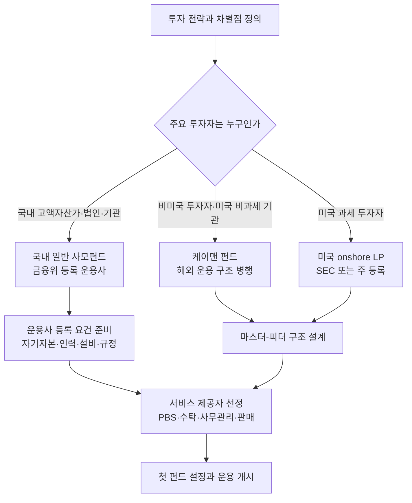

> This chunk is a verbatim extract of the source report. It is general information. It is not legal, tax, or investment advice. Read HF-REF-00 for the full notice.

<!-- chunk-body:start -->
## 2. 설립 전 핵심 의사결정

설립 절차에 들어가기 전에 세 가지 질문에 먼저 답해야 합니다. 어떤 전략으로 수익을 낼 것인지, 누구의 자금을 받을 것인지, 어느 관할권의 법률 아래에서 펀드를 만들 것인지입니다. 이 세 가지가 정해져야 조직 규모, 필요한 인프라, 규제 부담, 초기 자본의 크기가 결정됩니다.

### 2.1 투자 전략 선택

**표 2-1** 주요 헤지펀드 전략별 설립 요건 비교

| 전략 | 수익 원천 | 핵심 인력 | 인프라 요구 | 운용 용량 | 국내 적용 시 유의점 |
|---|---|---|---|---|---|
| 주식 롱숏 | 종목 선별 알파, 숏 포지션으로 시장 위험 축소 | 섹터 애널리스트, PM | PBS 대차, 잔고관리 전산, 리스크 시스템 | 중간 | 2025년 3월 공매도 재개 이후 대차 상환기간 제한과 잔고관리 전산 의무 |
| 롱바이어스드 | 순매수 노출과 종목 선별 | PM, 애널리스트 | 기본 수준 | 중간 이상 | 상승장 성과는 크지만 하락장 방어력을 따로 입증해야 함 |
| 이벤트 드리븐·메자닌·공모주 | 인수합병, 구조조정, 공모주 배정, CB·BW·EB | 딜 소싱, 법률·신용 분석 인력 | 딜 네트워크, 비상장 자산 평가 체계 | 작음~중간 | 비시장성 자산이 50%를 넘으면 개방형 펀드 불가, 공매도 거래자의 CB·BW 취득 제한 |
| 상대가치·차익거래 | 가격 괴리의 수렴 | 퀀트, 트레이더 | 저지연 실행, 레버리지 | 중간 | 레버리지 400% 한도, 증권거래세 0.20% |
| 매크로 | 금리·환율·원자재의 방향성 | 이코노미스트, 트레이더 | 선물·외환 거래 인프라 | 큼 | 해외 파생상품 접근성, 외환 규제 |
| 퀀트·시스템 | 통계적 신호, 팩터 | 퀀트 리서처, 엔지니어 | 데이터·백테스트·실행 시스템 | 전략별 상이 | 회전율이 높으면 거래세 부담이 크고 모델 거버넌스가 필요 |
| 멀티전략·멀티매니저 | 다수 독립 팀의 비상관 수익 합산 | 다수 PM 팀, 중앙 리스크 조직 | 대규모 공통 플랫폼 | 매우 큼 | 규모의 경제가 전제되어 설립 단계 모델로 부적합 |
| 픽스드인컴 | 캐리, 신용 스프레드 | 채권 운용역 | 레포·신용 인프라 | 큼 | 국내에서는 증권사 레포펀드 비중이 컸으나 최근 비중이 줄어듦 |

신설 운용사에게 권할 만한 원칙은 **검증 가능한 단일 핵심 전략으로 시작하는 것**입니다. 멀티매니저 플랫폼은 최근 업계에서 가장 빠르게 성장한 모델이지만, 중앙 리스크·데이터·실행 인프라와 수백 명 규모의 인력이 있어야 작동하므로 설립 단계의 모델로는 적합하지 않습니다. 전략 하나에 집중하면 인력과 시스템을 최소화할 수 있고, 투자자에게 수익 원천을 명확하게 설명할 수 있습니다. 트랙레코드가 쌓인 뒤에 인접 전략을 추가하는 방식이 성장 경로로서 가장 안전합니다.

국내 시장에서 전략을 고를 때에는 제도 변화를 함께 고려해야 합니다. 2025년 공매도 전면 재개로 롱숏 전략의 운용 여건은 정상화되었지만, 대차 상환기간 제한과 잔고관리 전산 의무가 새로 생겼습니다. 2025년 상법 개정으로 이사의 충실의무 대상이 주주까지 확대되는 등 지배구조 환경이 바뀌고 있어 이벤트 드리븐·행동주의 전략의 기회도 넓어지고 있습니다. 반면 회전율이 높은 퀀트 전략은 2026년부터 0.20%로 오른 증권거래세를 비용 모델에 반드시 반영해야 합니다.

### 2.2 관할권 선택

**표 2-2** 펀드 설립 관할권 비교

| 구분 | 국내 일반 사모펀드 | 미국 onshore 펀드 | 케이맨 offshore 펀드 |
|---|---|---|---|
| 주요 투자자 | 국내 고액자산가, 법인, 기관 | 미국 과세 투자자 | 비미국 투자자, 미국 비과세 기관 |
| 대표 법적 형태 | 투자신탁 | Delaware 유한파트너십(LP) | 면제회사(Exempted Company) 또는 면제 유한파트너십 |
| 운용사 규제 | 금융위원회 등록 | SEC 등록 투자자문업자 또는 면제 보고 자문업자, 경우에 따라 주(state) 등록 | 운용사 소재지 규제를 따름 |
| 펀드 규제 | 설정 후 2주일 이내 보고 | 투자회사법 3(c)(1)·3(c)(7) 면제, Regulation D 사모 발행 | CIMA 등록 (투자자별 최소 청약 10만 달러 등) |
| 장점 | 국내 판매망, 원화 자금, 국내 시장 접근성 | 세계 최대 자금 시장 접근 | 세제 중립성, 글로벌 기관 투자자에게 익숙한 표준 |
| 부담 요인 | 투자자 수·레버리지 한도, 판매사 의존 | 규제 준수 비용, 투자자 적격성 요건 | 이사회, 자금세탁방지 담당자, 현지 감사 등 운영 비용 |

국내 투자자 중심으로 시작한다면 국내 일반 사모펀드가 가장 현실적인 선택입니다. 해외 투자자 유치가 필요한 단계에 이르면 케이맨 마스터-피더 구조를 추가하는 방식이 일반적입니다. 다만 국내 운용사가 해외 펀드를 운용하려면 국내 금융투자업 규제, 외국환 거래 규정, 해외 현지 규제를 동시에 검토해야 하므로, 해외 구조는 운용 규모와 투자자 수요가 확인된 뒤에 도입하는 편이 비용 면에서 합리적입니다. 싱가포르나 홍콩에 운용 거점을 두는 방안도 있으며, 이 경우 현지 금융당국(싱가포르 MAS, 홍콩 SFC)의 인가가 별도로 필요합니다.

### 2.3 목표 투자자와 자금 조달 경로

**표 2-3** 투자자 유형별 특징과 접근 경로

| 투자자 유형 | 특징 | 요구 사항 | 접근 경로 |
|---|---|---|---|
| 국내 고액자산가 | 3억원 이상 투자하는 적격 일반투자자, 펀드당 49인 한도 | 판매사 상품 승인, 핵심상품설명서 | 증권사 PB·WM 채널, 운용사 직접 판매 |
| 국내 법인·전문투자자 | 투자자 수 한도의 부담이 상대적으로 작음 | 운용 보고, 전략 설명 | 직접 영업 |
| 국내 기관(연기금·공제회·보험사) | 대규모 자금, 긴 의사결정 기간 | 다년간의 트랙레코드, 운영 실사 | 위탁운용사 선정 공모, 제안 영업 |
| 시드·앵커 투자자 | 설정 초기의 대규모 자금 | 운용사 수익 공유 또는 지분 | 시딩 전문사, 계열 금융사, 대주주 |
| 해외 기관·패밀리오피스 | 달러 자금, 엄격한 운영 실사 | 독립 사무관리, 외부 감사, 표준 실사 질의서(DDQ) 응답 | 케이맨 펀드, 프라임 브로커의 투자자 소개(cap intro) |

설정 초기에는 투자자 수와 금액이 모두 작기 때문에 운용사 대주주의 자기자금 투자와 계열 금융사·지인 네트워크의 자금이 첫 자금이 되는 경우가 많습니다. 초기 투자자에게 보수를 할인해 주는 설립자 클래스(founder share class)는 해외에서 널리 쓰이는 유치 수단이며, 국내에서도 집합투자규약으로 투자자별 보수 조건을 달리 설계할 수 있는지 법률 검토를 거쳐 활용할 수 있습니다.

### 2.4 의사결정 흐름

아래 흐름도는 전략 정의에서 첫 펀드 설정까지 의사결정이 이어지는 순서를 정리한 것입니다.

<!-- chunk-body:end -->

Previous: [HF-REF-02](02-industry-and-market.md) · Index: [README](README.md) · Next: [HF-REF-04](04-legal-structure.md)
