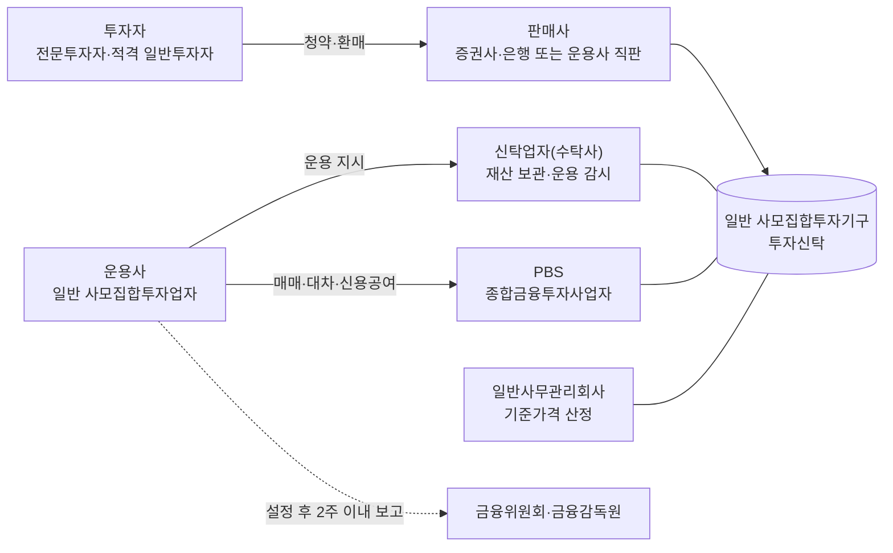
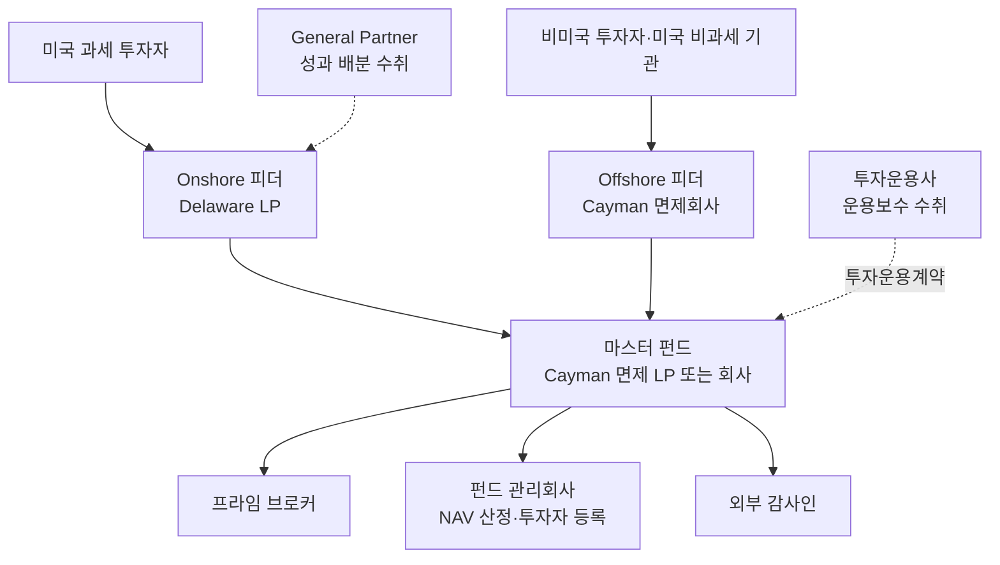

> This chunk is a verbatim extract of the source report. It is general information. It is not legal, tax, or investment advice. Read HF-REF-00 for the full notice.

<!-- chunk-body:start -->
## 3. 법적 구조

### 3.1 운용사와 펀드의 분리

헤지펀드 사업은 운용사(회사)와 펀드(투자기구)를 분리하는 구조를 기본으로 합니다. 운용사는 인력을 고용하고, 투자 의사결정을 내리고, 보수를 받는 영리 법인입니다. 펀드는 투자자의 자금이 모이는 별도의 법적 실체이며, 펀드 재산은 운용사의 고유재산과 분리되어 제3자인 수탁사나 커스터디언이 보관합니다. 이 분리 원칙은 운용사가 파산하거나 부정행위를 저지르더라도 투자자 재산을 보호하기 위한 장치이며, 기관 투자자가 운영 실사에서 가장 먼저 확인하는 항목이기도 합니다.

미국식 구조에서는 여기에 무한책임사원(General Partner, GP) 법인이 추가됩니다. 투자운용사(Investment Manager)는 운용보수를 받고, 펀드의 무한책임사원은 성과보수를 보수가 아닌 이익 배분(performance allocation) 형태로 받습니다. 성과보수를 이익 배분으로 받으면 세무상 성격이 달라질 수 있기 때문에 두 법인을 나누어 두는 것이 일반적입니다.

### 3.2 국내 구조: 투자신탁형 일반 사모펀드

국내 헤지펀드는 대부분 투자신탁 형태로 설정됩니다. 운용사는 위탁자로서 신탁업자(수탁사)에게 운용을 지시하고, 수탁사는 펀드 재산을 보관하면서 운용 지시가 법령과 집합투자규약에 맞는지 감시합니다. 증권 대차와 신용공여가 필요한 전략은 종합금융투자사업자가 제공하는 전담중개업무(PBS)를 이용하며, 기준가격 산정은 일반사무관리회사에 맡기는 경우가 많습니다.

**표 3-1** 국내 헤지펀드 참여 기관과 역할

| 기관 | 역할 | 비고 |
|---|---|---|
| 운용사(일반 사모집합투자업자) | 전략 수립, 운용 지시, 핵심상품설명서 작성, 규제 보고 | 금융위원회 등록 |
| 신탁업자(수탁사) | 재산 보관·관리, 운용 지시 감시, 분기별 자산 대사 | 일반투자자 대상 펀드는 감시 의무가 강화됨 |
| 판매사 | 적격투자자 확인, 핵심상품설명서 검증·교부, 운용이 설명서에 부합하는지 확인 | 운용사가 직접 판매하는 것도 가능 |
| PBS(종합금융투자사업자) | 증권 대차, 신용공여, 담보 관리, 재산 보관 연계 | 자기자본 3조원 이상 증권사만 영위 가능 |
| 일반사무관리회사 | 기준가격 산정, 펀드 회계 | 운용사가 산정 결과를 별도로 검증하는 것이 바람직함 |
| 외부감사인 | 펀드 재무제표 감사 | 원칙적으로 의무, 투자자 전원 동의 등 예외 인정 |
| 금융위원회·금융감독원 | 등록, 보고 접수, 검사와 제재 | |

### 3.3 글로벌 표준: 마스터-피더 구조

해외 기관 자금을 받는 헤지펀드는 대부분 마스터-피더 구조를 사용합니다. 미국 과세 투자자는 미국 델라웨어 유한파트너십(onshore 피더)에, 비미국 투자자와 미국 비과세 기관(연기금·재단 등)은 케이맨 면제회사(offshore 피더)에 투자하고, 두 피더가 하나의 마스터 펀드에 자금을 모아 단일 포트폴리오로 운용합니다. 미국 비과세 기관이 법인형 offshore 피더를 거치는 이유는 레버리지를 사용하는 펀드에서 발생할 수 있는 비관련 사업 과세소득(UBTI)을 차단하기 위해서입니다. 이 구조를 쓰면 투자자별 세무 요구를 충족하면서도 포트폴리오를 하나로 관리할 수 있어 매매 배분과 운영이 단순해집니다.

### 3.4 기타 구조

**표 3-2** 대안적 펀드·계좌 구조

| 구조 | 설명 | 활용 상황 |
|---|---|---|
| 별도 운용 계좌(SMA)·단독 펀드 | 대형 투자자 한 명을 위해 별도 계좌나 펀드를 운용 | 대형 기관이 맞춤 조건과 투명성을 요구할 때. 국내에서 계좌 형태로 운용하려면 투자일임업 등록이 필요 |
| 분리형 포트폴리오 회사(SPC) | 한 법인 안에 자산·부채가 분리된 여러 포트폴리오를 둠 | 여러 전략이나 클래스를 비용 효율적으로 운영할 때 |
| 운용 계좌 플랫폼 | 제3자 플랫폼이 계좌를 소유하고 운용사는 운용만 담당 | 신규 운용사가 기관 수준의 트랙레코드를 쌓을 때 |
| UCITS 등 공모형 대체투자 펀드 | 유동성·레버리지 제한을 받는 공모형 헤지 전략 | 유럽 개인 투자자 채널로 확장할 때 |
| 공모 액티브 ETF | 사모 전략의 운용 방식을 상장 ETF로 제공 | 사모 규제의 투자자 수 한도를 넘어 확장할 때 (국내 타임폴리오, 해외 Man Group 사례) |

<!-- chunk-body:end -->

Previous: [HF-REF-03](03-founding-decisions.md) · Index: [README](README.md) · Next: [HF-REF-05](05-kr-registration-and-roadmap.md)
