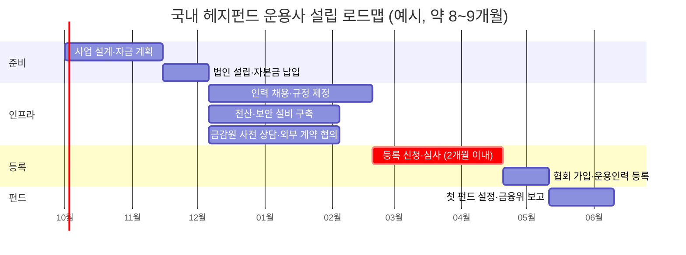

> This chunk is a verbatim extract of the source report. It is general information. It is not legal, tax, or investment advice. Read HF-REF-00 for the full notice.

<!-- chunk-body:start -->
## 4. 국내 설립 절차

### 4.1 일반 사모집합투자업 등록 요건

일반 사모집합투자업을 영위하려면 금융위원회에 등록해야 하며, 등록하지 않고 영업하는 것은 금지됩니다(자본시장법 제249조). 등록 요건은 법률(제249조의3)과 시행령(제271조의2)에 나뉘어 규정되어 있으며, 핵심은 다음 표와 같습니다.

**표 4-1** 일반 사모집합투자업 등록 요건

| 요건 | 내용 | 근거 |
|---|---|---|
| 법적 형태 | 상법상 주식회사 또는 대통령령으로 정하는 금융회사, 또는 국내에 영업소를 둔 외국 집합투자업자 | 법 제249조의3 제2항 제1호 |
| 자기자본 | 10억원 이상 (법률은 5억원 이상으로 정하고, 시행령이 10억원으로 규정) | 법 같은 항 제2호, 시행령 제271조의2 제3항 |
| 인력 | 상근 임직원인 투자운용인력 3명 이상 | 시행령 제271조의2 제4항 제1호 |
| 물적 설비 | 업무 수행에 필요한 전산설비와 통신수단, 사무실 등 업무 공간과 사무장비, 전산설비를 보호할 보안설비 | 시행령 제271조의2 제4항 제2호 |
| 임원 | 금융회사의 지배구조에 관한 법률 제5조의 임원 자격 요건 충족 | 법 같은 항 제4호 |
| 대주주 | 충분한 출자능력, 건전한 재무상태, 사회적 신용 | 법 같은 항 제5호 |
| 재무·사회적 신용 | 경영건전성 기준 충족, 법령 위반 사실이 없을 것, 최근 5년간 등록 직권말소 이력이 없을 것 등 | 법 같은 항 제6호, 시행령 |
| 이해상충 방지 | 운용사와 투자자 사이, 특정 투자자와 다른 투자자 사이의 이해상충을 방지하는 체계 | 법 같은 항 제7호 |
| 심사 기간 | 신청서 접수 후 2개월 이내 결정 (보완 기간 등은 산입하지 않음) | 법 제249조의3 제4항·제5항 |
| 등록 후 의무 | 등록 요건 유지 (자기자본·대주주 요건은 완화된 기준 적용) | 법 제249조의3 제8항 |

금융위원회는 요건을 갖추지 못했거나, 신청서를 거짓으로 작성했거나, 보완 요구를 이행하지 않은 경우가 아니면 등록을 거부할 수 없습니다. 등록이 결정되면 등록부에 기재되고 관보와 홈페이지에 공고됩니다. 등록 이후에도 방심해서는 안 됩니다. 2021년 개정법은 자기자본 유지 요건 미준수, 일정 기간의 미영업, 투자운용인력 요건 미준수, 월별 업무보고서 미제출 등을 등록 직권말소 사유로 정했습니다. 운용인력이 퇴사하여 3명 아래로 줄어드는 상황은 신설 운용사에서 흔히 일어나므로 인력 계획에 여유를 두어야 합니다.

투자운용인력은 금융투자협회에 등록된 금융투자전문인력이어야 하며, 자격과 경력 요건은 협회 규정을 따릅니다. 등록 신청 전에 채용 예정자의 등록 가능 여부를 확인해 두는 것이 좋습니다.

### 4.2 단계별 로드맵

아래 로드맵은 일반적인 소요 기간을 바탕으로 작성한 예시입니다. 실제 기간은 준비 수준, 보완 요구 횟수, 외부 계약 협의 속도에 따라 크게 달라집니다.

**표 4-2** 국내 운용사 설립 로드맵 (예시)

| 단계 | 예상 기간 | 주요 작업 | 산출물 |
|---|---|---|---|
| 1. 사업 설계 | 1~2개월 | 전략·목표 투자자·수익 모델 확정, 창업 멤버와 대주주 구성, 자금 계획 수립 | 사업계획서, 3개년 재무 모델, 주주간 계약 |
| 2. 법인 설립 | 2~4주 | 주식회사 설립, 자본금 10억원 이상 납입, 사무실 임차 | 법인 등기, 사업자 등록 |
| 3. 인력·규정 | 2~3개월 | 상근 투자운용인력 3명 이상 채용, 준법감시인 선임, 내부통제기준·이해상충방지·위험관리 규정 제정, 책무구조도 작성 | 규정집, 인력 현황 |
| 4. 전산·설비 | 2개월 (3단계와 병행) | 주문관리·리스크·잔고관리 시스템, 보안설비, 업무 연속성 계획 | 시스템 구축·테스트 기록 |
| 5. 사전 협의 | 2개월 (3단계와 병행) | 금융감독원 사전 상담, PBS·수탁사·사무관리사·판매사와 협의 | 협의 결과, 거래 의향서 |
| 6. 등록 신청·심사 | 2개월 이내 (보완 기간 별도) | 등록신청서 제출, 보완 요구 대응, 현장 확인 | 등록 결정, 관보·홈페이지 공고 |
| 7. 협회 가입·인력 등록 | 2~4주 | 금융투자협회 회원 가입, 투자운용인력 등록 | 등록 확인 |
| 8. 첫 펀드 설정 | 1개월 내외 | 집합투자규약·핵심상품설명서 작성, 수탁·PBS·판매 계약, 설정 | 설정 후 2주일 이내 금융위원회 보고 |

<!-- roadmap -->

<!-- chunk-body:end -->

Previous: [HF-REF-04](04-legal-structure.md) · Index: [README](README.md) · Next: [HF-REF-06](06-kr-fund-rules-controls-tax.md)
