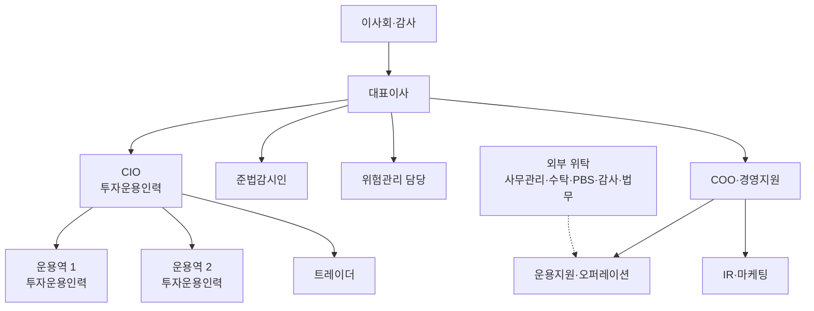
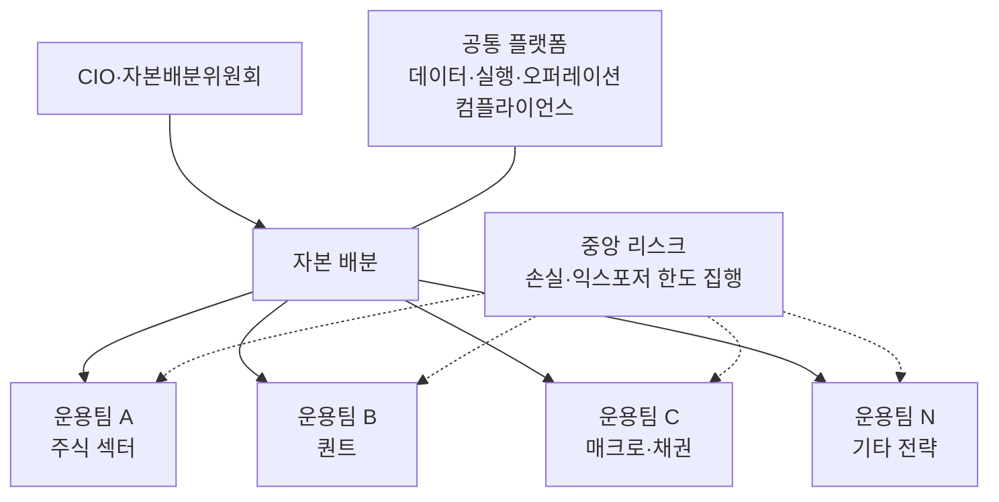

> This chunk is a verbatim extract of the source report. It is general information. It is not legal, tax, or investment advice. Read HF-REF-00 for the full notice.

<!-- chunk-body:start -->
## 6. 조직도

### 6.1 기능 체계

헤지펀드 운용사의 기능은 투자를 직접 수행하는 프런트 오피스, 투자를 통제하고 검증하는 미들 오피스, 거래와 회계를 처리하는 백 오피스, 그리고 회사를 운영하고 자금을 모으는 경영·영업 부문으로 나뉩니다. 소규모 운용사는 한 사람이 여러 기능을 맡지만, 운용과 통제(리스크·준법)의 보고 라인만큼은 처음부터 분리해야 합니다.

**표 6-1** 헤지펀드 운용사의 기능별 직무

| 부문 | 직무 | 주요 책임 | 설립 초기 운영 방식 |
|---|---|---|---|
| 경영 | 대표이사(CEO) | 경영 총괄, 대외 관계, 자금 조달 | 창업자가 맡는 경우가 많음 |
| 프런트 | 최고투자책임자(CIO) | 투자 철학, 최종 포트폴리오 결정, 위험 예산 배분 | 대표이사 겸직이 흔함 |
| 프런트 | 포트폴리오 매니저(PM)·운용역 | 전략 또는 북(book) 운용, 성과 책임 | 투자운용인력 3명 요건의 핵심 |
| 프런트 | 애널리스트·퀀트 리서처 | 기업·산업 분석, 모델 연구 | 운용역과 겸직하거나 소수 채용 |
| 프런트 | 트레이더 | 주문 집행, 최선 집행, 대차와 유동성 관리 | 운용역 겸직 또는 1명 |
| 미들 | 위험관리 담당(CRO) | 한도 설정·점검, 스트레스 테스트, 유동성 관리, 독립 보고 | CIO와 분리된 보고 라인 필수 |
| 미들 | 준법감시인(CCO) | 내부통제기준, 이해상충 관리, 임직원 개인 매매, 판매 자료 심사, 규제 보고 | 법정 선임, 운용 업무 겸직 금지 |
| 미들 | 오퍼레이션 | 매매 확인, 결제, 운용사·PB·수탁사 간 잔고 대사, 기업 행위 처리 | 1명과 외부 위탁 병행 |
| 백 | 펀드 회계·기준가 | 기준가격 산정 결과 검증 | 사무관리회사 위탁과 내부 검증 병행 |
| 백 | 재무·경영지원(CFO·COO) | 운용사 회계, 예산, 인사, 계약 관리 | 1명이 겸직 |
| 백 | IT·데이터·보안 | 시스템 운영, 데이터 관리, 사이버보안, 업무 연속성 | 외부 위탁 중심 |
| 영업 | IR·마케팅 | 투자자 관계, 판매사 협업, 실사 질의서 대응, 보고서 작성 | 대표이사와 1명 |
| 영업 | 법무 | 규약·계약 검토 | 외부 법무법인 활용 |

### 6.2 국내 신설 운용사의 최소 조직

등록 요건과 실무 운영을 함께 고려하면 국내 신설 운용사의 현실적인 최소 조직은 7~9명입니다. 투자운용인력 3명(CIO 포함 가능), 준법감시인 1명, 위험관리 담당 1명(규모에 따라 겸직 가능 여부 확인), 운용지원·오퍼레이션 1명, 경영지원·IR 1~2명으로 구성하고, 기준가 산정·수탁·대차·감사·법무는 외부에 맡기는 형태입니다.

> **핵심** 위험관리 담당이 CIO에게 보고하는 구조는 피해야 합니다. 위 조직도처럼 리스크와 준법 기능이 대표이사(또는 이사회)에게 직접 보고하도록 설계해야 운용 부문이 한도를 넘었을 때 통제 기능이 실제로 작동합니다. 기관 투자자는 운영 실사에서 이 보고 라인을 반드시 확인합니다.

### 6.3 성장 단계별 조직

**표 6-2** 성장 단계별 조직 설계 (예시)

| 단계 | 운용자산 규모 (예시) | 인원 | 조직 특징 | 우선 투자 영역 |
|---|---|---|---|---|
| 1단계 설립기 | 1,000억원 미만 | 7~10명 | CIO 중심의 단일 전략, 백 오피스 외부 위탁 최대화, 통제 기능의 최소 독립성 확보 | 트랙레코드, 규정과 시스템의 완성도 |
| 2단계 성장기 | 1,000억~5,000억원 | 10~25명 | 전략 2~3개로 확장, 전담 리스크팀, IR 전담 인력, 기준가 내부 검증(shadow NAV) | 판매 채널 다변화, 기관 운영 실사 대응 |
| 3단계 기관화 | 5,000억원 이상 | 25명 이상 | 복수 PM 체제, 중앙 리스크·데이터 플랫폼, 해외 펀드 구조 검토 | 인재 육성 체계, 거버넌스와 승계 계획 |

### 6.4 유형별 조직 원형

운용 전략에 따라 조직이 작동하는 원리가 다릅니다. 설립자는 자신의 전략에 맞는 원형을 선택하고, 그 원형이 요구하는 핵심 기능에 먼저 투자해야 합니다.

**표 6-3** 헤지펀드 조직의 네 가지 원형

| 원형 | 조직 원리 | 핵심 기능 | 대표 사례 |
|---|---|---|---|
| 단일 매니저 펀더멘털 | CIO가 소수의 애널리스트와 함께 집중 포트폴리오를 운용 | 리서치 깊이, 의사결정 규율 | TCI, 엘리엇 |
| 시스템·퀀트 | 연구, 엔지니어링, 실행이 하나의 파이프라인으로 연결되고 모델을 중앙에서 관리 | 데이터 인프라, 연구 플랫폼, 모델 거버넌스 | 르네상스, 투시그마, AQR, Man AHL |
| 멀티매니저 플랫폼 | 다수의 독립 운용팀(pod)에 자본을 배분하고 중앙 리스크가 손실 규칙을 집행 | 자본 배분, 중앙 리스크, 인재 확보, 공통 플랫폼 | 밀레니엄, 시타델, Point72, Balyasny |
| 매크로 | 소수의 핵심 의사결정자와 리서치 조직, 또는 체계적 매크로 연구 조직 | 거시 리서치, 파생상품 실행 | 브리지워터 |

멀티매니저 플랫폼의 구조는 다음과 같습니다. 각 운용팀은 배분받은 자본 안에서 독립적으로 운용하고, 중앙 리스크 조직은 팀별 손실과 익스포저 한도를 실시간으로 점검합니다. 밀레니엄의 경우 운용팀이 배분 자본 대비 5% 손실을 내면 자본이 줄어들고 7.5% 손실을 내면 퇴출된다는 규칙이 업계에 널리 알려져 있습니다.

### 6.5 보상 구조

운용사의 수익은 운용보수와 성과보수로 구성되고, 임직원 보상은 기본급과 성과급으로 구성됩니다. 멀티매니저 플랫폼에서는 운용팀이 자신이 만든 손익(팀 비용 차감 후)의 일정 비율을 성과급으로 받는 공식형 보상이 표준이며, 이 보상은 펀드 비용으로 투자자에게 전가되는 경우가 많습니다. 단일 전략 운용사는 회사 전체 성과보수를 재원으로 성과급 풀을 만들고 기여도에 따라 배분하는 방식이 일반적입니다.

신설 운용사가 보상 체계를 설계할 때 고려할 원칙은 세 가지입니다. 첫째, 핵심 인력의 이탈이 곧 등록 요건 위반(투자운용인력 3명 미만)으로 이어질 수 있으므로 지분 참여나 이연 보상으로 장기 근속 동기를 만들어야 합니다. 둘째, 성과급은 단기 수익이 아니라 위험 조정 성과와 한도 준수 여부를 반영해야 합니다. 셋째, 운용 인력이 자신이 운용하는 펀드에 직접 투자하도록 하여 투자자와 이해관계를 일치시키는 것이 좋습니다. 지배구조 법령은 일정 규모 이상 금융회사의 성과보수 이연 지급을 규정하고 있으므로, 적용 대상 여부를 설립 단계에서 확인해야 합니다.

<!-- chunk-body:end -->

Previous: [HF-REF-07](07-offshore-setup.md) · Index: [README](README.md) · Next: [HF-REF-09](09-investment-risk-execution.md)
