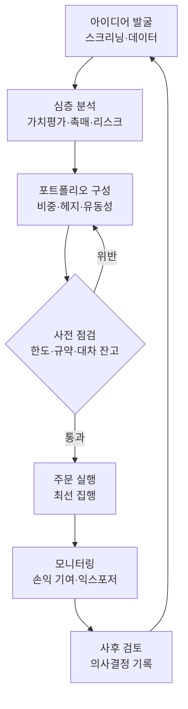

> This chunk is a verbatim extract of the source report. It is general information. It is not legal, tax, or investment advice. Read HF-REF-00 for the full notice.

<!-- chunk-body:start -->
## 7. 운영 방식

### 7.1 투자 프로세스

헤지펀드의 투자 프로세스는 아이디어 발굴에서 사후 검토까지 이어지는 순환 구조입니다. 모든 주문은 실행 전에 한도·규약·대차 잔고를 자동으로 점검하는 단계를 통과해야 하며, 이 단계가 있어야 운용 재량과 통제가 함께 작동합니다.

각 단계에서 운용사가 갖추어야 할 장치는 다음과 같습니다. 아이디어 발굴 단계에서는 투자 대상의 범위와 스크리닝 기준을 문서로 정해 두어야 운용이 전략에서 벗어나는 것(스타일 드리프트)을 막을 수 있습니다. 심층 분석 단계에서는 투자 논리, 기대 수익의 원천, 손절 또는 재검토 조건을 기록합니다. 포트폴리오 구성 단계에서는 종목·섹터·요인별 노출과 유동성을 함께 고려하여 비중을 정합니다. 사후 검토 단계에서는 수익과 손실을 의사결정 기록과 대조하여 운이 아닌 과정의 품질을 평가합니다. 투자위원회를 운영한다면 회의록과 의사결정 근거를 남겨야 하며, 이 기록은 기관 투자자의 운영 실사에서 투자 규율을 입증하는 자료가 됩니다.

### 7.2 리스크 관리 체계

리스크 관리는 헤지펀드의 생존을 결정하는 기능입니다. 수익은 운용역의 역량에서 나오지만, 치명적인 손실은 대부분 한도 체계의 부재나 한도 미준수에서 나옵니다.

**표 7-1** 위험 유형별 측정 지표와 통제 수단

| 위험 | 측정 지표 | 통제 수단 (예시) |
|---|---|---|
| 시장 위험 | 총·순 익스포저, 베타, VaR, 스트레스 손실 | 총·순 익스포저 한도, 섹터·단일 종목 한도, 시나리오별 손실 한도 |
| 손실 관리 | 고점 대비 손실(drawdown) | 단계별 규칙 (예: 일정 손실 도달 시 위험 축소, 추가 손실 시 운용 중단 검토) |
| 유동성 위험 | 일평균 거래량 대비 청산 소요 일수, 환매 조건과의 정합성 | 환매 주기·통지 기간 설정, 환매 제한 조항, 비시장성 자산 비중 관리 |
| 레버리지 | 법정 레버리지 비율(순자산의 400%), 총 레버리지 | 법정 한도보다 낮은 내부 한도 설정 |
| 쏠림(크라우딩) | 헤지펀드 보유 집중도, 공매도 잔고 비율, 대차 수수료 | 쏠림 지표 모니터링, 숏 스퀴즈 대비 한도 |
| 거래상대방 위험 | PB·장외파생 상대방별 노출 | 복수 PB 활용, 담보 관리 |
| 운영 위험 | 오류·사고 건수, 대사 불일치 건수 | 이중 확인(4-eyes) 원칙, 3자 대사, 권한 분리 |
| 모델 위험 | 모델 변경 이력, 실제 성과와 모델 예측의 괴리 | 모델 변경 승인·검증 절차, 코드 접근 통제 |
| 규제 위험 | 한도 위반, 보고 누락 | 주문 전 컴플라이언스 점검, 규제 보고 일정표 |

손실 규칙은 사전에 수치로 정하고 예외 없이 집행할 때 의미가 있습니다. 멀티매니저 운용사들이 운용팀별 손실 한도를 기계적으로 집행하는 이유는 손실을 본 운용역이 스스로 위험을 줄이기 어렵다는 행동 편향 때문입니다. 단일 전략 운용사도 같은 원리를 펀드 단위와 종목 단위에 적용할 수 있습니다.

### 7.3 트레이딩과 실행

실행 체계는 주문관리시스템(OMS)과 체결관리시스템(EMS)을 중심으로 구성됩니다. 주문은 OMS에서 사전 컴플라이언스 점검(규약 한도, 법정 한도, 공매도 가능 잔고)을 거친 뒤 EMS나 증권사 주문 채널로 전달되고, 체결 결과는 다시 OMS와 포트폴리오 관리 시스템에 반영됩니다. 운용사는 최선 집행 정책을 문서화하고, 거래 비용 분석(TCA)으로 브로커와 주문 방식의 성과를 정기적으로 점검해야 합니다.

국내 시장에서는 두 가지를 추가로 고려해야 합니다. 첫째, 공매도 주문은 펀드 계좌별 잔고 범위 안에서만 나가도록 시스템으로 통제하고, 주문 기록을 5년간 보관해야 합니다. 둘째, 증권거래세 0.20%와 매매 수수료를 포함한 총 거래 비용을 전략의 기대 수익과 비교하여 적정 회전율을 관리해야 합니다.

<!-- chunk-body:end -->

Previous: [HF-REF-08](08-organization.md) · Index: [README](README.md) · Next: [HF-REF-10](10-operations-and-providers.md)
