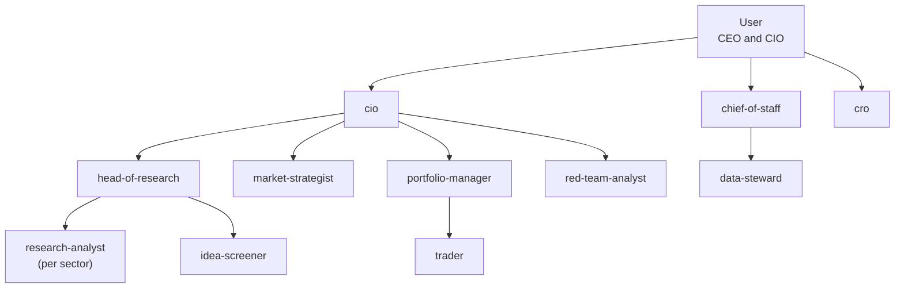
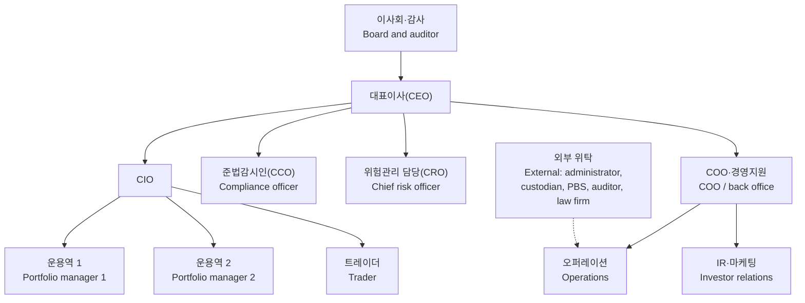

# HFT-ORG-001 — Hedge Fund Standard Organization Blueprint

## 1. Document control

| Field | Value |
|---|---|
| Document ID | HFT-ORG-001 |
| Title | Hedge Fund Standard Organization Blueprint |
| Version | 0.6 |
| Date | 2026-09-24 |
| Status | Draft for founder review |
| Owner | Advisor (main session) |
| Baseline | CCGS v1.1.1 (7ed2c3e) |
| Writing standard | ASD-STE100 writing rules. Checked manually in v0.1; the STE lint helper is a P3 deliverable. |
| Working files | The names design-spec, question-spec, wf1.json, assess-compact.md, orgmap.json, verifier-issues.md, review.txt, and mapping.txt refer to files in [`evidence/`](evidence/README.md). |
| Scope | The target hedge-fund organization: functions, human-required roles, reporting lines, agent roster, archetype variants, delegation rules, control points, recurring artifacts, lifecycle, and benchmark principles |

This document is not legal advice. It is not tax advice. It is not
investment advice. The source report states this rule at HF-REF-00. Do not
rely on any control point or legal citation in this document. Get advice
from the Financial Supervisory Service (FSS), a law firm, and an
accounting firm first.

**Change history**

| Version | Date | Change |
|---|---|---|
| 0.1 | 2026-09-24 | Initial draft. |
| 0.2 | 2026-09-24 | Mission reset after founder rounds 1-3; activation waves; W1 information core. |
| 0.3 | 2026-09-24 | Kept ceo-office in W2 (Erratum 01: W1 11, W2 23 total, W3 29 total). Applied DEC-17 to §8 and §9. Recorded DEC-17 to DEC-24 in §14. Defined the 8 /stock-pitch sections (DEC-23). |
| 0.4 | 2026-09-24 | Recorded DEC-25, DEC-29, DEC-30, and DEC-32 in §14, and marked Q35 and Q36 as not asked. Changed the /refresh-facts cadence in §11A to "on request" (DEC-35). |
| 0.5 | 2026-09-24 | Reconciled with DEC-17 to DEC-38: no order drafting (DEC-30) in §2A, §3, and §6; confidential data (DEC-32) in §2A and §13; fixed seats (DEC-18), limit approval (DEC-19), and review depth (DEC-20) in §8 and §9; the virtual investment committee (DEC-22) and the stage scalar (DEC-21) in §11; new §11A.4 to §11A.8 (DEC-26, DEC-27, DEC-28, DEC-31, DEC-33); the principle priority (DEC-25) in §12; the question list in §14. |
| 0.6 | 2026-09-25 | Applied the founder's P2 answers (p2/P2-00-INDEX.md §4): minutes owner (P2-C-01), notification channel (P2-D-01, P2-D-02), and price provider (P2-D-03). |

## 2. Purpose and basis

This document is the base frame for the target organization. The founder
asked for this base frame before any agent or skill build starts. It sets
the standard hedge-fund organization structure that the rest of the
transition plan (HFT-PLAN-001) builds toward.

This blueprint follows the report chunks in `docs/hedge-fund-setup/ref/`
(HF-REF-00 to HF-REF-20). It does not add strategy advice beyond what the
report states. Where a fact is missing from the loaded chunks, this
document marks it GAP. Where a statement is a reasonable extension of a
cited fact, not a direct quote, this document marks it INFERENCE.

Every agent role in Section 6 supports a human role from Section 3. No
agent takes over a human-required role. Section 4 lists the roles the law
reserves for a real person and states this rule again in full.

This blueprint is not the T2 (knowledge-service organization) target that
`docs/org-migration-review/README.md` assessed. That review found 41.4% of
CCGS components reusable for a T2 target (agency or consulting firm). A
hedge fund is a different shape. Its domain content is close to T2 (mostly
new). Its control process (decision records, traceability, change
control, gates) is close to T1 (a software product organization, 70.3%
reusable). This blueprint sets the organization. The reuse decision itself
is out of scope here and belongs to `TRANSPLANT-MANIFEST.md`.

## 2A. Mission and founder decisions

The agent organization gives the founder, one user, all the investment
information that a hedge-fund organization produces. The user holds the
CEO and CIO roles together (DEC-03). The information areas are research,
investment direction (house view), risk, stock picking, and market
analysis (DEC-09).

Rules:

- The user makes every investment decision. Agents give information,
  analysis, and recommendations with a confidence level.
- Agents do not draft or send orders. Agents record hypothetical
  model-portfolio positions (DEC-30).
- Holdings and personal data stay in a gitignored local directory. Wave
  W1 uses no classification scheme (DEC-32).
- Every number carries a source and an as-of date.
- Every stock call and every house-view change goes through the bull
  case, the bear case, and the synthesis (DEC-16).
- The output serves the user's own decisions. It is not advice to third
  parties.

Three rounds of founder decisions set this mission reset. See
[QUESTIONS.md](QUESTIONS.md) and `evidence/design-addendum-01.md`. The
table below lists the decisions that shape this blueprint.

| DEC | Question | Answer | Effect on this blueprint |
|---|---|---|---|
| DEC-03 | Q03 founder role | CEO and CIO, combined | The user is the only decision maker for investment and firm matters (Section 5). |
| DEC-05 | Q05 archetype | Single-manager fundamental | Section 7 marks this archetype as selected. Quant rows stay CONDITIONAL. |
| DEC-06 | Q06 strategy | Long-biased | The cro agent must give bear-market stress information for the book (Section 6). |
| DEC-09 | Q09 scale, mission reset | Information core for one user | This section states the mission. Wave W1 sets the first roster (Section 6). |
| DEC-10 | Q10 control lines | The cro and the cco report to the user | Section 5 states this rule and its review trigger. |
| DEC-11 | Q11 front office | Sector analysts | research-analyst runs as one instance per sector cluster (Section 6). |
| DEC-12 | Q12 governance | Founder sole control | The key-person clause and the succession plan stay on the document list (Section 13). |
| DEC-13 | Q37 non-investment scope | Investment information first | Wave W1 covers investment information only. Wave W2 adds operations, IR, and regulatory reporting (Section 6). |
| DEC-14 | Q38 delivery | Briefings, reports, Q&A, alerts | Section 11A states the delivery cadence. |
| DEC-15 | Q39 coverage | Korean equities, macro, global indicators | Section 11A states the coverage rule. Coverage stays config data for a later US addition. |
| DEC-16 | Q40 conclusion method | Bull case, bear case, CIO synthesis | Section 8 states the bull/bear rule. Every call needs both cases and a synthesis. |

## 3. Functions

The table below lists every function named in HF-REF-08 표 6-1, plus the
governance and committee roles from §6.2 and §6.4. Keep the Korean role
name as the technical name. An English gloss follows the first use.

Read "Agent may do" and "Agent must not do" as INFERENCE in every row: the
loaded chunks describe the human function, not an agent's scope. Section 4
repeats the human-required rule for the roles marked "Yes" below.

| # | Division | Role (Korean, technical name) | Responsibilities | Legal basis and citation | Human required | Agent may do (INFERENCE) | Agent must not do (INFERENCE) |
|---|---|---|---|---|---|---|---|
| 1 | Management | 대표이사(CEO) — chief executive officer | Run the firm. Manage external relations. Raise capital. The founder often holds this role at the start. | Officer qualification, Act on Corporate Governance of Financial Companies Art. 5; Capital Markets Act Art. 249-3(2)(4). HF-REF-05 표 4-1. | Yes — HF-REF-05 표 4-1: officer qualification requirement. | Draft the business plan and 3-year financial model. Prepare board material. Track the regulatory reporting calendar. Draft external communication. | Make the final management decision. Sign a contract or a registration filing. Speak for the board. |
| 2 | Front office | 최고투자책임자(CIO) — chief investment officer | Set investment philosophy. Make the final portfolio decision. Set the risk budget. Often combined with the CEO role. | May count toward the 3-person investment-management-staff requirement. HF-REF-05 표 4-1. | Yes — HF-REF-05 표 4-1: "3 or more full-time staff as investment-management staff." | Draft research summaries. Generate portfolio exposure reports. Collect pre-trade check results for review. | Make the final portfolio decision. Set the final risk budget. Approve an order. |
| 3 | Front office | 포트폴리오 매니저(PM)·운용역 — portfolio manager | Run a strategy or book. Own the performance result. Core of the 3-person staff requirement. | "3 or more full-time investment-management staff." Enforcement Decree Art. 271-2(4)(1). HF-REF-05 표 4-1. | Yes — HF-REF-08 표 6-1; HF-REF-05 표 4-1. | Draft the investment thesis and stop-loss condition. Organize screening results. | Make the trading decision. Submit an order. |
| 4 | Front office | 애널리스트·퀀트 리서처 — analyst / quant researcher | Analyze companies and industries. Research models. Often combined with the PM role, or a small hire. | Not stated — no statutory basis in this chunk. | No — no legal duty stated in this chunk. | Screen data. Help run a backtest. Draft a research note. | Make the final investment decision. Approve a model for live use. |
| 5 | Front office | 트레이더 — trader | Execute orders. Get best execution. Manage stock loans and liquidity. | Not stated. | No stated duty — but sending a live order is understood to need a human (INFERENCE). | Collect TCA data. Compare broker performance. Give liquidity and market-impact information. | Draft or send a live order (execution instruction) (DEC-30). |
| 6 | Middle office | 위험관리 담당(CRO) — chief risk officer | Set and check limits. Run stress tests. Manage liquidity. Report independently of the CIO. | At some firm sizes, the compliance officer may combine this role. HF-REF-06 §4.5. | Yes — HF-REF-06 §4.5: "depending on firm size, the compliance officer may combine the risk-officer role." | Monitor limits. Alert on a loss-rule breach. Run stress-test scenarios. Track crowding indicators. | Give final approval of a limit value. Approve an exception for the CIO. |
| 7 | Middle office | 준법감시인(CCO) — compliance officer | Set internal-control standards. Manage conflicts of interest. Log staff personal trading. Review sales material. Handle regulatory reporting. | The Act on Corporate Governance of Financial Companies requires this appointment; this officer must not also do asset management. HF-REF-06 §4.5. | Yes — HF-REF-06 §4.5: "the compliance officer must not also do asset-management work"; HF-REF-08 표 6-1: "statutory appointment, no combination with the management-operation role." | Check the pre-trade compliance log. Log personal-trading disclosures. Track the regulatory reporting calendar. Check sales material against a checklist. | Give the final compliance approval or rejection. Report to the regulator in person. |
| 8 | Middle office | 오퍼레이션 — operations | Confirm trades. Settle trades. Reconcile balances between the firm, the prime broker, and the custodian. Process corporate actions. | Not stated. | No stated duty. | Automate trade confirmation and balance reconciliation. Flag a mismatch. | Give the final approval of a reconciliation correction. |
| 9 | Back office | 펀드 회계·기준가(내부검증) — fund accounting / NAV internal check | Check the NAV result. "The administrator computes the NAV; the firm checks it independently." | Not stated. | No stated duty — but the final NAV sign-off is understood to be a human task (INFERENCE). | Auto-compare the administrator's NAV against internal records. Alert on a gap. | Give the final NAV confirmation or publication. |
| 10 | Back office | CFO·COO — chief financial / operating officer | Run firm accounting, budget, HR, and contract management. "One person often holds this role." | Not stated. | No stated duty. | Track budget execution. Organize the contract register. Help manage HR records. | Give final budget approval. Sign a contract. |
| 11 | Back office | IT·데이터·보안 — IT, data, and security | Run systems. Manage data. Handle cybersecurity and business continuity. "Mostly outsourced." | Not stated. | No stated duty. | Monitor system status. Manage backup and disaster-recovery check logs. | Make the final call on a security incident. Grant or revoke an access right. |
| 12 | Sales | IR·마케팅 — investor relations / marketing | Manage investor relations. Work with the distributor. Answer due-diligence questionnaires. Write reports. | Not stated. | No stated duty. | Draft DDQ answers. Draft the monthly report and the investor letter. Organize distributor communication logs. | Make a final promise or guarantee to an investor. Give final approval of investment advertising. |
| 13 | Sales (표 6-1 prints this role in the "영업" [sales] column) | 법무 — legal | Review fund rules and contracts. "Uses an outside law firm." | Not stated. | No stated duty — outsourcing is assumed. | Check contract clauses against a checklist. Track the fund-rule amendment history. | Give legal advice. Give the final review or signature on a contract. |
| 14 | Governance | 이사회·감사 — board and auditor | Sit at the top of the org chart. Oversee the CEO. | Not stated in this chunk (org-chart position only). | Yes (INFERENCE) — a director or auditor is normally a natural person; this chunk gives no article number. | Prepare board material. Draft minutes. Track agenda items. | Cast a vote. Give an audit opinion. |
| 15 | Governance | 투자위원회 — investment committee | When it runs, keep minutes and the decision record. Used as evidence of investment discipline in operational due diligence. | Not stated. | No — running this committee is optional ("if the firm runs one"), not a statutory duty. | Write the minutes. Document the decision record. Look up a past decision. | Vote in the investment committee. |
| 16 | Middle office / governance | 자산 평가 위원회 — asset valuation committee | Run the valuation rule that stops overvaluation of a non-marketable or distressed asset. A basic device to prepare before registration. | Not stated. | No stated duty — GAP: this chunk gives no membership, quorum, or voting procedure (see Section 13). | Gather valuation support material for a non-marketable asset. Track valuation changes. Check for a violation pattern. | Give the final valuation vote. |
| 17 | Governance / front office — CONDITIONAL: archetype = multi-manager | 자본배분위원회 — capital allocation committee | Decide capital allocation per trading pod (운용팀). | Not stated. | No stated duty — but its member, the CIO, is human-required. | Collect per-pod allocation performance data. Present allocation scenarios. | Give the final capital-allocation vote. |

Citation for every row: HF-REF-08 표 6-1, unless a row states a different
citation. Rows 14 and 17 also cite HF-REF-08 §6.2 and §6.4 (org-chart
sections).

## 4. Human-required roles and the legal basis

The law needs real people in three places (F-10):

1. **3 full-time investment-management staff.** Enforcement Decree
   (시행령) Art. 271-2(4)(1); HF-REF-05 표 4-1. The CIO and the PM roles in
   Section 3 count toward this number.
2. **A compliance officer (준법감시인)** who does not also do asset
   management. Act on Corporate Governance of Financial Companies;
   HF-REF-06 §4.5.
3. **Qualified officers.** Act on Corporate Governance of Financial
   Companies Art. 5; HF-REF-05 표 4-1.

A director or auditor (이사회·감사) is normally a natural person. HF-REF-08
§6.2 gives only the org-chart position, with no article number, so this
rule is INFERENCE.

**Do not assign an agent to a human-required role.** An agent may draft,
check, and log for the CEO, the CIO, the PM, the CRO, or the CCO. An agent
must never make the final call these roles hold, sign a filing, or
represent the firm to the regulator or the board. Section 3's "Agent must
not do" column lists the exact boundary for each role.

## 5. Reporting lines and independence rules

### 5.1 W1 information-core reporting lines

The cro agent reports to the user (CEO). Its verdicts stay
non-overridable by other agents (Section 8, DEC-10). Revisit this rule
before external money arrives (HF-REF-08 §6.2).

This diagram shows the wave-W1 roster (Section 6). Solid lines are
reporting lines. The user is the only decision maker (DEC-03, Section
2A).

### 5.2 W2 fund-operation reporting lines (from HF-REF-08 §6.2)

This diagram applies from wave W2, when the founder starts fund setup
(Section 6). It keeps the CEO and CIO boxes separate, because HF-REF-08
§6.2 states them as separate seats; the user holds both under DEC-03.

This diagram matches HF-REF-08 §6.2. Solid lines are internal reporting
lines. The dotted line marks an outsourced relationship.

### 5.3 Independence rules

- **Risk must not report to the CIO.** HF-REF-08 §6.2 names this the
  "핵심" (key) rule: "위험관리 담당이 CIO에게 보고하는 구조는 피해야 합니다"
  ("avoid a structure where the risk officer reports to the CIO"). An
  institutional investor checks this reporting line in every operational
  due-diligence review.
- **준법감시인 (the compliance officer) must not do asset management.**
  HF-REF-06 §4.5.
- **A CCO/CRO combination needs a legal review first.** HF-REF-06 §4.5:
  "depending on firm size, the compliance officer may also hold the
  risk-officer role." Do not combine the roles until counsel confirms the
  firm qualifies for this exception.
- **External oversight comes from the distributor (판매사) and the
  custodian (수탁사), not from an internal reporting line.** The
  distributor checks that management matches the summary prospectus and
  can demand a fix. The custodian watches management instructions and
  reconciles fund assets every quarter. HF-REF-06 §4.3 표 4-3.

### 5.4 Q03 and Q10 resolution

The founder decided Q03 and Q10. The user holds the CEO and CIO roles
together (DEC-03). The cro and the cco report to the user (DEC-10). This
is the founder's own choice, not the report's recommended answer: the
report recommends the CRO and CCO report outside the CEO's line when one
person holds CEO and CIO, because the CEO's line is then also the CIO's
line (HF-REF-08 §6.2).

The W1 diagram (Section 5.1) shows this reporting line for the
information core. Revisit DEC-10 before external money arrives. An
institutional investor checks the CRO reporting line in every operational
due-diligence review (HF-REF-08 §6.2).

## 6. Standard agent roster

This roster follows design-spec §3 exactly. Every agent listed is an AI
subagent that supports the human role named in "Supports." No agent in
this table replaces a human-required role from Section 4.

The following prohibited actions apply to every agent in this roster, in
every row, in addition to any row-specific entry:

- Draft an order.
- Send an order.
- Sign a filing or a contract.
- Give the final NAV.
- Give the final compliance approval.
- Give the final limit approval.
- Make an investor promise.
- Give legal advice.

The "CCGS donor skeleton" column names the CCGS agent whose file skeleton
the new agent copies: the frontmatter, the collaboration protocol, and the
named mechanism. No game content transfers (Strategy C). The evidence for
each mechanism is in `evidence/assess-compact.md` (agents-gates area).

| # | Agent ID | Tier | Supports (human role) | Reports to | Wave | Condition | Primary chunks | CCGS donor skeleton | Prohibited beyond the general list |
|---|---|---|---|---|---|---|---|---|---|
| 1 | ceo-office | 1 | 대표이사(CEO) — firm management, from wave W2 (chief-of-staff holds the W1 briefing role) | CEO (human) / board | W2 | core | HF-REF-08 표 6-1; HF-REF-05 표 4-1 | producer | — |
| 2 | cio | 1 | CIO — runs the bull, bear, and synthesis process; writes the synthesis with a confidence level (DEC-16) | CEO | W1 | core | HF-REF-08 §6.2; HF-REF-09 §7.1 | creative-director (protocol shape only) | Must not set the final risk budget. Must not decide for the user (Section 2A). |
| 3 | cro | 1 | 위험관리 담당(CRO) — gives risk information: exposure, concentration, liquidity, bear-market stress, and regulatory limits (DEC-06, DEC-13) | user (CEO) — never cio (DEC-10) | W1 | core | HF-REF-09 §7.2; HF-REF-14 | technical-director (Strategic Decision Workflow shape); systems-designer (Formula Output Format for limit formulas) | Its verdict must not be overridden by any other agent (Section 8). |
| 4 | cco | 1 | 준법감시인(CCO) | user (CEO), DEC-10 | W2 | core | HF-REF-06 §4.5; HF-REF-14 | technical-director (Strategic Decision Workflow shape); security-engineer (per-change review checklist) | Its verdict must not be overridden by any other agent (Section 8); must not do asset management. |
| 5 | coo | 1 | CFO·COO | CEO | W2 | core | HF-REF-08 표 6-1; HF-REF-10 §7.4 | producer | — |
| 6 | portfolio-manager | 2 | 포트폴리오 매니저(PM)·운용역 — turns approved calls into a model portfolio view and sizing proposals | cio | W1 | core | HF-REF-08 표 6-1; HF-REF-09 §7.1 | game-designer (Question-First Workflow shape only) | Must not submit an order. |
| 7 | fund-operations-lead | 2 | 오퍼레이션 | coo | W2 | core | HF-REF-10 §7.4 표 7-2 | release-manager (strict, no-skip staged pipeline) | — |
| 8 | head-of-research | 2 | 애널리스트 (research function) | cio | W1 | core | HF-REF-08 표 6-1; HF-REF-09 §7.1 | game-designer (Question-First Workflow shape only) | — |
| 9 | head-of-trading | 2 | 트레이더 (execution function) | cio | W3 | core | HF-REF-09 §7.3; HF-REF-06 §4.4 | release-manager (no-skip pipeline; halt on a failed step) | Must not send a live order. |
| 10 | investor-relations-lead | 2 | IR 전담 인력 | coo | W3 | core | HF-REF-08 §6.3 표 6-2 (2단계 row) | community-manager (no-unverified-claims rule; crisis communication) | Must not make an investor promise. |
| 11 | technology-lead | 2 | IT·데이터·보안 | coo | W2 | core | HF-REF-12 §7.8 | technical-director | — |
| 12 | legal-counsel-liaison | 2 | 법무 (external law-firm interface) | ceo-office, with a dotted line to cco | W2 | core | HF-REF-08 표 6-1 | No domain donor; game-designer (Question-First Workflow shape only) | Must not give legal advice. |
| 13 | risk-analytics-lead | 2 | CRO's 전담 리스크팀 (stage 2) / 중앙 리스크·데이터 플랫폼 (stage 3) | cro | W3 | core | HF-REF-08 §6.3 표 6-2; HF-REF-09 §7.2 | analytics-engineer (metric taxonomy; dashboard specification) | Shares the cro's non-override protection (Section 8). |
| 14 | quant-research-lead | 2 | CIO (수석 연구자 겸직 — may double as chief researcher, INFERENCE; see §7.2) | cio | CONDITIONAL | CONDITIONAL (Q25 = C or D) | HF-REF-08 표 6-3; HF-REF-12 §7.8 | prototyper (research isolation rule; PROCEED/PIVOT/KILL) | No approval authority over a model change (Section 9). |
| 15 | model-governance-lead | 2 | model-change control (new control function) | cro — never to research | CONDITIONAL | CONDITIONAL (Q25 = C or D) | HF-REF-12 §7.8; HF-REF-14 §8.5 표 8-3 | lead-programmer (standards enforcement; code review); qa-lead (evidence-type table) | Gives technical input only; approval rests with cro/cco (Section 9). |
| 16 | research-analyst | 3 | 애널리스트·퀀트 리서처 — writes the bull case and the full research note | cio (stage 1) / head-of-research (stage 2+) | W1 | core — one instance per sector cluster (DEC-11) | HF-REF-08 표 6-1; HF-REF-09 §7.1 | game-designer (Question-First Workflow shape only) | Must not make the final investment call. |
| 17 | trader | 3 | 트레이더 — gives execution information only: liquidity, market impact, trading cost, including the 0.20% securities transaction tax (HF-REF-06 §4.6) | cio (stage 1) / head-of-trading (stage 2+) | W1 | core — execution support only | HF-REF-08 표 6-1; HF-REF-09 §7.3 | No domain donor; lead-programmer (Implementation Workflow shape only) | Must not send a live order. |
| 18 | investor-relations | 3 | IR·마케팅 | coo (stage 1) / investor-relations-lead (stage 2+) | W2 | core | HF-REF-08 표 6-1; HF-REF-11 §7.7 | community-manager (discipline only) | Must not make an investor promise. |
| 19 | risk-analyst | 3 | CRO's team | cro | W3 | core | HF-REF-09 §7.2 표 7-1 | systems-designer (Formula Output Format) | — |
| 20 | compliance-analyst | 3 | CCO's team | cco | W2 | core | HF-REF-06 §4.5 | security-engineer (per-change review checklist) | — |
| 21 | regulatory-reporting-specialist | 3 | CCO's team (regulatory calendar) | cco | W2 | core | HF-REF-06 §4.3 표 4-3 | release-manager (staged pipeline; version numbering) | — |
| 22 | operations-analyst | 3 | 오퍼레이션 | fund-operations-lead | W2 | core | HF-REF-10 §7.4 표 7-2 | qa-tester (checklist and case writing) | Must not give the final reconciliation-correction approval. |
| 23 | fund-accountant | 3 | 펀드 회계·기준가 (shadow NAV, fee calc) | fund-operations-lead | W2 | core | HF-REF-10 §7.4; HF-REF-11 §7.6 | economy-designer (canonical registry awareness) | Must not give the final NAV confirmation. |
| 24 | investor-communications-writer | 3 | IR reporting drafts | investor-relations-lead | W3 | core | HF-REF-11 §7.7 | writer | Must not make an investor promise. |
| 25 | security-officer | 3 | IT·보안 | technology-lead | W2 | core | HF-REF-12 §7.8 | security-engineer | Must not grant or revoke an access right alone. |
| 26 | governance-secretary | 3 | 이사회·감사 / 투자위원회 minutes, succession tracking | ceo-office / board | W3 | core | HF-REF-16 §9.3; HF-REF-17 §9.5 표 9-5 | producer (records; milestone tracking) | Must not cast a board or investment-committee vote. |
| 27 | quant-researcher | 3 | 퀀트 리서처 | quant-research-lead | CONDITIONAL | CONDITIONAL (Q25 = C or D) | HF-REF-08 표 6-1; HF-REF-12 §7.8 | prototyper (isolation rule; worktree isolation) | Must not approve a model for live use. |
| 28 | data-engineer | 3 | IT·데이터 (code pipeline) | technology-lead | CONDITIONAL | CONDITIONAL (Q25 = C or D) | HF-REF-12 §7.8 | devops-engineer (branching strategy; CI); engine-programmer (data pipeline code) | — |
| 29 | valuation-analyst | 3 | 자산 평가 위원회 support | cro / valuation-committee chair | not applicable (DEC-05, DEC-06) | not applicable — Q06 = B, long-biased (DEC-06) | HF-REF-06 §4.5 | economy-designer (canonical registry; conflicting-value flags) | Must not give the final valuation vote. |
| 30 | macro-economist | 3 | 이코노미스트 (macro archetype) | cio | not applicable (DEC-05, DEC-06) | not applicable — archetype = single-manager fundamental (DEC-05) | HF-REF-03 §2.1 표 2-1; HF-REF-09 §7.1 | systems-designer (Formula Output Format) | — |
| 31 | pod-lead | 3 | 운용팀(pod) lead | capital-allocation-support / cio (solid line); central risk, dotted oversight via cro | not applicable (DEC-05, DEC-06) | not applicable — archetype = single-manager fundamental (DEC-05) | HF-REF-08 §6.4 표 6-3 | producer (scope and schedule discipline) | Must not exceed the pod loss limit the cro sets. |
| 32 | capital-allocation-support | 3 | 자본배분위원회 | cio / 자본배분위원회 | not applicable (DEC-05, DEC-06) | not applicable — archetype = single-manager fundamental (DEC-05) | HF-REF-08 §6.4 표 6-3 | economy-designer (source and sink balance model) | Must not give the final capital-allocation vote. |
| 33 | chief-of-staff | 1 | The user (CEO and CIO) — daily briefing, weekly report, and routing | user | W1 | core (DEC-09) | Not in HF-REF — new role for the mission reset | producer (coordination, milestone tracking) | Must not change an analyst's conclusion (Section 8). |
| 34 | market-strategist | 2 | Market analysis — macro, rates, FX, flows, and the KOSPI/KOSDAQ regime | cio | W1 | core (DEC-09) | Not in HF-REF — new role for the mission reset | systems-designer (Formula Output Format for indicators) | Must not make the final house-view decision. |
| 35 | red-team-analyst | 3 | Bear case and thesis attack, for every stock call and house-view change | cio | W1 | core (DEC-09, DEC-16) | Not in HF-REF — new role for the mission reset | design-review (adversarial reviewer brief) | Must not write the bull case it attacks (Section 8). |
| 36 | idea-screener | 3 | Idea generation — valuation, earnings, and event screens for the sector analysts | head-of-research | W1 | core (DEC-09) | Not in HF-REF — new role for the mission reset | balance-check (outlier detection) | Must not make the final investment call. |
| 37 | data-steward | 3 | Data sources and freshness — source registry, adapters, and coverage config | chief-of-staff | W1 | core (DEC-09) | Not in HF-REF — new role for the mission reset | economy-designer (canonical registry) | Must not change a source value without a logged reason. |

### 6.1 Wave counts, with the arithmetic

- **W1: 11 agent definitions.** Five new agents (chief-of-staff,
  market-strategist, red-team-analyst, idea-screener, data-steward, rows
  33–37) plus six agents kept or moved from the old roster (cio, cro,
  portfolio-manager, research-analyst, trader, and head-of-research, rows
  2, 3, 6, 8, 16, 17). research-analyst runs as one instance per sector
  cluster (DEC-11). 5 + 6 = 11.
- **W2: 11 agents named in addendum §4, plus ceo-office.** The addendum
  names 11 agents moved to W2: cco, coo, fund-operations-lead,
  investor-relations, compliance-analyst,
  regulatory-reporting-specialist, operations-analyst, fund-accountant,
  legal-counsel-liaison, technology-lead, and security-officer (rows 4,
  5, 7, 18, 20, 21, 22, 23, 12, 11, 25). ceo-office (row 1) also moves to
  W2: chief-of-staff takes its W1 briefing role, and ceo-office keeps
  supporting firm management once fund setup starts. The addendum's own
  count text states "11 more, 22 in total"; it does not name ceo-office in
  that count. The Advisor keeps ceo-office in W2 because it supports
  the fund-setup documents (business plan, financial model, registration
  pack). `evidence/design-addendum-01.md` Erratum 01 records this
  correction. 11 + 1 = 12. Running total after W1 and W2: 11 + 12 = 23.
- **W3: 6 agents.** head-of-trading, investor-relations-lead,
  investor-communications-writer, risk-analyst, risk-analytics-lead, and
  governance-secretary (rows 9, 10, 24, 19, 13, 26). Running total after
  W1, W2, and W3: 23 + 6 = 29.
- **Conditional: 0 to 4.** quant-research-lead, model-governance-lead,
  quant-researcher, and data-engineer (rows 14, 15, 27, 28). These
  activate only when Q25 = C or D.
- **Not applicable: 4.** macro-economist, pod-lead,
  capital-allocation-support, and valuation-analyst (rows 30, 31, 32, 29).
  DEC-05 and DEC-06 rule out their archetype or strategy condition.

**Final counts.** W1 = 11, W1 + W2 = 23, W1 + W2 + W3 = 29, plus 0 to 4
conditional on Q25 = C or D. Addendum §4 gave 22 and 28 because it left
ceo-office out of the W2 list; Erratum 01 corrects this.

These counts are design estimates (design-spec §3), not a fixed
headcount.

## 7. Archetype variants

DEC-05 selected the single-manager fundamental archetype (Section 7.1).
The other archetypes below stay in this document as reference.

HF-REF-08 표 6-3 names four archetypes. This section adds a fifth,
hybrid, variant as INFERENCE, because the loaded chunks do not give it a
table row of its own.

### 7.1 단일 매니저 펀더멘털 — single-manager fundamental (TCI, Elliott)

This is the roster in Section 6 with no archetype-conditional rows active.
Key function: research depth and decision discipline (HF-REF-08 표 6-3).
No special caution beyond the general control model in Sections 8–9.

### 7.2 시스템·퀀트 — systematic / quant (Renaissance, Two Sigma, AQR, Man AHL) — CONDITIONAL archetype = quant

- **Roster change**: activate quant-research-lead and model-governance-lead
  at stage 1 (rows 14–15). Activate quant-researcher at any stage (row 27)
  and data-engineer at stage 2 if a code pipeline exists (row 28). The cio
  role may double as chief researcher — mark this INFERENCE; HF-REF-08 표
  6-3 names "데이터 인프라, 연구 플랫폼, 모델 거버넌스" (data infrastructure,
  research platform, model governance) as this archetype's key functions
  but does not state that the CIO may hold both roles.
- **Key functions**: data infrastructure, research platform, model
  governance (HF-REF-08 표 6-3).
- **Caution**: a high-turnover strategy must add the 0.20% securities
  transaction tax to the cost model (HF-REF-06 §4.6). The model-change
  control point (Section 9) needs CCO/CRO approval; the 2025 SEC penalty
  against Two Sigma is the report's cited reason (HF-REF-12 §7.8;
  HF-REF-14 §8.5 표 8-3).

### 7.3 멀티매니저 플랫폼 — multi-manager platform (Millennium, Citadel, Point72, Balyasny)

- **Roster change**: at stage 1, add only an embryonic central-risk
  function; the rest of the stage-1 roster stays close to the
  single-manager fundamental roster. At stage 3, activate pod-lead (row
  31, ×N pods) and capital-allocation-support (row 32); central risk grows
  into a full Tier-2 lead.
- **Key functions**: capital allocation, central risk, talent acquisition,
  a shared platform (HF-REF-08 표 6-3).
- **Caution — do not build this archetype's full roster at the founding
  stage.** The report states this model needs scale economics: "규모의
  경제가 전제되어 설립 단계 모델로 부적합" ("scale economics is a
  precondition, so this is not fit for a founding-stage model") — HF-REF-03
  §2.1 표 2-1. Even the stage-3 (25+ headcount) roster is a readiness
  step, not a full platform copy; a true platform model needs a staff
  count in the hundreds (HF-REF-03 §2.1).

### 7.4 매크로 — macro (Bridgewater)

- **Roster change**: activate macro-economist at stage 1 (row 30). Add a
  derivatives-trading execution role. The CIO may double as the economist
  — mark this INFERENCE; HF-REF-03 §2.1 표 2-1 names "이코노미스트,
  트레이더" (economist, trader) as this strategy's key staff but does not
  state that the CIO may hold both roles.
- **Key functions**: macro research, derivatives execution (HF-REF-08 표
  6-3).
- **Caution**: needs futures and FX execution infrastructure, plus a
  foreign-exchange-regulation review (HF-REF-03 표 2-1).

### 7.5 하이브리드 — hybrid, fundamental + quant (D.E. Shaw type) — INFERENCE

HF-REF-08 표 6-3 does not name a hybrid archetype. This row is built from
HF-REF-16 §9.3, which describes D.E. Shaw as "하이브리드 (퀀트와 재량)"
(hybrid: quant and discretionary).

- **Roster change (INFERENCE)**: combine the single-manager fundamental
  roster with the quant conditional roles (rows 14–15, 27–28). At growth
  stage 3, consider a collective-leadership body in place of a single CIO;
  HF-REF-16 §9.3 names D.E. Shaw's 7-person executive committee as the
  benchmark.
- **Key functions**: the union of Sections 7.1 and 7.2.
- **Caution**: a single-founder-CIO structure concentrates governance
  risk. D.E. Shaw's answer is collective leadership, not one founder-CIO
  (HF-REF-16 §9.3). Treat this as a growth-stage-3 design choice, not a
  founding-stage one.

## 8. Delegation matrix

Front-office and back-office agents must not spawn a control agent. The
`tools: Agent(...)` allow-list in each agent's frontmatter is a
harness-enforced mechanism, not a prose rule (F-08). The harness reads
this list and refuses a disallowed spawn. The pattern already exists
at `godot-specialist.md:4`, `unity-specialist.md:4`, and
`unreal-specialist.md:4`. Set each agent's allow-list to the "May spawn"
column below.

| Spawning agent | May spawn | Must not spawn |
|---|---|---|
| ceo-office | cio, coo (Tier-1 peers, on the founder's instruction); fund-operations-lead, technology-lead, legal-counsel-liaison, investor-relations-lead, governance-secretary | cro, cco, and every agent that reports to them (risk-analytics-lead, risk-analyst, compliance-analyst, regulatory-reporting-specialist, model-governance-lead) |
| cio | portfolio-manager, research-analyst, trader, head-of-research, head-of-trading, quant-research-lead, quant-researcher, macro-economist, pod-lead, capital-allocation-support | cro, cco, and every agent that reports to them |
| coo | fund-operations-lead, operations-analyst, fund-accountant, technology-lead, security-officer, data-engineer, investor-relations-lead, investor-relations, investor-communications-writer, legal-counsel-liaison | cro, cco, and every agent that reports to them |
| cro | risk-analytics-lead, risk-analyst | Every front-office or back-office agent (any agent under cio or coo in Section 6). |
| cco | compliance-analyst, regulatory-reporting-specialist | Every front-office or back-office agent (any agent under cio or coo in Section 6). |
| Every Tier-2 or Tier-3 agent | Only the agents that list it as "Reports to" in Section 6, reversed | cro, cco, and every agent that reports to them, in every case. |

**Non-override rule.** No agent may override, edit, or suppress a cro or
cco verdict. Only the founder or the board may accept a documented
exception. A control review runs from a skill, not from the agent under
review — the reviewed agent must never approve its own control check.

**Review depth rule (DEC-20).** Judgment outputs use full review: a stock
call, the house view, and a limit. Routine outputs, such as the daily
briefing, use lean review.

**Bull, bear, and synthesis rule (DEC-16).** This rule applies from wave
W1, for every stock call and every house-view change.

- red-team-analyst writes the bear case. It must never write the bull
  case it attacks.
- cio writes the synthesis only after both the bull case and the bear
  case exist.
- chief-of-staff compiles the information products. It must not change
  an analyst's conclusion.
- No agent may edit a cro verdict. This restates the non-override rule
  above for the bull, bear, and synthesis process.

## 9. Control points

"Hard block" marks a control that stops the action until it passes. A "No"
value marks a detection or record-keeping control: it does not itself stop
the action, but a downstream step (a correction, a statutory filing) still
applies. Rows 17–23 are new; the design record and the verifier review
found them missing from the earlier draft (Section 14 lists the source
corrections).

Per DEC-17, "hard block" does not mean a hook. A hard-block control needs
the cro verdict (and the cco verdict from W2) plus a recorded approval by
the user. A control decision without that receipt reads NOT ASSESSED. The
action does not proceed until the receipt exists. Revisit hook
enforcement before real capital. DEC-18 keeps the cro (W1) and cco (W2)
seats fixed. No workflow mode skips them. They join every gate and every
cio synthesis.

| # | Control | Stage | Owner role | Rule | Hard block | Citation |
|---|---|---|---|---|---|---|
| 1 | Pre-trade compliance check | Before order submission | Trader / OMS, with rules set by cro and cco | Check the fund-rule limit, the statutory limit, and the short-sale-eligible balance before the order reaches the EMS. On a violation, return to portfolio construction. | Yes | HF-REF-09 §7.1, §7.3 |
| 2 | Loss rules | Portfolio monitoring | cro drafts; the founder approves | The cro drafts the loss limit as a number in advance. The founder approves it, and the limit lives in a config file (DEC-19). Enforce it with no exception. | Yes | HF-REF-09 §7.2 |
| 3 | Four-eyes check | Operations (settlement / reconciliation) | Operations | Use the four-eyes principle, three-way reconciliation, and segregation of duties to control operational risk. | Yes | HF-REF-09 §7.2 표 7-1 |
| 4 | Three-way reconciliation | Every day, after settlement | Operations | Match the firm's, the prime broker's, and the custodian's (or administrator's) balances and cash, every day. | No — a detection control; a mismatch needs a separate correction step. | HF-REF-10 §7.4 표 7-2 |
| 5 | Independent NAV computation | NAV calculation | Administrator (external) + fund accounting (internal check) | The firm must not set its own fund value. The administrator computes the NAV; the firm checks it. | Yes | HF-REF-10 §7.4 |
| 6 | Model-change control (code/model governance) | Model development and deployment lifecycle | cco/cro give the approval; the quant lead gives technical input only, with no approval authority (INFERENCE — HF-REF-12 §7.8 names no co-owner) | Put model-change approval, code-access rights, and change-history management in the compliance rules. The 2025 SEC penalty against Two Sigma is the cited reason. | Yes — CONDITIONAL: archetype = quant, code pipeline = yes. Not active in W1 (Q25 = B, DEC-29). | HF-REF-12 §7.8 |
| 7 | Short-sale balance management | Before a short-sale order | Trading / operations (OMS, short-sale balance system) | Let a sale order out only within the balance of each fund, discretionary, or trust account. | Yes | HF-REF-06 §4.4 표 4-4 |
| 8 | Five-year order-record retention | Record keeping | cco / operations | Keep the date, name, quantity, and staff name for every short-sale order for five years. | No — a statutory duty, not a trade-blocking gate. | HF-REF-06 §4.4 표 4-4 |
| 9 | Asset valuation committee / valuation rule | Asset valuation | Valuation committee / fund accounting | Prepare the pre-trade compliance function and the valuation-committee rule before registration. | Yes | HF-REF-06 §4.5 |
| 10 | 400% leverage limit | Portfolio, at all times | cro/cco | Keep derivative risk value, guarantees, borrowings, and effective borrowing at or under 400% of net assets. Set the internal limit lower than the statutory limit. | Yes | HF-REF-06 §4.3 표 4-3; HF-REF-09 §7.2 표 7-1 |
| 11 | 50% non-marketable-asset limit for open-end funds | Fund structure design | Legal / product design | Do not set up an open-end (redeemable-on-demand) fund when non-marketable assets pass 50% of the fund. | Yes | HF-REF-06 §4.3 표 4-3 |
| 12 | Distributor and custodian oversight | Ongoing operation (retail-investor funds) | Distributor / custodian (external) | The distributor checks the fund against the summary prospectus and can demand a fix. The custodian watches management instructions and reconciles assets every quarter. | Yes | HF-REF-06 §4.3 표 4-3 |
| 13 | General meeting on a redemption deferral | Liquidity-crisis governance | CEO / board / IR | Hold a general meeting of unit holders within 3 months of a redemption deferral. | Yes | HF-REF-06 §4.3 표 4-3 |
| 14 | Key-person clause | Fund structuring / ongoing | Legal / IR | Give investors a redemption right if a key person leaves or cannot act. | No — a negotiated contract term (CONDITIONAL). | HF-REF-14 §8.3 |
| 15 | Counterparty diversification (multiple prime brokers) | Counterparty setup / ongoing | cro / trading | Use more than one prime broker. Manage collateral to control the exposure per counterparty. | No | HF-REF-09 §7.2 표 7-1 |
| 16 | Crowding monitoring | Portfolio, ongoing | cro | Track crowding indicators. Set a short-squeeze limit. | CONDITIONAL — a hard block only once a limit is set. | HF-REF-09 §7.2 표 7-1 |
| 17 | Investor-count cap (NEW) | Fund structuring / subscription | cco / legal (INFERENCE — the chunk names no owner) | Keep the fund at 100 investors or fewer. Keep general (non-professional) investors at 49 or fewer. | Yes | HF-REF-06 §4.3 표 4-3 |
| 18 | 15-year disposal for management-participation holdings (NEW) | Portfolio holding period | cio / cco (INFERENCE) | Dispose of a management-participation investment (10% or more of the voting shares) within 15 years. | Yes | HF-REF-06 §4.3 표 4-3 |
| 19 | Transfer restriction (NEW) | Secondary transfer of fund units | cco / operations (INFERENCE) | Do not let a fund unit transfer to a person who is not a qualified investor. | Yes | HF-REF-06 §4.3 표 4-3 |
| 20 | Investment-advertising restriction (NEW) | Marketing / IR | cco / IR (INFERENCE) | Advertise only to a professional investor, or to a general investor above a set financial-product-balance threshold, by individual notice. | Yes | HF-REF-06 §4.3 표 4-3 |
| 21 | External audit duty (NEW) | External audit (cadence not stated in this chunk — GAP; §10 row 16 tracks it) | CFO·COO / board (INFERENCE) | Get an external audit as a rule. The only exception needs consent from every investor. | Yes | HF-REF-06 §4.3 표 4-3 |
| 22 | Securities-lending tenor limit (NEW) | Securities lending, for short sales | Trading / operations (INFERENCE) | Set each stock loan at 90 days or less. Even with a renewal, keep the total at or under 12 months. | Yes | HF-REF-06 §4.4 표 4-4 |
| 23 | Deferred performance-fee applicability check (NEW) | Firm setup (compensation design) | CEO / cco (INFERENCE) | Check, at the setup stage, whether the deferred-performance-pay rule for a larger financial firm applies to this firm. | No — a one-time determination; it becomes binding only if it applies. | HF-REF-08 §6.5 |

## 10. Recurring artifacts and regulatory calendar

Row 6 carries a correction. The report names the distributor, not an
internal CCO step, as the verifier of the summary prospectus (Section 14
lists the source correction). Row 16 is new.

| # | Artifact | Cadence or trigger | Owner | Legal basis | Citation |
|---|---|---|---|---|---|
| 1 | Fund-setup report (and change report) | Within 2 weeks of the fund's setup date; within 2 weeks of any later change (trigger) | cco / legal | 법 제249조의6 | HF-REF-06 §4.3 표 4-3 |
| 2 | Quarterly derivative / guarantee / borrowing report | Every quarter end | cco / operations | 법 제249조의7 제3항 | HF-REF-06 §4.3 표 4-3 |
| 3 | Ad-hoc report (for example, a redemption deferral) | Within 3 business days of the trigger event | cco | 법 제249조의7 제4항 | HF-REF-06 §4.3 표 4-3 |
| 4 | Monthly business report | Every month | coo / cco. A missed filing is grounds for the registration to lapse. | Not stated in this chunk. | HF-REF-05 §4.1; HF-REF-18 표 10-1 |
| 5 | Asset management report (자산운용보고서) | Given on a regular cycle — the exact cycle is not in this chunk (GAP). | IR / fund accounting | 법 제249조의8 제2항 | HF-REF-06 §4.3 표 4-3 |
| 6 | Summary prospectus (핵심상품설명서) | On fund setup or a later change (trigger) | The firm (cio/cco draft) writes it. The distributor (판매사, external) verifies it against the fund rules before it reaches a general investor. An internal cco review step before hand-off is INFERENCE; the chunk does not state it. | 법 제249조의4 | HF-REF-06 §4.3 표 4-3 |
| 7 | Monthly performance report | Every month, from the fund's first month, in a consistent format | IR | Not stated. | HF-REF-11 §7.7 |
| 8 | Investor letter | Quarterly or annual | IR / CEO | Not stated. | HF-REF-11 §7.7 |
| 9 | DDQ (standard due-diligence questionnaire) response | On investor request (trigger); kept current at all times | IR / coo | Not stated. | HF-REF-11 §7.7; HF-REF-18 표 10-1 |
| 10 | Accountability map (책무구조도) | Written once at setup; kept current after that | CEO (direct check) plus a duty assignment per officer | Not stated. | HF-REF-06 §4.5 |
| 11 | Internal control rule set (internal-control standard, conflict-of-interest prevention, risk management, personal trading, short-sale internal control, asset valuation) | Set at firm setup; updated on amendment | cco drafts it; the board adopts it. | Not stated. | HF-REF-05 표 4-2 (stage 3); HF-REF-18 표 10-1 |
| 12 | Short-sale balance submission (거래소 NSDS) | Every business day; submitted within 2 business days | Operations / trading system | Not stated. | HF-REF-06 §4.4 표 4-4 |
| 13 | Transaction cost analysis (TCA) | On a regular cycle | Trading / operations | Not stated. | HF-REF-09 §7.3 |
| 14 | Investment-committee minutes | At every meeting (trigger) | cio / investment-committee secretary | Not stated. | HF-REF-09 §7.1 |
| 15 | Business plan, 3-year financial model, shareholders' agreement | Produced once at setup stage S1; updated on a regular cycle | CEO / founding members | Not stated. | HF-REF-05 표 4-2 (stage 1) |
| 16 | External audit report (NEW) | Cadence not stated in the loaded chunks (GAP). | CFO·COO | 법 제249조의8 제2항 (외부 감사 원칙적 의무) | HF-REF-06 §4.3 표 4-3 |

## 11. Lifecycle

### 11.1 Setup stages, S1 to S8

Source: HF-REF-05 표 4-2 (duration and outputs); HF-REF-18 표 10-1 (exit
criteria).

| Stage | Duration | Outputs | Exit criteria |
|---|---|---|---|
| S1 — 사업 설계 (Business design) | 1–2 months | Business plan, 3-year financial model, shareholders' agreement | A strategy statement; a cost-included backtest or a past track record; a break-even AUM figure; a signed shareholders' agreement with a key-person clause and a succession plan. |
| S2 — 법인 설립 (Company incorporation) | 2–4 weeks | Corporate registration, business registration | Paid-in capital of 1 billion won or more, plus an operating-deficit buffer. |
| S3 — 인력·규정 (Staffing and rules) | 2–3 months | Rule set, staffing status | 3 or more full-time investment-management staff and a compliance officer in place (check association-registration eligibility; plan for staff turnover). Internal-control standards adopted by the board. The accountability map written. |
| S4 — 전산·설비 (Systems and facilities), parallel with S3 | 2 months | System build and test record | A demonstration and test record for order management, pre-trade compliance, risk, short-sale balance management, security, and the business continuity plan. |
| S5 — 사전 협의 (Pre-consultation), parallel with S3 | 2 months | Consultation result, letters of intent | A letter of intent or a contract with the PBS, the custodian, the administrator, the distributor, and the auditor. |
| S6 — 등록 신청·심사 (Registration application and review) | Within 2 months (a supplement period is separate) | Registration decision, official-gazette and website notice | The registration application filed after FSS pre-consultation; the registration decision notice and gazette publication received. |
| S7 — 협회 가입·인력 등록 (Association membership and staff registration) | 2–4 weeks | Registration confirmation | KOFIA membership and investment-management-staff registration complete. |
| S8 — 첫 펀드 설정 (First fund launch) | About 1 month | A report to the FSC within 2 weeks of setup | The fund rules, the summary prospectus, and the redemption/fee terms finalized; the distributor's product approval received; the FSC report filed within 2 weeks of setup. |

### 11.2 Growth stages, G1 to G3

Source: HF-REF-08 §6.3 표 6-2.

| Stage | AUM (example) | Headcount | Features | Priority area |
|---|---|---|---|---|
| G1 — 설립기 (Founding stage) | Under 100 billion won | 7–10 | A single CIO-led strategy. Back-office work outsourced as much as possible. Minimum independence for the control function. | Track record; complete rules and systems. |
| G2 — 성장기 (Growth stage) | 100–500 billion won | 10–25 | 2–3 strategies. A **dedicated risk team (전담 리스크팀)**. A dedicated IR role. Internal (shadow) NAV verification. | Diversify the sales channel; handle institutional operational due diligence. |
| G3 — 기관화 (Institutionalization stage) | Over 500 billion won | 25+ | A multiple-PM structure. A **central risk-and-data platform (중앙 리스크·데이터 플랫폼)**. Review of an offshore fund structure. | A talent-development system; governance and a succession plan. |

**Note the stage split.** The dedicated risk team (전담 리스크팀) belongs to
G2, not G3. The central risk-and-data platform (중앙 리스크·데이터 플랫폼)
belongs to G3. HF-REF-08 표 6-2 ties each phrase to a different stage. Do
not attach the G2 phrase to the G3 roster row (Section 14 lists the
source correction).

### 11.3 The per-idea investment cycle

Source: HF-REF-09 §7.1. This cycle repeats for every investment idea. It
is not a `project.stage` value; it runs like a story inside a growth
stage. `project.stage` tracks only the S1-S8 and G1-G3 axis and stays
one scalar. W1's daily, weekly, and monthly cadence runs beside it
(DEC-21).

1. **Idea generation** (screening, data) → a scope and screening-criteria
   document; this step prevents style drift.
2. **Deep analysis** (valuation, catalyst, risk) → the investment thesis,
   the source of the expected return, and the stop-loss or re-check
   condition.
3. **Portfolio construction** (weight, hedge, liquidity) → a position-size
   decision across name, sector, and factor exposure, with liquidity
   considered.
4. **Pre-trade check** (limit, fund rule, stock-loan balance) — **GATE**.
   A pass moves the idea to order execution. A violation returns the idea
   to portfolio construction.
5. **Order execution** (best execution) → the execution record.
6. **Monitoring** (P&L attribution, exposure) → the monitoring report.
7. **Post-trade review** (decision record) → compares the result against
   the decision record. When the investment committee runs, its minutes
   become operational-due-diligence evidence. The cycle then returns to
   step 1.

Wave W1 runs this investment committee as a virtual body: cio, cro,
portfolio-manager, and red-team-analyst present the case. The user
decides. The committee keeps minutes (DEC-22). In W1, chief-of-staff
keeps them (P2-C-01, 2026-09-25).

## 11A. Information products and delivery (W1)

Wave W1 delivers investment information through skills. Each skill has
one owner agent (Section 6). The table below lists every W1 product
(addendum §6).

| Skill | Owner agent | Output | Cadence |
|---|---|---|---|
| /daily-briefing | chief-of-staff | Market, portfolio, risk, and watch-list events on one page | Each trading day |
| /weekly-report | chief-of-staff | House view, sector reviews, pick-list changes, risk review | Weekly |
| /ask | chief-of-staff | Routed answer from the right agent, with sources | On demand |
| /event-alert | data-steward | Disclosure, price-move, and limit-proximity alerts | On event |
| /house-view | market-strategist, red-team-analyst, cio | Market direction with bull case, bear case, and synthesis | Weekly, and on regime change |
| /stock-pitch | research-analyst | Bull case and full research note for one stock, in 8 sections (DEC-23): 1 thesis, 2 business and industry structure, 3 competitive position, 4 financial analysis, 5 valuation, 6 catalysts and timeline, 7 risks and scenarios (bull, base, bear), 8 monitoring indicators and review triggers. The section list is INFERENCE for P2 approval. | On idea |
| /red-team-review | red-team-analyst | Bear case against one pitch or house view | For every pitch and house-view change |
| /cio-synthesis | cio | Synthesis, confidence level, and open questions for the user | After each red-team review |
| /idea-screen | idea-screener | Ranked candidate list with screen evidence | Weekly |
| /risk-report | cro | Exposure, concentration, liquidity, bear-market stress, regulatory limits | Daily summary, weekly full |
| /portfolio-review | portfolio-manager | Model portfolio view and sizing proposals | Weekly |
| /call-review | cio, chief-of-staff | Track record of past calls against outcomes, and model-portfolio performance against a benchmark | Monthly |
| /coverage-config | data-steward | Coverage universe, sector clusters, data sources | On change |
| /refresh-facts | data-steward | Re-verification of medium and high volatility values | On the user's request only (DEC-35); no fixed schedule |

The CCGS donors for these skills stay as in
[TRANSPLANT-MANIFEST.md](TRANSPLANT-MANIFEST.md): design-system (section
cycle) for /stock-pitch, design-review (adversarial review) for
/red-team-review, the team-* skeleton for the bull, bear, and synthesis
sequence, post-mortem and playtest-report for /call-review, and
consistency-check for the fact registry.

### 11A.1 Delivery cadence (DEC-14)

The founder chose four delivery forms: a daily briefing, a weekly
report, on-demand Q&A, and event alerts. Every product above uses one of
these four forms.

### 11A.2 Coverage rules (DEC-15)

- Coverage starts with Korean listed equities, at stock level.
- Coverage adds macro and global indicators, for market analysis.
- Coverage, data sources, and the sector taxonomy stay in config data.
  This lets US equities join later, with no code change.

### 11A.3 Default sector clusters (addendum §5, INFERENCE)

The clusters below are INFERENCE. Ask the founder to confirm them in a
later round.

1. IT, semiconductors, electronics
2. Batteries, autos, industrials
3. Financials
4. Healthcare and biotech
5. Consumer, retail, media, entertainment
6. Materials, energy, utilities

The taxonomy maps to KRX sectors now. It maps to GICS when US equities
join (DEC-15).

### 11A.4 Build order (DEC-26)

W1 builds /daily-briefing, /house-view, /event-alert, /idea-screen,
/stock-pitch, /red-team-review, and /cio-synthesis first. Risk,
portfolio, and quality products follow.

### 11A.5 First milestone (DEC-27)

The first milestone delivers one daily briefing, and one stock through
screen, pitch, red-team review, synthesis, and the virtual investment
committee (DEC-22).

### 11A.6 Delivery surface (DEC-28)

W1 delivers every product through an HTML dashboard and one
notification channel. The channel is Telegram (P2-D-01). The dashboard
is a locally generated file in a gitignored path. A Telegram message
can carry a market summary, but never holdings, positions, sizing, or
personal data (P2-D-02; DEC-32, R-14).

### 11A.7 Data sources (DEC-31)

W1 uses OpenDART for disclosures and financials. It uses exchange or
broker data for prices, volume, and flows. It uses web search for
regulation, news, and macro. The price provider is the KIS Developers
Open API, called through a read-only endpoint allow-list (P2-D-03,
DEC-30). P3 adds pykrx only for a data type that KIS does not give.

### 11A.8 Document language (DEC-33)

Agents, skills, rules, and procedures use ASD-STE100 English. Every W1
product uses Korean: the briefings, the reports, the answers, the
alerts, and the dashboard.

## 12. Principles to encode

This table is the "agent_encoding" field from `orgmap.json`, verbatim in
sense. Every row carries an INFERENCE mark: the report states the
benchmark principle, not an agent design. DEC-25 puts three principles
first: documented principles and open dissent, research-centred
collective management, and capacity control. In W1, cro and
portfolio-manager outputs carry capacity estimates. The loss and
exposure limits stay as config values (DEC-19).

| # | Principle | Benchmark firm | Report application | Agent encoding (INFERENCE) | Citation |
|---|---|---|---|---|---|
| 1 | Institutionalize risk rules | Millennium (numeric loss rules); the multi-manager central-risk function | Document loss and exposure limits from day one. Keep the risk reporting line separate from the CIO. | A cro agent reads the numeric limit from a config file. It auto-blocks or alerts on a breach. The reporting line stays fixed to CEO/board. | HF-REF-17 §9.5 표 9-5 |
| 2 | Control operating capacity | The top-20 firms' 2025 inflow limits and capital return; Bridgewater's Pure Alpha size cut; Renaissance's closed Medallion fund | Estimate capacity per strategy. Tell investors the new-money limit in advance. | A capacity-monitoring agent tracks the AUM-to-estimated-capacity ratio. It warns cio/CEO near the threshold. The subscription-limit decision stays with a human. | HF-REF-17 §9.5 표 9-5 |
| 3 | Invest in talent, data, and technology | D.E. Shaw and Renaissance's research organizations; Two Sigma's data infrastructure | Give key staff equity. Concentrate spend on what differentiates the firm. | An HR/compensation agent tracks the equity-vesting schedule and deferred-pay compliance. The pay decision stays with a human. | HF-REF-17 §9.5 표 9-5 |
| 4 | Govern for succession | Bridgewater's recovery after the founder's exit; D.E. Shaw's executive committee | Document the shareholders' agreement, the key-person clause, and the succession plan at the setup stage. | A governance-document agent tracks the version and renewal date of each document. Signature and the vote stay with a human. | HF-REF-17 §9.5 표 9-5 |
| 5 | Align the cost structure | Investor pushback on cost pass-through; the spread of hurdle-rate demands | Combine a low management fee with a high-water mark and a hurdle, in a transparent fee structure. | A fee-calculation agent computes and checks the performance fee against the high-water mark and the hurdle. The rate decision stays with a human. | HF-REF-17 §9.5 표 9-5 |
| 6 | Diversify the investor base | Millennium's growing high-net-worth share; Man Group and Timefolio's ETF channel | Use more than one distributor. Combine direct sales, institutional sales, and, over time, a public-offering product. | An IR agent tracks the AUM share by sales channel. It reports concentration. | HF-REF-17 §9.5 표 9-5 |
| 7 | Build independent operating infrastructure | The post-Madoff standard institutional investors now demand | Use an independent custodian, administrator, and auditor. Run a three-way reconciliation. | An operations agent runs the daily three-way reconciliation and escalates a mismatch. It never confirms the NAV itself. | HF-REF-17 §9.5 표 9-5 |
| 8 | Return capital to control scale; disclose the cost structure | Citadel | Return capital even in a strong year, to keep the firm from over-growing. Disclose the cost structure to investors in detail. | An IR-reporting agent auto-discloses each pass-through cost line in the investor report. | HF-REF-16 §9.3 |
| 9 | Enforce numeric loss rules with no exception | Millennium — "a pod that loses 5% has its capital cut; a pod that loses 7.5% is shut down" | Give each PM wide discretion, but fix the loss limit as a number in advance. Enforce it with no exception. | In the multi-manager archetype, an agent auto-enforces a per-pod loss line (example: 5%/7.5%; the founder must set the real number). | HF-REF-16 §9.3 |
| 10 | Assume a leverage-and-liquidity crisis together, in a stress test | LTCM (1998, about 25x leverage before the collapse) | Do not over-trust normal-market statistics. Run a stress test that assumes a leverage crisis and a liquidity crisis at the same time. | A cro agent runs a combined leverage-plus-liquidity stress scenario on a regular schedule. | HF-REF-14 §8.5 표 8-3 |
| 11 | Sum leverage across prime brokers | Archegos (2021 — hid leverage across several PBs' total-return swaps before the collapse) | Remember that a counterparty also carries risk. Sum leverage spread across prime brokers; do not track it broker by broker. | A counterparty-exposure agent sums leverage and exposure across every PB and reports the total to cro. | HF-REF-14 §8.5 표 8-3 |

## 13. Gaps that need counsel or later research

The loaded chunks do not answer every question this blueprint raises.
design-spec R-12 and `orgmap.json`'s gaps array name the same 12 items.
Get legal, tax, or compliance counsel before this organization relies on
any of them.

| # | Gap | What the loaded chunks give instead | Citation |
|---|---|---|---|
| 1 | MNPI (material non-public information) control and information-barrier procedure | A conflict-of-interest-prevention system only; no MNPI control or barrier design. This gap stays open until legal review, before wave W2 (DEC-32). | HF-REF-05 표 4-1 |
| 2 | Personal-trading pre-clearance workflow detail | Only a statement that the firm must make a personal-trading rule; no workflow. | HF-REF-08 표 6-1; HF-REF-18 표 10-1 (corrected — see Section 14) |
| 3 | Cybersecurity roles and incident-response process | "Security and business continuity" as one technology-stack line, with no role or process detail. | HF-REF-12 §7.8 |
| 4 | Domestic AML/KYC detailed procedure | The Lime/Optimus case, named but not an AML/KYC procedure. | HF-REF-16 §9.4 |
| 5 | Business continuity plan (BCP) detail standard | A BCP required only as a named deliverable. | HF-REF-05 표 4-2; HF-REF-18 표 10-1 |
| 6 | Service-provider (PBS/custodian/administrator) due-diligence procedure detail | Selection criteria only, not a due-diligence procedure. | HF-REF-10 §7.5 |
| 7 | Asset valuation committee composition, quorum, and voting procedure | Only a statement that an operating rule is needed. | HF-REF-06 §4.5 |
| 8 | Key-person departure: detailed replacement or succession process | Only a statement that a key-person clause is needed. | HF-REF-14 §8.3 |
| 9 | ESG / stewardship policy | Not mentioned in the loaded chunks. | — |
| 10 | Investor personal-data / privacy rule | Not mentioned in the loaded chunks. | — |
| 11 | Recommended standard performance-fee crystallization period | Only a statement that a shorter cycle is worse for the investor; no recommended value. | HF-REF-11 §7.6 |
| 12 | Model-governance procedure detail (change-approval workflow, code-review standard, access-tier scheme) | A requirement for model-change approval, code-access rights, and change-history management, with no procedure detail. | HF-REF-12 §7.8 |

**New risks from the mission reset (addendum §8).** These need design
attention, not counsel.

| ID | Risk | Mitigation | Needs design attention |
|---|---|---|---|
| R-13 | Confident but wrong information misleads the single decision maker. | Bull case, bear case, and synthesis for every call; confidence levels; the /call-review track record; sources and as-of dates on every number. | The confidence-level scale and the /call-review method (Section 11A). |
| R-14 | Information for the user reads as investment advice to others. | State in every product that it serves the user's own decisions. Do not distribute products to third parties in wave W1. | The product-labeling standard for every skill in Section 11A. |
| R-15 | Data freshness: a stale price or disclosure drives a call. | data-steward checks as-of dates. A product with stale data shows NOT ASSESSED for that part. | The as-of-date check method (data-steward, Section 6). |

## 14. Decisions that change this blueprint

The founder's answers to the questions in [QUESTIONS.md](QUESTIONS.md)
drive most of the design choices above. Every Q-ID in the table below is
decided, except Q35 and Q36. These two are not asked, because Q25 = B
(DEC-29). The mission reset added Q37 to Q40 (DEC-13 to DEC-16, addendum
§1). The table maps each question to the section it changes.

| Q-ID | Decision | Sections it changes | Why | Status |
|---|---|---|---|---|
| Q01 | Primary purpose of the agent organization | §6, §11 | Sets which stage to build first and the lifecycle emphasis (setup-only versus full cycle). | Decided — DEC-01 |
| Q02 | Agent-to-human-staff relationship | §3, §4, §8 | Changes the "agent may do" / "must not do" boundary and the delegation model. | Decided — DEC-02 |
| Q03 | The founder's own title | §5, §6 | Changes whether CEO and CIO combine; this changes the reporting-line diagram and the cio/ceo-office "reports to" cells. | Decided — DEC-03 |
| Q05 | Organization archetype | §6, §7 | Selects which archetype-conditional roster rows activate. | Decided — DEC-05 |
| Q06 | Core strategy | §7, §9 | Changes which archetype variant applies and which strategy-specific control points matter (short-sale, event-driven valuation, quant tax). | Decided — DEC-06 |
| Q07 | Jurisdiction and fund structure | §2, §11 | An offshore leg adds setup stages this blueprint does not cover; §11's S1–S8 track is the domestic track only. | Decided — DEC-07 |
| Q08 | Target investor type | §9, §10 | Affects the investor-count control point and which IR artifacts get priority. | Decided — DEC-08 |
| Q09 | Design/build scope (how many stages to implement now) | §6 | Sets which roster stage this blueprint's roster gets built first. | Decided — DEC-09 |
| Q10 | Reporting line for the control function | §5, §6 | Sets the cro/cco "reports to" cell directly. | Decided — DEC-10 |
| Q11 | Front-office segmentation basis | §6 | Sets the research-analyst instance count and how Tier 3 splits. | Decided — DEC-11 |
| Q12 | Governance and equity structure | §4, §6 | Sets when governance-secretary activates and what the board/IC human roles need. | Decided — DEC-12 |
| Q13 | Control-blocking mechanism | §8, §9 | Sets how the "hard block" column in §9 works: cro verdict plus recorded user approval, no hook. | Decided — DEC-17 |
| Q14 | How far control seats (cro, cco) may be skipped | §6, §8 | Keeps the fixed seats in every mode and every cio synthesis. | Decided — DEC-18 |
| Q15 | How to set the initial loss/exposure limit | §9 | The cro drafts the limits; the user approves; the limits live in config files. | Decided — DEC-19 |
| Q16 | Review intensity (modes.review_mode) | §8, §9 | Full review for judgment outputs; lean review for routine outputs. | Decided — DEC-20 |
| Q17 | Lifecycle structure | §11 | Keeps the S1-S8 and G1-G3 stage axis for the fund; W1 runs on daily, weekly, and monthly cycles. | Decided — DEC-21 |
| Q18 | Investment decision body | §3, §11 | A virtual investment committee (cio, cro, portfolio-manager, red-team-analyst) presents; the user decides; minutes are kept. | Decided — DEC-22 |
| Q19 | Stock-pitch standard depth | §11A | /stock-pitch uses the full 8-section format, plus the bull, bear, and synthesis parts. | Decided — DEC-23 |
| Q20 | Call-quality validation | §11A | Call record (/call-review) plus a model portfolio against a benchmark. | Decided — DEC-24 |
| Q21 | Organization-principle benchmark priority | §12 | Documented principles, research-centred collective management, and capacity control come first. | Decided — DEC-25 |
| Q25 | Code/model pipeline scope | §6, §9 | Analysis code only. data-engineer and the other three Q25 conditional agents stay off. | Decided — DEC-29 |
| Q26 | Agent execution authority | §3, §4, §8 | Agents analyze and record hypothetical model-portfolio positions. No agent drafts or sends an order. | Decided — DEC-30 |
| Q28 | MNPI / confidential-data handling | §3, §13 | Holdings and personal data stay in a gitignored local directory. Gap #1 in §13 stays open until legal review before W2. | Decided — DEC-32 |
| Q35 | (conditional on Q25 = C/D) Model/strategy-change approver | §9 | Sets the exact owner of the model-change control point. | Not asked (Q25 = B) |
| Q36 | (conditional on Q25 = C/D) Evidence-gate strength for a model-parameter change | §9 | Sets whether the model-change control's hard-block column stays "Yes" in every case, or only for a change that affects capital, leverage, or a limit. | Not asked (Q25 = B) |
| Q37 | Non-investment scope | §2A, §6 | Sets wave W1 as investment information only; sets wave W2 as operations, IR, and regulatory reporting. | Decided — DEC-13 |
| Q38 | Delivery form | §11A | Sets the four delivery forms: briefing, report, Q&A, and alert. | Decided — DEC-14 |
| Q39 | Coverage universe | §11A | Sets the coverage universe and the config-data rule for a later US addition. | Decided — DEC-15 |
| Q40 | Conclusion method | §8, §11A | Sets the bull case, bear case, and synthesis rule for every call. | Decided — DEC-16 |

Some questions do not change this document. These are: Q04 (repository
strategy); Q30 (AAA scope); Q32 (approval scope); Q33 (weekly hours);
and Q34 (agent model tier). These questions govern implementation and
tooling, not the organization design in this blueprint. Q22–Q24, Q27,
Q29, and Q31 change Section 11A: the build order, the first milestone,
the delivery surface, the data sources, the document language, and the
fact-refresh cadence (DEC-26, DEC-27, DEC-28, DEC-31, DEC-33, DEC-35).

**Questions with a changed option set.** Addendum §7 changed the
option set for six questions, to match the mission reset: Q17
(lifecycle cadence), Q19 (memo depth, for /stock-pitch), Q20 (call-quality
judging method), Q22 (skill bundles, now the Section 11A product list),
Q23 (first milestone, now a W1 vertical slice), and Q24 (delivery
surface, now the Section 11A products; investor tools move to wave W2).
The founder answered all six with the changed options (DEC-21, DEC-23,
DEC-24, DEC-26, DEC-27, and DEC-28).

---

**Corrections applied in this draft** (design-spec §10; verifier-issues.md,
orgmap section):

1. Re-cited the personal-trading GAP (§13, item 2) to HF-REF-08 표 6-1 and
   HF-REF-18 표 10-1. The earlier citation, HF-REF-06 §4.5, does not
   contain the phrase it was cited for.
2. Re-cited investor-relations-lead's "IR 전담 인력" (§6, row 10) to
   HF-REF-08 §6.3 표 6-2 (the 2단계 성장기 row), not HF-REF-11.
3. Split "전담 리스크팀" (dedicated risk team, G2) from "중앙 리스크·데이터
   플랫폼" (central risk-and-data platform, G3) in §11.2, instead of
   attaching the G2 phrase to the G3 roster row.
4. Corrected the summary-prospectus owner in §10, row 6: the firm writes
   it; the distributor (external) verifies it; an internal cco review step
   is marked INFERENCE, not stated as fact.
5. Corrected the model-change control owner in §9, row 6, to cco/cro for
   approval; the quant lead gives technical input only, marked INFERENCE,
   with no approval authority.
6. Marked the macro archetype's "CIO may double as economist" claim
   INFERENCE in §7.4, instead of stating it as fact.
7. Added 7 control points to §9 (rows 17–23): the investor-count cap
   (100/49), the 15-year disposal rule for management-participation
   holdings, the transfer restriction, the investment-advertising
   restriction, the external-audit duty, the securities-lending tenor
   limit (90 days/12 months), and the deferred-performance-fee
   applicability check.
8. Added the external audit report to §10 as row 16, with its cadence
   marked GAP.
9. Marked the quant archetype's "CIO doubles as chief researcher" claim
   INFERENCE in §6 (row 14) and §7.2, instead of stating it as fact. No
   loaded chunk states that the CIO may hold both roles; this matches the
   verifier's treatment of the parallel macro-archetype claim (item 6).
